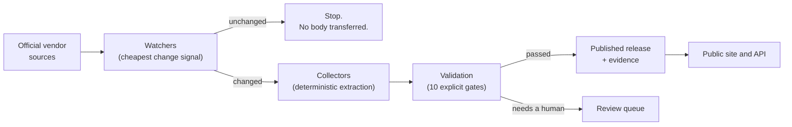

<div align="center">

```
███████╗██╗██████╗ ███╗   ███╗███████╗ ██████╗ ██████╗ ██╗   ██╗████████╗
██╔════╝██║██╔══██╗████╗ ████║██╔════╝██╔════╝██╔═══██╗██║   ██║╚══██╔══╝
█████╗  ██║██████╔╝██╔████╔██║███████╗██║     ██║   ██║██║   ██║   ██║   
██╔══╝  ██║██╔══██╗██║╚██╔╝██║╚════██║██║     ██║   ██║██║   ██║   ██║   
██║     ██║██║  ██║██║ ╚═╝ ██║███████║╚██████╗╚██████╔╝╚██████╔╝   ██║   
╚═╝     ╚═╝╚═╝  ╚═╝╚═╝     ╚═╝╚══════╝ ╚═════╝ ╚═════╝  ╚═════╝    ╚═╝   
```

**An open catalogue and continuous monitor for firmware, BIOS, BMC images,
drivers, embedded operating systems, and appliance software.**

*Dependabot for the hardware in your racks.*

[](LICENSE)
[](docs/architecture/licensing.md)
[](go.mod)
[](database/migrations)
[](#project-status)

[Blueprint](docs/architecture/blueprint.md) ·
[Architecture](docs/architecture/) ·
[Decisions](docs/adr/) ·
[Diagrams](docs/diagrams/) ·
[Contributing](CONTRIBUTING.md)

</div>

---

## The question this answers

> *What firmware is my switch supposed to be on, and when did that version actually ship?*

You can find out. It takes a browser, a vendor portal that reorganised itself last
quarter, a release notes PDF, and about eleven minutes. Then you write it in a
spreadsheet, and six weeks later the spreadsheet is wrong.

That information is not secret. It is scattered across thousands of vendor portals,
published in incompatible formats, relocated without warning, and almost never
machine-readable in a consistent way. Every infrastructure team maintains its own
private, decaying copy of the same facts.

FirmScout makes that copy public, current, and **evidence-backed** — once, for everyone.

## What makes it different

The database is not the hard part. Anyone can design a schema for versions and dates.

The hard part is a **discovery and maintenance engine whose cost per monitored source is
low enough that watching tens of thousands of them is economically boring** — and that
stays correct when a vendor silently redesigns their download page.

That engine is deterministic by default. Conditional HTTP requests, normalised content
hashing, and configuration-driven extractors do the routine work. Large language models
are an escalation path for discovery and repair, invoked when deterministic methods
fail, under explicit financial budgets, and **never on the default execution path**.

A catalogue of plausible-looking wrong firmware versions is worse than no catalogue at
all. Someone acts on this data to decide whether a device is patched.

## Core principles

| Principle | What it means in practice |
| --- | --- |
| **Deterministic by default, AI only by escalation** | The routine path is conditional requests and configured selectors. A model is invoked only when that fails, within a budget, and its output is a proposal — never a database write. |
| **Evidence first** | Every published fact carries a source URL, a retrieval timestamp, a content hash, and the excerpt it was read from. |
| **Immutable history** | Releases are inserted, never overwritten. Corrections and withdrawals are new rows with audit trails, not edits. |
| **No invented dates** | A release dated "February 2026" is stored with month precision, and the API renders `2026-02`. FirmScout never fabricates a day to make a date field look complete. |
| **No assumed semantic versioning** | Real versions look like `3.003.0015.001` and `CollabOS 2.1.B (2.1.121)`. Version strings are opaque; "latest" comes from release date and observation history, never from sorting strings. |
| **Collectors cannot publish** | A collector emits candidates and holds no repository handle. A separate validation step, with ten explicit gates, decides what becomes a published fact. |
| **Compliance before collection** | A source's `robots.txt` status and terms review gate whether it is ever fetched. A newly contributed source is not collectable until a human has read the vendor's terms. |

Each principle is an [architecture decision record](docs/adr/), with the alternatives
that were rejected and the measurable condition that would justify revisiting it.

## How it works



A watcher picks the cheapest signal a source offers: a vendor webhook, a feed, an API
cursor, an `ETag`, a `Last-Modified` header, or — for pages that offer none — a hash of
just the section that carries releases. Almost every check ends there, having
transferred no body and run no parser. **That is the whole economic argument.**

When something genuinely changed, a collector extracts candidates from the stored
artifact. Candidates are observations, not facts. Ten deterministic gates decide whether
one becomes a release: product identity, duplicate detection, date validity, version
plausibility, evidence retention, confidence, applicability, and agreement between
sources. Anything ambiguous goes to a human rather than to a guess.

## Project status

**Pre-alpha.** The architecture is designed, documented, and the first vertical slice is
built and verified end to end against a real PostgreSQL. The catalogue itself is
**empty on purpose**: the two registered MikroTik sources ship disabled, pending a human
review of the vendor's terms of use, and a test enforces that no committed source is
collectable without that review.

What is real today:

- The full pipeline — registry sync, scheduled check, change detection, extraction,
  validation, publication — running against recorded fixtures with a real database.
- A public HTTP API returning correct date precision, and a Next.js site that renders it.
- 296 tests, a mechanically enforced Clean Architecture dependency rule, and a
  29-table schema whose constraints encode the product's promises.

What is designed but not built: the AI agents, CVE correlation, lifecycle tracking,
billing, and the entire AWS deployment.

The honest, itemised account — including the ten defects that running the system found
and reading it would not have — is in the
[architecture consistency report](docs/architecture/consistency-report.md).

## Quick start

Requires [Go 1.27+](https://go.dev/dl/), [Node 22+](https://nodejs.org/), and Docker.

```bash
git clone https://github.com/macimottin/firmscout.git
cd firmscout

# Bring up PostgreSQL, the API, the worker, and the website.
make up

# Apply the schema and load the Git-managed registry into it.
make migrate
go run ./apps/cli registry sync
```

The site is on <http://localhost:3000> and the API on <http://localhost:8080>.

Add `--profile observability` to the Compose command for Grafana, Prometheus, Loki and
Tempo, provisioned with dashboards.

Without Docker, you can still run everything that does not need a database:

```bash
make check      # format, vet, lint, test, architecture rule, diagrams, schemas
go run ./apps/cli registry validate
```

> **Note:** the Docker Compose stack has been written and statically validated but has
> not yet been executed. If it does not come up cleanly for you, that is a bug worth
> [reporting](https://github.com/macimottin/firmscout/issues) — not something you are
> doing wrong.

## Repository layout

```
apps/          api, worker and cli binaries, plus the Next.js website
internal/
  domain/      entities, value objects, state machines. Standard library only.
  application/ use cases and the ports they depend on. Imports domain only.
  adapters/    postgres, http, fetch, normalize, collectors, telemetry, registry
  platform/    configuration and dependency wiring — the composition root
  archtest/    the dependency rule, as a test that fails the build
collectors/    the collector SDK and the YAML configurations
dataset/       the Git-managed registry: vendors, categories, products, sources
database/      SQL migrations and queries
docs/          blueprint, architecture, ADRs, diagrams
infrastructure/ Docker Compose, observability configuration, Terraform skeleton
```

The dependency rule is not a convention documented in a file nobody reads. It is
[a test](internal/archtest/arch_test.go): the domain may import only the standard
library, the application layer only the domain, and adapters may not import each other.
Break it and `go test ./...` fails.

## Documentation

| Start here | For |
| --- | --- |
| [Blueprint](docs/architecture/blueprint.md) | The complete technical and product design |
| [Overview](docs/architecture/overview.md) | One fact traced end to end, plus the component catalogue |
| [ADRs](docs/adr/) | Every significant decision, with the rejected alternatives |
| [Diagrams](docs/diagrams/) | 29 diagrams, each naming the code that implements it |
| [Data model](docs/architecture/data-model.md) | Why the schema is shaped the way it is |
| [Update pipeline](docs/architecture/update-pipeline.md) | The watcher ladder and the ten validation gates |
| [Security](docs/architecture/security.md) | Threat model, honest about what is not built |
| [Consistency report](docs/architecture/consistency-report.md) | What is verified by execution, and what is not |

## Contributing

FirmScout gets better mostly by getting more sources, and adding one is a pull request
with a YAML file — no code required.

```yaml
# collectors/config/acme/releases.yaml
spec:
  engine: html_selectors
  extract:
    release_container: "div.release"
    fields:
      version:      { selector: "span.version", transform: trim }
      release_date: { selector: "time", date_format: "2006-01-02", precision: exact_day }
```

Every collector is tested against a recorded fixture. **No test in this repository ever
fetches from a live vendor site** — a suite that breaks when a manufacturer redeploys
their website is a suite people learn to ignore.

Read [CONTRIBUTING.md](CONTRIBUTING.md) for the workflow, the fixture provenance rules,
and the source compliance rules that are not negotiable: never bypass authentication,
never circumvent a CAPTCHA, never evade a rate limit, never ignore `robots.txt`.

Also worth reading: [GOVERNANCE.md](GOVERNANCE.md), which states plainly which decisions
the hosted service does *not* get to impose on the project, and
[DATA_SOURCES.md](DATA_SOURCES.md), which explains why one technically ideal vendor
catalogue is registered but deliberately never collected.

## Licensing

Four separate decisions, kept separate on purpose:

| | |
| --- | --- |
| **Source code** | [Apache-2.0](LICENSE) — permissive, with an explicit patent grant |
| **Dataset** | CC BY 4.0 for delayed public snapshots; separate terms for the live feed |
| **Hosted service** | Separate terms, not yet drafted |
| **Contributions** | DCO sign-off (`git commit -s`), not a CLA |

The moat is the dataset, the operational record, and the reliability — not source
secrecy. See [licensing.md](docs/architecture/licensing.md) for the full reasoning and
the itemised list of questions that **require qualified legal review before launch**.

## Acknowledgements

FirmScout catalogues facts published by manufacturers, and it does so on their terms. It
links to official release notes rather than reproducing them, respects `robots.txt`,
honours rate limits, and stops when asked. If you are a vendor and you would like your
products handled differently — or would rather offer an API — please
[open an issue](https://github.com/macimottin/firmscout/issues) or see
[SECURITY.md](SECURITY.md) for a private channel.

<div align="center">
<sub>Built in the open. Every fact has a source.</sub>
</div>
