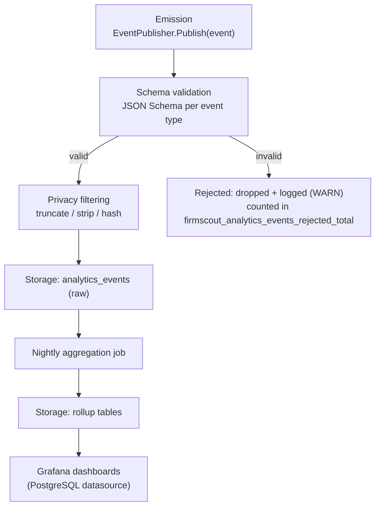

# Product analytics

> Companion to [`blueprint.md`](blueprint.md) (§6 decision 12, [ADR-0012](../adr/0012-product-analytics.md)). Diagram: [`docs/diagrams/product-analytics.md`](../diagrams/product-analytics.md). This document covers **business/product events** — operational health signals (request latency, error rates, collector success) are a separate concern, defined in [`observability.md`](observability.md), and the two pipelines are deliberately not merged (see §3).

---

## 1. Purpose and privacy stance

FirmScout needs to answer product questions — what are people searching for, which vendors deserve the next collector, is the free tier converting to paid — without becoming the kind of site its own users would be uncomfortable being tracked by. The infrastructure engineers FirmScout targets are, professionally, unusually alert to tracking; a third-party analytics beacon on a firmware-version lookup site would be a strange thing to ship on a project whose whole premise is trustworthy, evidence-first data.

**The stance is first-party, aggregate, privacy-conscious analytics:**

- **First-party only.** Events are emitted by FirmScout's own servers and stored in FirmScout's own PostgreSQL database (blueprint §3, §11). There is no third-party analytics SDK, no Google Analytics, no Segment, no marketing pixel, and no client-side script from an external domain.
- **No fingerprinting.** No canvas fingerprinting, no device fingerprinting, no cross-site identifiers, no attempt to re-identify an anonymous visitor across sessions.
- **No unnecessary personal data.** The event catalogue in §2 is deliberately built from product-relevant facts (a query, a product slug, a status code) rather than from anything that identifies a person.

**What is collected (plainly stated):** aggregate counts of searches, page views, API calls, collector outcomes, and publication events, each with a small number of product-relevant, non-identifying properties (§2). Search query text is stored, but truncated and normalised before it is written (§4) — the intent is "what did people search for, in aggregate," not "what exact string did this person type."

**What is deliberately not collected:** IP addresses in raw form (§4 covers the narrow, separate, short-retention exception for abuse detection), precise geolocation, device fingerprints, cross-site or cross-session identifiers, a persistent identifier for anonymous visitors, names, email addresses (outside the account data a registered API consumer explicitly provides for their own account), the contents of uploaded inventory files, or the contents of authenticated vendor portals a collector might traverse. None of these are needed to answer the product questions in §7, and collecting them "in case they're useful later" is exactly the anti-pattern this stance rejects.

---

## 2. Event catalogue

Every event is emitted through the `EventPublisher` port (blueprint §7.3) and, for the events below, persisted to `analytics_events` after schema validation and privacy filtering (§3). Property lists below are the *complete* set of fields stored for each event — nothing else is attached.

| Event | Properties | Trigger | Product question it answers |
| --- | --- | --- | --- |
| `SearchExecuted` | `query_normalized` (truncated/lowercased, ≤48 chars), `result_count`, `latency_ms`, `has_api_key` (bool) | A search request (web or API) completes | What are people searching for, how many results do they get, and is search fast enough? |
| `SearchReturnedNoResults` | `query_normalized`, `alias_candidates_considered` (count) | `SearchExecuted` with `result_count = 0` | Which products or vendors are missing from the catalogue, or which aliases are missing? |
| `ProductViewed` | `product_slug`, `vendor_slug`, `release_type`, `referrer_type` (`search`/`direct`/`vendor_page`/`api_docs`) | A product detail page renders | Which products get attention, and does that match where freshness effort is spent? |
| `VendorViewed` | `vendor_slug`, `product_count_shown` | A vendor page renders | Which vendors deserve the next collector investment? |
| `APIRequestCompleted` | `route_pattern`, `method`, `status_code`, `api_tier`, `latency_ms`, `cache_result` (`hit`/`miss`) | An API response is sent | Which endpoints and tiers are actually used, at what latency, by which class of consumer? |
| `APIQuotaExceeded` | `route_pattern`, `api_tier` | A request is rejected for exceeding a persisted quota | Who is hitting the ceiling of their tier — a candidate signal for upselling to Professional? |
| `SourceChecked` | `vendor_slug`, `source_type`, `outcome` (`changed`/`unchanged`/`failed`), `duration_ms` | `CheckSource` completes | Is collector cadence and reliability matching expectations per vendor? |
| `SourceChanged` | `vendor_slug`, `source_id`, `source_type` | `DetectSourceChange` finds `outcome = changed` | Which sources are noisy versus stable — informs scheduling policy tuning |
| `SourceBroken` | `vendor_slug`, `source_id`, `source_type`, `failure_class`, `consecutive_failures` | The source health state machine transitions to `broken` | What is the current collector maintenance backlog, prioritised by vendor? |
| `SourceRecovered` | `vendor_slug`, `source_id`, `downtime_duration_s` | The state machine transitions back to `active` | What is mean time to repair, per vendor? |
| `CandidateReleaseCreated` | `vendor_slug`, `product_slug` (nullable if unresolved), `source_id`, `confidence`, `discovery_method` (`deterministic`/`ai_repair`) | `ExtractCandidateRelease` produces a candidate | What is extraction throughput and confidence distribution, and how much comes via AI repair versus the deterministic path? |
| `ReleasePublished` | `vendor_slug`, `product_slug`, `release_type`, `channel`, `confidence`, `evidence_lag_days` (days between the vendor's own publish signal and FirmScout's publication) | `PublishRelease` commits | What is the freshness lag per vendor, and what fraction of candidates make it all the way to publication? |
| `ReleaseWithdrawn` | `vendor_slug`, `product_slug`, `reason` | The withdrawal use case runs | What is the rate of data-quality incidents that require a correction after the fact? |
| `CollectorFailed` | `vendor_slug`, `source_type`, `failure_class`, `consecutive_failures` | Each individual failed check (higher-frequency than `SourceBroken`, which fires once per state transition) | Which vendors are trending toward breakage, as an early-warning signal before the state machine trips `broken`? |
| `CollectorRecovered` | `vendor_slug`, `source_type` | A check succeeds after one or more prior failures, independent of whether the state machine reached `broken` | Is this vendor's failure pattern transient (self-resolving) or persistent (needs a fix)? |
| `AIRepairRequested` | `vendor_slug`, `source_id`, `trigger_reason` (`selector_miss`/`content_type_change`/`broken`), `budget_cap_usd` | The Repair agent is invoked | What is AI escalation volume, and which trigger dominates — informs where deterministic collectors need hardening so escalation is needed less often |
| `AIRepairCompleted` | `vendor_slug`, `outcome` (`success`/`failed`/`schema_invalid`/`budget_exceeded`), `cost_usd`, `confidence` | The Repair agent run completes | Is AI escalation earning its cost — repair success rate against actual spend |
| `CorrectionSubmitted` | `product_slug`, `correction_type` (`version`/`date`/`release_type`/`other`), `submitter_type` (`anonymous`/`api_key`/`authenticated`) | A community correction is submitted | How much community engagement exists, and which products draw the most correction activity (a data-quality attention signal)? |
| `APIKeyCreated` | `api_tier`, `signup_source` (`web`/`referral`) | An API key is issued | What is the funnel from anonymous web visitor to registered API consumer (validates blueprint assumption P3)? |

**Relationship to domain events:** the domain layer emits its own events (blueprint §7.7 — `SourceChanged`, `SourceUnchanged`, `SourceFailed`, `CandidateCreated`, `CandidateValidated`, `CandidateRejected`, `ReleasePublished`, `ReleaseWithdrawn`, `HumanReviewRequested`, `SourceRelocated`), dispatched in-process and persisted to `analytics_events` and the job queue. Several analytics events above map directly onto a domain event (`ReleasePublished`, `ReleaseWithdrawn`, `SourceChanged`) and reuse the same trigger; the naming differs in a few places (`SourceFailed` → `SourceBroken`, `CandidateCreated` → `CandidateReleaseCreated`) because the analytics catalogue is shaped around the product questions in this document rather than around the domain's own vocabulary, which is shaped around invariants and state transitions. Other analytics events (`SearchExecuted`, `ProductViewed`, `APIRequestCompleted`) have no domain-event counterpart at all — they originate at the web/API boundary, where there is no domain state transition, only a user or client action worth recording for product purposes.

---

## 3. The event pipeline



**Where each stage runs:**

1. **Emission** happens in-process, inside whichever adapter or use case observed the event — the HTTP handler for `APIRequestCompleted`, the `PublishRelease` use case for `ReleasePublished`, and so on. This calls the same `EventPublisher` port the domain events use (blueprint §7.3), so there is one publishing mechanism, not two.
2. **Schema validation** runs synchronously against a JSON Schema per event type, stored alongside the other schemas in `packages/schemas/` (blueprint §10). This is the same discipline the blueprint applies to AI agent output (§15) and dataset YAML — nothing is trusted structurally until it passes a schema.
3. **Privacy filtering** runs immediately after validation, in the same adapter, before anything touches durable storage — the rules in §4 are applied here, never as a later cleanup pass. This ordering matters: an event that fails privacy filtering never has a raw, unfiltered form written anywhere, even transiently.
4. **Storage (raw)** is a single `analytics_events` table (§6), written by the API and worker processes directly — no separate analytics service.
5. **Aggregation** runs as a nightly scheduled job (the worker's scheduler loop locally; EventBridge Scheduler on AWS, the same pattern the blueprint uses for source-check scheduling), reading the previous day's raw events and upserting into the rollup tables in §6.
6. **Storage (rollups)** holds the small, long-lived, pre-aggregated tables that dashboards actually query.
7. **Dashboards** read the rollup tables through a read-only PostgreSQL role, via Grafana's PostgreSQL datasource — this is a fourth Grafana datasource alongside Prometheus/Loki/Tempo (see [`grafana-dashboards.md`](grafana-dashboards.md)), because product-analytics questions ("top searched products") are not shaped like Prometheus time series and forcing them into one would mean re-deriving joins Postgres already does well.

**What happens to an event that fails validation:** it is dropped — never partially written, never retried indefinitely. The failure is logged at `WARN` with the event name and the schema violation, and counted by `firmscout_analytics_events_rejected_total{event_name, reason="schema_invalid"}` (defined in [`observability.md`](observability.md) §5), so a spike in rejected events — for example after a client-side change that stops matching the schema — is visible as an operational signal, not silent data loss. The same counter, with `reason="privacy_filter_dropped"`, covers the rarer case where an event's *shape* is valid but its *content* trips a privacy rule strict enough to warrant dropping the event entirely rather than merely redacting a field (see §4).

---

## 4. Privacy filtering rules

Applied in the adapter, before storage (§3, stage 3):

- **No raw IP storage in product analytics.** IP addresses are never written to `analytics_events` or any rollup table, not even hashed. A separate, narrowly scoped abuse-detection subsystem (feeding the "Abuse and scraping" dashboard in [`grafana-dashboards.md`](grafana-dashboards.md) §7) hashes the IP with a **rotating salt** (rotated on a schedule short enough that the hash cannot be used to reconstruct a stable long-term identifier) and retains that hash for a **short, fixed window** sufficient for rate-based abuse detection and no longer. That subsystem exists to protect the service, not to profile users, and its data deliberately never joins with product analytics.
- **Coarse geography at most**, and only where a product question genuinely needs it (none of the events in §2 currently carry geography at all — this rule exists for future additions, and the bar is country- or region-level, never city or precise coordinates).
- **No cross-site identifiers.** No shared cookie, device ID, or fingerprint that could correlate a FirmScout visit with activity on another site.
- **No persistent visitor ID for anonymous users.** There is no anonymous-tracking cookie assigned on first visit and read back on return visits. Where a rollup needs to distinguish "one burst of activity" from "the same person across days" (search abandonment, §5), it uses a **short-lived, session-scoped** bucket that is not persisted or reused across sessions — it exists only to correlate events within one browsing session for aggregate funnel math, never to identify a returning individual.
- **Aggressive truncation of search queries.** Raw query text is normalised (lowercased, whitespace-collapsed) and truncated to a short maximum length (48 characters) before it is ever written. This is deliberately not "for storage efficiency" — it is a privacy control: a visitor could paste an internal asset tag, a serial number, or other sensitive string into the search box, and truncation plus aggressive normalisation (which collapses near-duplicate queries into the same bucket, further diluting any one person's exact input) keeps what's stored close to "a product name people search for" rather than "verbatim text a specific person typed."
- **Absolute prohibition, matching [`observability.md`](observability.md) §6:** API keys, tokens, credentials, customer inventory contents, and authenticated vendor portal contents are never logged, never stored in an analytics event, and never appear in a rollup — this list is identical between the two documents on purpose, because the same secret leaking into an analytics table is exactly as bad as it leaking into a log.

---

## 5. Search analytics

Search is the highest-leverage analytics surface because it is where an anonymous, non-tracked visitor still tells FirmScout something valuable simply by using the product as intended. Each signal maps to a specific, concrete action:

| Signal | Source | Feeds this decision |
| --- | --- | --- |
| Most searched products and vendors | `SearchExecuted` + `ProductViewed`/`VendorViewed` rollups | Prioritising which vendors get the next collector, and which existing products get freshness/quality attention first — effort follows demonstrated demand rather than guesswork |
| Result counts per search | `SearchExecuted.result_count` | Distinguishing "the catalogue doesn't have this" (zero results) from "the catalogue has it but ranking is poor" (low but nonzero results with no follow-on `ProductViewed`) |
| Search latency | `SearchExecuted.latency_ms`, cross-checked against `firmscout_api_request_duration_seconds{route="/api/v1/search"}` in Prometheus | Whether PostgreSQL full-text search (blueprint §3.10) is still adequate as the catalogue grows — the threshold to revisit (`p95 > ~200ms`) is stated in the blueprint and measured here |
| Zero-result searches | `SearchReturnedNoResults`, aggregated by `query_normalized` | The single most direct "missing product" signal FirmScout has — a query pattern with a growing zero-result count and no corresponding product is a concrete argument for registering a new vendor/product/source |
| Common aliases | Zero-result queries that *do* resolve once a manual alias is added later, compared against pre-alias search volume for the same normalised term | Which aliases to add to `dataset/products/*/aliases` — this is the mechanism that turns "people search for 'RB750'" into an actual alias entry reviewed and merged like any other registry change (blueprint §3.3) |
| Common typos | Near-miss queries — a `query_normalized` with low search volume individually but high combined volume when clustered against a known product/vendor slug by edit distance | Whether `pg_trgm` fuzzy matching (already in place per blueprint §3.10) is catching them, or whether a specific typo is common enough to deserve an explicit alias rather than relying on fuzzy matching alone |
| Abandonment, measured without invasive tracking | Within one session-scoped bucket (§4): a `SearchExecuted` with `result_count > 0` followed by no `ProductViewed` in the same short session window | A search that returned results nobody clicked through is either poorly ranked or the results are stale/wrong — both are product-quality signals, and the measurement needs nothing beyond the session bucket already described in §4, no persistent identity required |

The common thread across every row: **search analytics turns anonymous usage into a concrete registry or ranking change** — a new alias, a new vendor priority, a new source — never into a profile of who searched for what.

---

## 6. Storage model

All analytics tables live in the same PostgreSQL instance as the rest of FirmScout's data (blueprint §3), under the observation-table conventions in blueprint §11 (high-volume, retention-managed, not part of the Git-synchronised registry).

**Raw events:**

```sql
CREATE TABLE analytics_events (
    id              BIGINT GENERATED ALWAYS AS IDENTITY PRIMARY KEY,
    event_name      TEXT NOT NULL,      -- one of the 19 names in §2
    occurred_at     TIMESTAMPTZ NOT NULL DEFAULT now(),
    session_bucket  TEXT,               -- short-lived, session-scoped only; NULL for server-originated events
    properties      JSONB NOT NULL,     -- validated against the event's JSON Schema before insert
    request_id      TEXT                -- correlates to observability traces/logs, per observability.md §4
);
```

`properties` is JSONB rather than one column per property because the catalogue in §2 has 19 different shapes and will grow; the JSON Schema validation at ingestion (§3) is what keeps this from becoming an unstructured dumping ground — every row's `properties` conforms to a known, versioned schema for its `event_name`.

**Aggregated rollups**, one table per dimension the product questions in §7 actually need, upserted nightly:

```sql
CREATE TABLE search_query_rollup_daily (
    date                DATE NOT NULL,
    query_normalized    TEXT NOT NULL,
    search_count        INT NOT NULL DEFAULT 0,
    zero_result_count    INT NOT NULL DEFAULT 0,
    avg_latency_ms      NUMERIC,
    PRIMARY KEY (date, query_normalized)
);

CREATE TABLE product_view_rollup_daily (
    date          DATE NOT NULL,
    product_slug  TEXT NOT NULL,
    vendor_slug   TEXT NOT NULL,
    view_count    INT NOT NULL DEFAULT 0,
    PRIMARY KEY (date, product_slug)
);

CREATE TABLE vendor_view_rollup_daily (
    date         DATE NOT NULL,
    vendor_slug  TEXT NOT NULL,
    view_count   INT NOT NULL DEFAULT 0,
    PRIMARY KEY (date, vendor_slug)
);

CREATE TABLE api_usage_rollup_daily (
    date               DATE NOT NULL,
    api_tier           TEXT NOT NULL,
    route_pattern      TEXT NOT NULL,
    request_count      INT NOT NULL DEFAULT 0,
    quota_exceeded_count INT NOT NULL DEFAULT 0,
    PRIMARY KEY (date, api_tier, route_pattern)
);
```

**Aggregation cadence:** nightly, reading the prior UTC day's rows from `analytics_events` and upserting into each rollup table. Product decisions (§7) operate on a weekly/monthly cadence, so near-real-time aggregation is not needed; the nightly job also naturally batches away the noise of any single hour.

**Retention:**

| Table | Retention | Rationale |
| --- | --- | --- |
| `analytics_events` (raw) | 90 days | Long enough to re-run or correct an aggregation, debug a rollup discrepancy, or answer an ad-hoc question about a recent period; short enough that raw, higher-detail data does not accumulate indefinitely |
| Rollup tables (`*_rollup_daily`) | Indefinite (no scheduled deletion in the MVP) | Small (one row per dimension per day), contain no per-event or per-person detail, and are exactly the historical trend data the monthly questions in §7 need — there is no privacy or storage-cost reason to delete an aggregate count |

---

## 7. How analytics reaches decisions

**Weekly questions:**

- Which searches returned zero results most often this week, and does any of them point at a missing product or a missing alias?
- Which existing products/vendors got the most views — does collector-check frequency for those match the attention they're getting?
- Did any API tier's quota-violation rate spike — is a specific consumer outgrowing the free tier?
- Which vendors generated the most `SourceBroken`/`CollectorFailed` events — does the collector maintenance backlog need reprioritising this week?
- Did `AIRepairRequested` volume or `AIRepairCompleted` cost move meaningfully — is a specific source pattern driving disproportionate AI spend?

**Monthly questions:**

- Trend in zero-result search rate over the month — is the catalogue's coverage improving relative to actual demand?
- Trend in `evidence_lag_days` on `ReleasePublished` per vendor — is freshness improving or degrading as the catalogue scales?
- `APIKeyCreated` volume and the subsequent share of those keys with any `APIRequestCompleted` activity — is the funnel from anonymous visitor to active API consumer moving (blueprint assumption P3, P4)?
- `CorrectionSubmitted` volume and distribution across products — is community engagement growing, and does correction density cluster around specific vendors that might need a source health review (blueprint assumption P5)?
- Month-over-month `ReleasePublished` count and `SourceChecked` volume — is the catalogue actually growing at the rate the roadmap assumes?

---

## 8. Compliance posture

**GDPR-relevant considerations:**

- No persistent identifier is assigned to anonymous visitors (§4), and the events in §2 do not, on their own, identify a natural person — the analytics data as designed is properly aggregate and product-focused rather than being individual-level tracking with the identifying fields merely omitted from display.
- The narrow exception — rotating-salt-hashed IPs for abuse detection, short retention, never joined to product analytics (§4) — is itself a form of processing personal data (a hash of an IP is still, under most interpretations, personal data if it can be linked back within its retention window) and needs its own, separate legal basis and retention justification from the aggregate analytics.
- Search query text, even truncated, could in rare cases contain something identifying if a visitor pastes it in (§4's truncation and normalisation reduce, but do not mathematically eliminate, this risk) — worth flagging explicitly rather than asserting a guarantee that does not exist.
- `analytics_events.properties` for events tied to an authenticated API consumer (`APIRequestCompleted`, `APIQuotaExceeded`, `APIKeyCreated`) are keyed by tier and route pattern, not by consumer identity, in the analytics tables themselves — consumer-identified usage lives in `usage_records` (blueprint §11) for billing/entitlement purposes, a separate table with a separate, contractual (not analytics) legal basis.

**Legal basis argument for first-party aggregate analytics:** the position is that non-identifying, first-party, product-focused aggregate analytics — with no persistent visitor identifier, no cross-site correlation, and no profiling — falls under **legitimate interest** (understanding and improving the product), balanced against the low privacy impact of data that cannot be tied back to an individual. This is a considerably weaker claim than "personal data isn't collected at all," and it is exactly the kind of argument that depends on implementation matching this document precisely — if a persistent visitor ID or cross-session profiling were ever added, the legal basis would need to shift toward consent, and that would be a materially different product decision, not a documentation update.

**This requires legal review before launch.** The rotating-salt IP hashing for abuse detection, the search-query truncation approach, and the legitimate-interest argument above are engineering-informed positions, not legal conclusions — the blueprint applies the identical caution to the dataset licensing question (§3.8) and the same standard applies here: qualified legal review, not an architecture document, is what makes this launch-ready.

---

## 9. MVP versus planned

**Implemented in the MVP vertical slice:**

- The `EventPublisher` port and its in-process dispatch mechanism (shared with domain events, blueprint §7.7).
- The `analytics_events` raw table and its schema-validation-before-insert discipline.
- A working subset of the event catalogue tied to the vertical slice's actual code paths: `SourceChecked`, `SourceChanged`, `CandidateReleaseCreated`, `ReleasePublished` at minimum, since those are exercised by `check-source` → publish.

**Explicitly not yet implemented, and honestly so:**

- The nightly aggregation job and the rollup tables in §6 — specified, not built; the vertical slice does not yet have enough event volume or elapsed time to make aggregation meaningful.
- The web-originated events (`SearchExecuted`, `SearchReturnedNoResults`, `ProductViewed`, `VendorViewed`) — these depend on `apps/web` pages that exist in the vertical slice (blueprint §B6) but are not yet instrumented to emit analytics events.
- The abuse-detection IP-hashing subsystem referenced in §4 and used by the "Abuse and scraping" dashboard — designed alongside the scraping-resilience ADR ([ADR-0008](../adr/0008-scraping-resilience.md)), not yet built.
- `AIRepairRequested`/`AIRepairCompleted` — depend on the AI agent adapters, which are ports and fakes only in the MVP (blueprint §15).
- `CorrectionSubmitted` and `APIKeyCreated` — depend on the community-correction and API-key-issuance flows, both later-phase product surfaces relative to the vertical slice's read-only catalogue.
- Legal review of the compliance posture in §8 — explicitly called out as a pre-launch requirement, not something this document can complete on its own.
