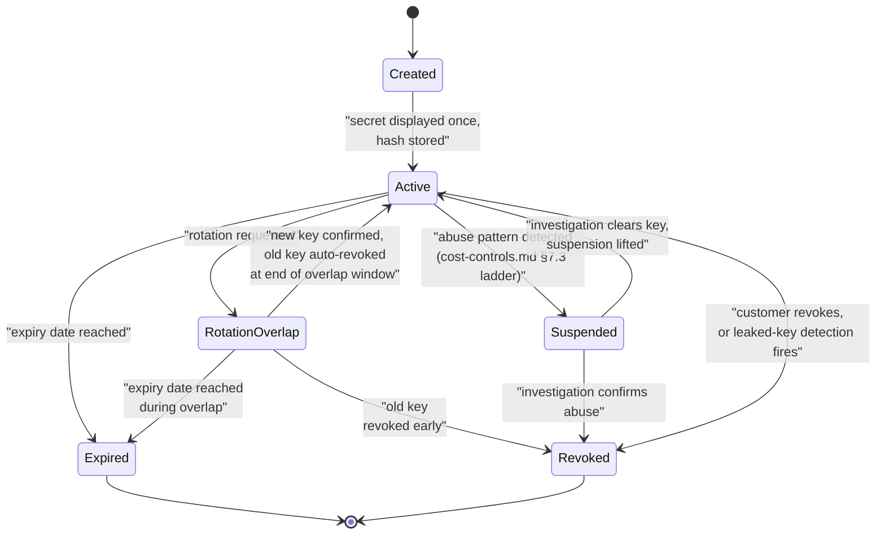

# API commercial design

> Companion to [blueprint.md](blueprint.md) §5 and §12, [ADR-0007 — Public web, paid API](../adr/0007-public-web-paid-api.md), and [cost-controls.md](cost-controls.md) (whose §3 and §7 supply the rate-limiting and incident-response mechanisms this document's entitlement layer depends on). This document covers plan mechanics, quotas, key lifecycle, usage metering, and billing events. It does not set prices, and it does not choose a billing provider — both are open product decisions, flagged explicitly in §9.

---

## 1. The commercial principle

Restated from blueprint §5: **the free tier is limited by convenience, not by truth.** FirmScout sells automation, reliability, scale, freshness depth, history, integrations, compliance, and guarantees. It never sells correctness, and it never cripples the public site to force conversions.

Concretely, what is being sold:

| Sold | Not sold |
| --- | --- |
| Automation — programmatic access instead of a human reading a web page | Correctness — a paid customer does not get a *more accurate* answer than an anonymous visitor |
| Reliability — a freshness SLO/SLA, business-hours or contractual support | Freshness of the *displayed current version* — the number on the free public page is never held back or delayed to create urgency to upgrade |
| Scale — bulk lookups, high quotas, webhooks | Official source links — every tier sees where a fact came from |
| History depth — full release history and point-in-time queries versus a recent window | Accessibility — the public site is never degraded, slowed, or obfuscated to push API adoption |
| Integrations — inventory upload/comparison, webhooks, compliance exports | Basic fields hidden in a shared response — if a field is present in the JSON at all, every tier that can reach the endpoint sees the same field, not a redacted version |
| Compliance and audit tooling — structured advisory data, exports, audit log access | The existence of a fact — nothing is deliberately wrong, incomplete, or stale to manufacture a paywall moment |

**What is explicitly not a paywall lever**, restated directly because it is the rule most tempting to violate under revenue pressure: correctness, the freshness of the currently-displayed version, official source links, and general accessibility of the public site. Degrading any of these to drive conversions destroys the trust the entire product depends on — a visitor who suspects the free answer might be deliberately stale stops trusting the paid answer too.

---

## 2. Plan capability matrix

The full anonymous/free/professional/enterprise matrix already exists in blueprint §5 and is not repeated here in full; this section adds the quota values (explicitly starting proposals, not commitments) and the pricing-axis discussion the blueprint defers to this document.

### 2.1 Quota proposal

| Quota / limit | Anonymous web | Free API key | Professional API | Enterprise |
| --- | --- | --- | --- | --- |
| Requests per minute (burst, token bucket) | 20 | 30 | 300 | negotiated, typically 1,000+ |
| Requests per day | 2,000 (per IP, approximate — cost-controls.md §1's layered rate limiting) | 5,000 | 100,000 | negotiated |
| Requests per month (durable quota) | not tracked per-identity (no key) | 50,000 | 2,000,000 | negotiated, typically unmetered with a fair-use ceiling |
| Bulk lookup batch size | not available | not available | up to 500 products/call | up to 5,000 products/call |
| Products monitored for webhooks | not available | not available | 100 | negotiated |
| API keys per account | n/a | 1 | 5 | unlimited, with seat-based RBAC |
| Seats (dashboard/console users) | n/a | 1 | 3 | negotiated |
| Release history depth | recent window (e.g. 12 months) on the web page | recent window | complete | complete |
| Freshness commitment | best effort | best effort | target SLO (documented, not contractual) | contractual SLA |

**All quota values above are starting proposals**, sized to be generous enough that a genuine free-tier developer never has to think about the limit during evaluation, while still being finite enough that they are a meaningful, enforceable number in the metering design (§5). They should be revisited against real signup and usage data (blueprint §2, assumption P3) before being treated as fixed.

### 2.2 Value metric and pricing axes

The blueprint asks this document to describe pricing axes and recommend a value metric, without setting prices. The candidate axes:

| Axis | What it measures | Fits FirmScout's value proposition? |
| --- | --- | --- |
| Requests (volume-based) | Raw API call count | Partially — cheap to explain, but it charges identically for a single product fetch and a 500-product bulk lookup unless combined with endpoint weighting (§3), and it does not track well with the *value* a customer gets (a compliance team polling 10,000 devices monthly needs a very different plan than a single-app integration polling one product) |
| Products monitored (subscription-based) | Distinct products under active tracking/webhook subscription | Strong fit — this tracks the actual "Dependabot for hardware" value proposition (blueprint §1): the customer is paying to have FirmScout watch a fleet on their behalf, and the size of that fleet is the natural unit of value, largely independent of how often they poll |
| Seats | Number of human users with dashboard access | Weak fit as a primary metric — FirmScout's core value is delivered to systems (CI pipelines, asset-management tools, compliance scanners), not to individual humans clicking a UI; seats matter for Enterprise RBAC but should not be the metric that decides the bill |
| Freshness / SLA tier | Contractual freshness commitment and support level | Strong complementary axis, not a standalone metric — it is what differentiates Professional from Enterprise at a similar monitored-product count, not what differentiates Free from Professional |

**Recommendation: products monitored, as the primary value metric, with request volume as a secondary fair-use ceiling rather than the primary bill driver.**

Reasoning: FirmScout's product is fundamentally a *monitoring* service — "Dependabot for hardware" (blueprint §1) — not a lookup API. A customer's willingness to pay scales with how much of their fleet they are trusting FirmScout to watch, not with how many times they happen to poll it; a well-built integration that caches aggressively and polls rarely provides exactly as much value as one that polls constantly, and a request-count-primary metric would perversely reward inefficient client implementations while punishing well-engineered ones. Products-monitored also aligns incentives with cost-controls.md's own cost model: FirmScout's dominant cost driver at scale is source-check volume (aws-cost-model.md §4), which is a function of products *tracked*, not API requests *received* — so the value metric and the cost driver point the same direction, which is the property a healthy pricing model needs. Request volume remains present as a fair-use / abuse ceiling (§2.1's per-minute/per-day/per-month numbers) so that a customer cannot monitor five products and hammer the API a million times a day for free, but it is not the axis that should define plan tiers or drive the headline price.

---

## 3. Endpoint weighting

Not every request costs the same to serve, and pricing by raw request count without accounting for that is the single easiest way to under-price the endpoints that actually matter for abuse and cost (aws-cost-model.md §2.3). A bulk lookup of 500 products touches the database and (for a cache miss) the summary-refresh path 500 times more than a single product fetch; a full-text search against `product_summaries` with a broad, low-selectivity query touches more index pages than a slug lookup that resolves to one row.

### 3.1 Why weight is necessary

- **Cost proportionality**: `cost_per_api_request` (aws-cost-model.md §2.3) is dominated by `endpoint_weight * Lambda duration`. An unweighted quota lets a customer consume 500× the backend work of another customer while counting identically against the same monthly request quota.
- **Abuse resistance**: an attacker probing for scraped data at scale gravitates toward the cheapest-to-call, most-data-per-call endpoint. If bulk lookup and full-text search cost the same "1 unit" as a single product fetch, they become the obvious abuse vector.
- **Fair billing signal**: a value-metric-aligned plan (§2.2) still needs an internal accounting unit for the fair-use ceiling; that unit should reflect actual load, not request count, so the ceiling protects the system rather than just capping an arbitrary number.

### 3.2 Proposed weight table

| Endpoint | Weight (quota units per call) | Rationale |
| --- | --- | --- |
| `GET /api/v1/products/{slug}` | 1 | Single-row, cache-friendly lookup — the baseline unit |
| `GET /api/v1/products/{slug}/latest` | 1 | Same shape as above |
| `GET /api/v1/vendors/{slug}` | 1 | Same shape |
| `GET /api/v1/releases/{id}` | 1 | Single immutable row, cacheable indefinitely |
| `GET /api/v1/products/{slug}/releases` | 2 | Multi-row result; full history for Professional+ is heavier than the free-tier recent window |
| `GET /api/v1/products/{slug}/advisories` | 2 | Structured multi-row result for Professional+ |
| `GET /api/v1/search?q=` | 3 | Full-text query against `tsvector`/`pg_trgm`, less cacheable than a slug lookup (query-key-dependent cache, blueprint §12) |
| `POST /api/v1/lookup` (bulk) | `2 + 1 per product in the batch` | Directly proportional to the actual backend work; a 500-product batch costs 502 units, making its cost visible in the same units as everything else rather than hidden behind "1 call" |
| `GET /api/v1/usage` | 1 | Cheap, but still metered so a monitoring integration polling its own usage cannot be used to bypass quota accounting entirely |

The `+1 per product` term for bulk lookup is deliberately linear and visible in the weight formula itself, not buried in a separate rate limit, so a customer's own usage dashboard (§7) can show them exactly why a bulk-heavy month consumed more quota than a lookup-heavy one of the same call count.

---

## 4. API key lifecycle

### 4.1 Lifecycle stages

- **Creation**: a consumer (via the dashboard or an authenticated management endpoint) requests a new key, scoped to a plan and optionally to a restricted set of endpoints/products (Enterprise). The system generates a high-entropy secret.
- **Secure display-once semantics**: the plaintext secret is shown exactly once, at creation, in the response/UI. It is never stored in retrievable form and never re-displayable — losing it means generating a new key, not "looking it up again." This is stated directly in blueprint §11 rule 10 and repeated here because it is the load-bearing security property of the whole scheme.
- **Hashing at rest**: the server stores `SHA-256(secret)`, plus an **identifying prefix** (the first 8 characters of the plaintext secret, stored unhashed) so that support tooling, logs, and the customer's own dashboard can reference "the key starting with `fsk_7a3b...`" without ever having the full secret available to look up. Blueprint §11 rule 10.
- **Scoping**: a key carries a plan reference (which determines quota and endpoint access per §2), and optionally a narrower scope (specific products, read-only, a specific environment label like `prod`/`staging`) for Enterprise customers who want least-privilege keys per integration.
- **Rotation with an overlap window**: creating a replacement key does not immediately revoke the old one. Both are valid for a configurable overlap window (default proposal: 7 days) so a customer can redeploy the new key across their systems without a hard cutover outage. The old key is revoked automatically at the end of the window unless the customer confirms early revocation.
- **Revocation**: immediate and irreversible. A revoked key fails authentication from the next request onward (blueprint's entitlement-evaluation diagram, `docs/diagrams/entitlement-evaluation.md`, models this as a `401` short-circuit before any resource is touched).
- **Expiry**: an optional, customer- or plan-configured expiry date after which the key stops working automatically, without requiring an explicit revocation action — useful for time-boxed integrations (a contractor engagement, a proof-of-concept).
- **Leaked-key handling**: a key detected as leaked (via a secret-scanning partner, a customer report, or an internal abuse-pattern detector) is revoked immediately, out of band from the customer's own action, with the account notified and a forced rotation flow offered.
- **Abuse-response path**: sustained quota violation, a pattern consistent with credential sharing (§8), or detected leakage routes through the same graduated response as cost-controls.md §7.3 — the least disruptive containment first (tighter rate limit on the specific key), escalating to suspension only if the lighter response does not resolve it.

### 4.2 Key lifecycle state diagram



### 4.3 What each transition implies operationally

| Transition | Who/what triggers it | System effect |
| --- | --- | --- |
| `Created → Active` | The creation flow completing | The hash and prefix are persisted; the plaintext leaves server memory and is never logged (a request/response logging middleware must explicitly redact this field, not rely on it never appearing by accident) |
| `Active → RotationOverlap` | Customer-initiated rotation | A second key is created and made active; both keys authenticate successfully for the overlap window; usage is metered per-key (§5) so the customer can see traffic migrating from old to new |
| `RotationOverlap → Active` | Overlap window elapses | The old key transitions to `Revoked` automatically; this is a scheduled job, not a manual step, so an overlooked rotation does not silently leave a stale key valid forever |
| `Active → Suspended` | The abuse-response path (§4.1, cost-controls.md §7.3) | The key stops authenticating (`401`, distinguishable in logs/support tooling from a plain revocation) while the account retains access to appeal or provide context; this is a deliberately softer state than `Revoked` because false positives in abuse detection are not free |
| `Suspended → Active` / `Suspended → Revoked` | Human investigation outcome | Either restores normal service or finalises revocation; never auto-resolves without a decision, since suspension exists specifically to buy time for a human judgement call |
| `Active → Expired` | Scheduled expiry date | Same authentication failure as revocation from the caller's perspective, but distinguished internally (and in the customer's dashboard) as a planned lifecycle event rather than a punitive one |
| `Active → Revoked` | Customer action or leaked-key detection | Immediate and irreversible; audited (`audit_events`, blueprint §11) with the reason recorded |

---

## 5. Usage metering design

### 5.1 What is measured

Per request that reaches a resource (i.e. survives the entitlement checks in `docs/diagrams/entitlement-evaluation.md` through to `allow` or `degrade_cached`): the API key (or `anonymous`), the endpoint and its weight (§3), the response status, latency, whether the response was served from cache, and the weighted quota cost of the call. Requests rejected at authentication or authorization (`401`/`403`) are logged for abuse monitoring but are explicitly **not** usage-recorded or billed, since no resource was served — this is stated directly in the entitlement diagram and repeated here because it is a metering-correctness rule, not just a security detail.

### 5.2 Where usage is recorded: synchronous durable counters, asynchronous detailed records

Two different recording paths, deliberately, because they have different accuracy/latency needs:

- **Quota-enforcement counters (synchronous, durable)**: the daily/monthly quota counters that `EvaluateAPIEntitlement` reads to decide whether to allow a request are written **synchronously**, in the same transaction or immediately after serving the request, to PostgreSQL. This is a durability-over-latency choice: an undercounted quota is a revenue and abuse-control leak, so the counter must not be lost to an async queue failure. It is also a small, cheap write (an increment), not the full detailed record, which keeps the synchronous path fast.
- **Detailed usage records (`usage_records`, asynchronous)**: the full per-request record (endpoint, latency, cache status, etc., used for the customer dashboard in §7 and for billing-event derivation in §6) is written **asynchronously**, via the same domain-event mechanism used elsewhere (blueprint §7.7 — dispatched in-process and persisted, forwardable to EventBridge on AWS without the domain changing). This is a latency-over-immediacy choice: the API response does not wait for the detailed record to land, because the customer-facing request latency must not be held hostage to an analytics write.

### 5.3 Idempotency of usage records

Every usage record carries an idempotency key derived from `(request_id, api_key_id)` — `request_id` is already generated per request for tracing (blueprint §12's `X-Request-Id`), so this reuses an identifier that already exists rather than inventing a new one. A retry of the asynchronous write (from a queue redelivery, a worker restart mid-processing) upserts against this key rather than inserting a second row. This is the mechanism, not just a property: the `usage_records` table has a unique constraint on the idempotency key, so a duplicate write is a no-op at the database level regardless of how many times the async path retries.

### 5.4 Aggregation windows

- **Real-time (approximate)**: the in-process token bucket (blueprint §3.9) operates per-minute, per-instance, with no cross-instance aggregation — the accepted approximation documented in the entitlement-evaluation diagram's assumptions.
- **Daily**: durable quota counters aggregate at UTC-day granularity, both for daily quota enforcement (§2.1) and as the unit the AI-spend alarm in cost-controls.md §7.1 mirrors for consistency across the codebase.
- **Monthly (billing period)**: the primary aggregation window for plan quotas and billing-event derivation (§6), aligned to the customer's billing anchor date, not necessarily calendar-month — this distinction matters once a customer signs up mid-month.

### 5.5 How quota enforcement reads the counters

`EvaluateAPIEntitlement` reads the durable daily/monthly counters (§5.2) synchronously as part of the entitlement check shown in `docs/diagrams/entitlement-evaluation.md` — this is the "Check daily/monthly quota (durable counters in PostgreSQL)" step in that diagram. It does not read `usage_records` directly for this decision; `usage_records` is a downstream, denormalised detail store for dashboards and billing reconciliation, not the source of truth quota enforcement depends on, so a slow or backlogged async write path never blocks or corrupts a live entitlement decision.

### 5.6 Accuracy versus latency trade-off

The system deliberately accepts two different accuracy profiles for two different purposes, and this is a design decision worth stating explicitly rather than leaving implicit:

- **Rate limiting** (per-minute bursts): approximate, per-instance, cheap, fast — because its job is to absorb bursts and protect the system, not to produce a billing-grade number. Over-permissive by a factor related to instance count (blueprint §3.9's documented limitation) is an accepted cost of avoiding a shared store (Redis) that the system does not otherwise need.
- **Quota and billing** (daily/monthly): exact, durable, synchronous where it gates access — because these numbers are customer-facing and revenue-relevant, and an undercount or overcount is either a leak or a support ticket. The trade-off accepted here is the opposite one: correctness over raw speed, though "synchronous durable increment" is still fast in absolute terms (a single indexed row update), so this is not actually a large latency cost in practice.

### 5.7 Surviving a partial failure without double-counting

- The synchronous quota-counter increment and the request's actual service are not one atomic operation by necessity (the request may fail downstream after the counter check but before a response is fully served) — the rule is: **the counter is incremented only for a request that is actually served** (`allow` or `degrade_cached` in the entitlement diagram), and if the service path fails *after* that point, the request was still genuinely served the resource it consumed capacity for, so the increment stands. A request that fails *before* reaching that point never increments the counter in the first place, because the increment happens as part of, not before, the allow decision.
- The asynchronous detailed-record write's idempotency key (§5.3) means a worker crash mid-processing and a subsequent redelivery of the same event produces at most one row, never two — this is what "survives a partial failure without double-counting" concretely means here: the failure mode is *at-least-once delivery of the event*, and the idempotency key converts that into *effectively-once persistence*.

---

## 6. Billing event design

**No billing provider is chosen yet.** The event shape below is deliberately provider-agnostic: it describes *what happened*, in domain terms, and is designed to be translatable into whichever provider's API (usage-based billing, metered subscriptions, or a custom invoicing system) is eventually selected, without the domain or the metering layer knowing which provider that is — the same port/adapter discipline as everything else in the architecture (blueprint §7.3).

### 6.1 Event shape

```json
{
  "event": {
    "id": "bevt_01J...",
    "type": "usage.period_closed",
    "idempotency_key": "billing:{consumer_id}:{billing_period_start}:{billing_period_end}",
    "emitted_at": "2026-10-01T00:05:00Z"
  },
  "consumer": {
    "id": "cons_01J...",
    "plan": "professional",
    "billing_period_start": "2026-09-01T00:00:00Z",
    "billing_period_end": "2026-09-30T23:59:59Z"
  },
  "measures": {
    "products_monitored": 340,
    "weighted_requests": 812450,
    "requests_by_endpoint_class": { "single_lookup": 700000, "history": 40000, "search": 22000, "bulk_lookup": 50450 },
    "overage_units": 0
  },
  "provenance": {
    "usage_record_count": 812450,
    "reconciled_against_counters": true
  }
}
```

### 6.2 When events are emitted

- **`usage.period_closed`**: at the end of every billing period (§5.4's monthly window, anchored per customer), summarising the period's measures — this is the primary event a metered-billing integration consumes.
- **`plan.changed`**: at the moment an upgrade or downgrade is confirmed (§6.4), carrying the old plan, the new plan, and the effective timestamp.
- **`key.lifecycle_changed`**: on creation, rotation, suspension, and revocation (§4) — not billing-relevant on its own for a flat-rate plan, but necessary provenance for any future per-key billing feature and for support/audit correlation.
- **`quota.overage_incurred`**: at the moment a customer crosses their plan's included quota, if the plan model supports metered overage rather than a hard cap — emitted once per crossing event, not repeatedly for every subsequent request while over quota, to avoid event-volume blowup.

### 6.3 Idempotency keys

Every billing event carries an idempotency key scoped to what it represents: `usage.period_closed` keys on `(consumer_id, billing_period_start, billing_period_end)` so a re-run of the period-close job (a retry after a crash, a manual re-trigger during investigation) produces the same event content and the same key, safely re-deliverable to a downstream billing provider without creating a duplicate charge. `plan.changed` and `key.lifecycle_changed` key on the underlying domain event's own idempotency key (blueprint §7.7's domain events already carry this property).

### 6.4 Reconciliation against usage records, and mid-period plan changes

- **Reconciliation**: `usage.period_closed`'s `measures` are computed by aggregating `usage_records` (§5.2) for the period, and the event's `provenance.usage_record_count` is carried specifically so a disputed invoice (§6.6) can be checked against the exact record count the event was derived from — a mismatch between that count and a fresh aggregation query is the first thing an investigation checks.
- **Mid-period upgrades**: take effect immediately for capability (a customer gains bulk-lookup access the moment the upgrade is confirmed), and the billing period is **split** for measurement purposes — usage before the upgrade timestamp is measured against the old plan's quota/rate, usage after against the new plan's. This means a single calendar billing period can close with two internal measurement segments feeding one `usage.period_closed` event, or two events if the billing provider's model expects that; the domain event itself is provider-agnostic on this choice.
- **Mid-period downgrades**: take effect at the **end** of the current billing period by default (avoiding a scenario where a customer is mid-way through a bulk operation that a downgrade would abruptly break), unless the customer explicitly requests immediate downgrade — a support/account-management decision, not an automatic one.
- **Proration**: computed as a formula over the split-period measures above (time-weighted, or usage-weighted depending on which the eventually-chosen billing provider supports) — deliberately not specified further here, since proration mechanics are usually implemented by the billing provider itself once one is chosen (§9), and FirmScout's job is to supply accurate, well-attributed usage measures for whichever proration model the provider applies.

### 6.5 Provider-agnosticism, stated directly

The event shape above intentionally contains no provider-specific concepts (no Stripe `usage_record`, no Chargebee `addon`). This is a deliberate application of the same Clean Architecture discipline used everywhere else (blueprint §7.3): a `BillingEventPublisher` port, with the concrete provider as an adapter, chosen later without the metering or entitlement layers changing.

### 6.6 Disputed invoice investigation

1. Retrieve the specific `usage.period_closed` event(s) covering the disputed period, by consumer and period key (§6.3).
2. Re-aggregate `usage_records` for the exact same period boundaries and compare the count and weighted-unit total against the event's `measures` and `provenance.usage_record_count`. A mismatch here means a metering or event-emission bug, investigated separately from the customer's specific dispute.
3. If the aggregation matches the event, walk the specific `usage_records` for the disputed window (filterable by endpoint, by day) to produce a human-readable breakdown the customer can be shown — this is the same data the customer's own usage dashboard (§7) surfaces, so a support agent should be looking at the same numbers the customer already has access to, not a hidden internal view.
4. If the dispute is about a plan-change boundary (§6.4), confirm which segment of the split period the disputed usage falls in against the `plan.changed` event's effective timestamp.
5. Resolution (credit, correction, or explanation) is a billing-provider-side action once a provider is chosen (§9); FirmScout's own system of record for the investigation is steps 1–4, independent of that choice.

---

## 7. Customer-facing usage dashboard

What it shows, and why each element is there rather than left for a support ticket to surface:

| Dashboard element | Source | Purpose |
| --- | --- | --- |
| Current usage (this billing period, weighted units and raw request count) | Live aggregation of `usage_records` for the open period, cross-checked against the durable quota counters (§5.2) | Lets a customer self-serve "am I close to my limit" without contacting support |
| Historical usage (prior periods) | Closed `usage.period_closed` events (§6.1) plus retained `usage_records` per cost-controls.md §5's retention table | Trend visibility for capacity planning on the customer's side, and the first place a customer looks before disputing an invoice |
| Remaining quota | Plan quota (§2.1) minus current usage, per quota dimension (per-minute is not shown historically since it is approximate and per-instance, per §5.6 — only the durable daily/monthly numbers are shown as "remaining") | The single most support-ticket-reducing number on the page |
| Top endpoints by usage | Grouped aggregation of `usage_records` by endpoint class | Helps a customer identify whether a bulk-heavy integration is consuming quota faster than expected (directly tied to the weighting in §3) |
| Monthly trends | Time-series of `usage.period_closed` measures over recent periods | Answers "is our usage growing" without a manual export |
| Rate-limit events (429s) | A filtered view of the abuse-monitoring log referenced in the entitlement diagram's "Logged; NOT billed" paths | Distinguishes for the customer between "we throttled you" and "you got charged" — an important trust signal given §1's principle that rejected requests are never billed |
| Usage by API key | `usage_records` grouped by `api_key_id`, joined against key metadata (prefix, label, creation date — never the secret) | Essential once a customer has multiple keys (§2.1, Professional+); lets them see a rotation in progress (§4.1) as usage visibly shifting from the old key's prefix to the new one |

---

## 8. Anti-abuse in a commercial context

This section is specifically about abuse patterns that only exist *because* there is a commercial layer — cost-controls.md §7 already covers general spend-incident response; this is the entitlement-and-revenue-specific subset.

| Abuse pattern | How it manifests | Response that does not punish honest customers |
| --- | --- | --- |
| **Shared keys** | One paid key's traffic pattern shows characteristics inconsistent with a single integration — multiple distinct client IPs/user-agents at a volume and diversity beyond what one deployed application plausibly produces | Detection is pattern-based and triggers **investigation and outreach first**, not automatic suspension — many legitimate deployments (a customer's own load-balanced service, a CDN-fronted integration) will show multiple IPs by design; the graduated response (§4.1, cost-controls.md §7.3) starts with account contact, not a `401` |
| **Quota evasion by key rotation** | Deliberately rotating keys faster than the overlap window (§4.1) specifically to reset a per-key rate limiter, if rate limits were naively scoped to the key rather than the account | Durable daily/monthly quota counters (§5.2) are scoped to the **consumer/account**, not the individual key, specifically so this evasion vector does not work — rotating keys changes which credential is used, not how much quota the account has consumed |
| **Free-tier farming** | Creating many free accounts (and free-tier keys) to aggregate quota beyond what a single free account provides | Account creation on the free tier applies the same layered defence as anonymous web traffic (blueprint §3.9): WAF-level signals on signup velocity/IP diversity, plus a durable per-verified-identity (not just per-account) quota ceiling where identity verification is available (e.g. requiring a confirmed email domain, or — for the free tier specifically — treating an unusually high rate of account creation from a narrow IP range as a signal for manual review, not an automatic block) |
| **Endpoint-weight gaming** | Structuring requests to minimise metered weight while maximising extracted data — e.g. avoiding the bulk endpoint's linear per-product weight (§3.2) by issuing many parallel single-product requests instead | The per-minute/per-day rate ceilings (§2.1) bound the *rate* regardless of which endpoint shape is used, so splitting a bulk request into many single requests trades a higher weight-per-call for a much higher call-count, which the rate limit — not the weight table — is what catches; this is a deliberate property of having both a weight table and a request-rate ceiling rather than relying on either alone |

**The shared principle across all four responses**: detection triggers investigation and, where the evidence is ambiguous, a *softer* state (§4.2's `Suspended`, or a support conversation) before an irreversible one (`Revoked`). False positives in abuse detection cost a real customer relationship; the graduated response ladder exists in the commercial context for exactly the same reason it exists in the operational one (cost-controls.md §7.3) — the least disruptive effective response first.

---

## 9. Open product questions requiring the founder's decision

These cannot be resolved by engineering judgement alone; they are listed here so they are visible rather than silently defaulted:

1. **Billing provider selection** — Stripe usage-based billing, a metered-billing specialist, or a custom invoicing path. This document's billing-event design (§6) is deliberately provider-agnostic so this decision can be made independently and late, but it still needs to be made before any real invoice is issued.
2. **Actual price points** — this document recommends the value metric (§2.2, products monitored) and proposes quota starting points (§2.1), but the founder sets the actual dollar figures per tier, informed by aws-cost-model.md's unit-cost figures and by real conversion data once available (blueprint §2, assumption P3).
3. **Free-tier generosity versus conversion pressure** — the quota values in §2.1 are a first guess at "generous enough to evaluate, finite enough to matter"; the right balance is a product decision that trades off acquisition (a more generous free tier drives more signups and self-hosted-to-hosted conversion, per blueprint §2 assumption P4) against direct pressure toward paid conversion (P3), and should be revisited with real signup funnel data.
4. **Overage model versus hard cap** — whether crossing a plan's quota results in metered overage billing (requiring the `quota.overage_incurred` event in §6.2 to actually drive a charge) or a hard `429` until the next period, or a soft cap with a grace allowance. This has real UX and revenue implications and is not resolved here.
5. **Enterprise contract mechanics** — the extent to which Enterprise pricing is a published rate card versus fully negotiated per-customer, and how the "unmetered with a fair-use ceiling" language in §2.1 gets made contractually concrete.
6. **Identity verification depth for free-tier anti-farming** (§8) — how much friction (email verification, phone verification, payment-method-on-file even for a $0 plan) the founder is willing to impose on free signups in exchange for stronger anti-farming guarantees; this is a direct trade against P4's acquisition-channel assumption.
7. **Data licensing interaction with API terms** — how the CC BY 4.0 delayed-snapshot license and the contractual FirmScout Data Terms for live API access (blueprint §3.8, [ADR-0009](../adr/0009-code-and-data-licensing.md)) interact with the commercial plans in §2 — e.g. whether a Professional/Enterprise customer's contractual terms for redistributing looked-up data differ from the public dataset's license, and how that is communicated in the API's terms-of-service surface. Flagged as requiring legal review per blueprint §3.8.

---

## Related documents

- [blueprint.md](blueprint.md) — the master document this one details, especially §5 (capability matrix) and §12 (API design)
- [cost-controls.md](cost-controls.md) — the rate-limiting mechanisms (§3, §7) this document's entitlement and abuse-response sections build on
- [aws-cost-model.md](aws-cost-model.md) — the per-request cost figures that inform the pricing-axis reasoning in §2.2
- [ADR-0007 — Public web, paid API](../adr/0007-public-web-paid-api.md), [ADR-0009 — Code and data licensing](../adr/0009-code-and-data-licensing.md)
- [`docs/diagrams/entitlement-evaluation.md`](../diagrams/entitlement-evaluation.md) — the request-time sequence this document's metering design (§5) is built on top of
