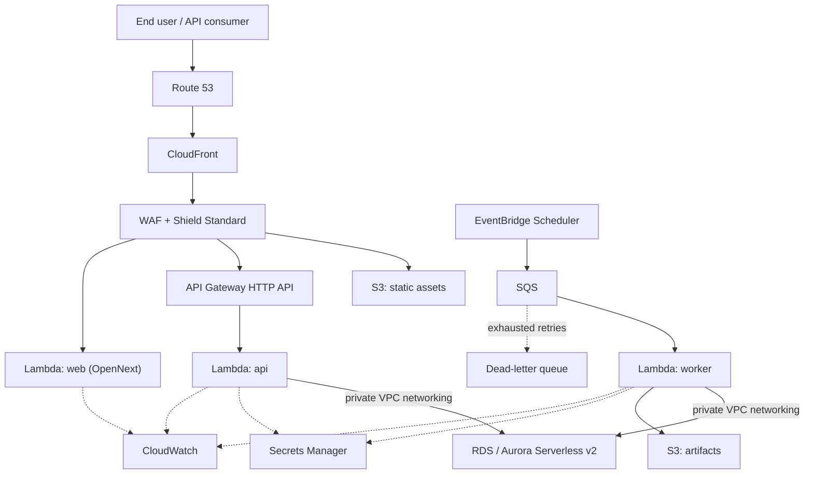

# AWS deployment

> The deep dive behind [blueprint.md](blueprint.md) §3.4, ADR-0010, and the deployment diagram [`docs/diagrams/deployment.md`](../diagrams/deployment.md). **Nothing described here is deployed.** `infrastructure/terraform/` is a skeleton of module layout, not a running environment — see the closing section for exactly what that means.

This document assumes familiarity with [overview.md](overview.md)'s runtime-component list and [clean-architecture.md](clean-architecture.md)'s port/adapter split — the whole reason this deployment can be described in one document without touching `internal/application` is that every AWS-specific concern below (Lambda, SQS, S3, EventBridge) is an adapter choice, wired at the `internal/platform` composition root, behind ports the application layer already depends on.

## The Lambda-first topology

The core decision, from blueprint §3.4: FirmScout's traffic at launch is bursty and low-volume, and the brief's requirement for low idle cost and scale-to-zero rules out an always-on task set. The *same, unmodified* Go binary that runs under `docker compose up` runs in Lambda behind the AWS Lambda Web Adapter — no application code branches on "am I in Lambda."

This matters beyond convenience: it means the AWS deployment is never a separate thing that could silently drift from what's tested locally and in CI. Whatever passes `go test ./...` and the Compose smoke checks is, byte for byte, what gets packaged into the Lambda deployment artifact — there is no AWS-specific build step that could introduce a behavioural difference between "works on my machine" and "works in production."

| Component | Role |
| --- | --- |
| **Route 53** | DNS for `firmscout.dev`, `www.firmscout.dev` and `api.firmscout.dev`, all three aliases on the same CloudFront distribution ([ADR-0019](../adr/0019-public-domain-shape.md)); health-check-based failover is available but not required at MVP scale |
| **ACM** | One certificate covering `firmscout.dev`, `www.firmscout.dev` and `api.firmscout.dev`, auto-renewed. One certificate rather than one per name, so there is a single thing to keep valid |
| **CloudFront** | The single public entry point for all three hostnames: terminates TLS, caches static assets and cacheable public API responses, and routes to API Gateway or the web Lambda by path. Behaviours match on path, not host, so `/api/v1/*` reaches the API origin from either name; `api.firmscout.dev` is the documented and advertised base URL ([ADR-0019](../adr/0019-public-domain-shape.md)). Responses to authenticated requests are not cached at the edge at all, per threat T-13 in [security.md](security.md) |
| **WAF** | Attached to CloudFront: managed rule groups plus FirmScout-specific rate rules, the first layer of the layered rate-limiting design (blueprint §3.9) |
| **Shield Standard** | Baseline DDoS protection, included at no extra configuration for anything sitting behind CloudFront |
| **S3 (static assets)** | OpenNext's build output for `apps/web` — JS/CSS/image assets served directly by CloudFront, never touching Lambda |
| **S3 (artifacts)** | The AWS `ArtifactStore` adapter — content-addressed raw fetched artifacts, replacing the filesystem/PG-large-object adapter used locally |
| **API Gateway HTTP API** | Fronts the `api` Lambda; HTTP API (not REST API) chosen for lower cost and latency, consistent with the low-idle-cost decision |
| **Lambda: api** | `apps/api`, wrapped by the Lambda Web Adapter so the binary's own `net/http` server runs unmodified inside the Lambda execution environment |
| **Lambda: worker** | `apps/worker`'s job-processing logic, invoked per-message by SQS and on-schedule by EventBridge Scheduler, rather than running the worker's in-process loop continuously |
| **Lambda: web** | `apps/web` via OpenNext, serving server-rendered Next.js routes; CloudFront serves the static output directly and only invokes this Lambda for routes that need it |
| **EventBridge Scheduler** | Drives the periodic "check due sources" tick that, locally, is the worker's own loop timer |
| **SQS (+ DLQ)** | The AWS `JobQueue` adapter — replaces the PostgreSQL `SKIP LOCKED` adapter used locally and in Compose (ADR-0015); dead-letter queues catch jobs that exhaust their retry budget |
| **RDS or Aurora Serverless v2 PostgreSQL** | The one stateful dependency, in private subnets, reachable only from the api and worker Lambdas over private VPC networking |
| **Secrets Manager** | Database credentials, API provider keys, any other runtime secret — read by Lambda at cold start and cached, never baked into the deployment artifact |
| **CloudWatch** | Logs, metrics, and alarms for every Lambda and for RDS/Aurora; the OTel Collector (see [overview.md](overview.md)) can additionally export here or to the self-hosted stack, per environment |

**Honest downsides, stated rather than hidden (blueprint §3.4):** cold starts (a Go binary's are small — tens of milliseconds — but non-zero, and worse for the api/worker Lambdas because they sit inside the VPC for RDS access, which adds ENI attachment time); a 15-minute execution ceiling per invocation (irrelevant here — jobs are per-source and short); and less predictable unit cost under sustained high traffic than a fixed-capacity alternative. **Threshold to switch to Fargate**, stated as a measured condition rather than a guess: sustained request rate at which Fargate's monthly cost undercuts Lambda's, calculated from real traffic rather than assumed in advance — see "The Fargate alternative" below.

## The network boundary

**Public:** Route 53, CloudFront, WAF, Shield Standard, API Gateway, the S3 buckets serving through CloudFront (never addressed directly by clients — bucket policies restrict access to the CloudFront origin identity).

**Private:** RDS/Aurora PostgreSQL, in private subnets with no route to the internet, reachable only from Lambdas attached to the VPC.

**Why no NAT Gateway is required for the common case:** the components that need outbound internet access — the worker Lambda fetching manufacturer sources, the api Lambda calling out to an AI provider once one exists — are the *same* components that need VPC access to reach RDS. A NAT Gateway exists specifically to give VPC-attached resources outbound internet reachability, and it is a real, continuously metered cost regardless of traffic volume. The topology avoids it by keeping outbound fetching logically separate from the VPC-bound database path where possible: the fetcher's outbound calls to manufacturer sources and the AI provider do not require any AWS-internal resource, so a worker Lambda configuration that is *not* VPC-attached can perform them directly over the public internet via its own Lambda-managed ENI, with only the specific database-writing step of the pipeline needing VPC attachment (and hence RDS Proxy or a VPC-attached invocation path for that step alone). Where the worker's fetch-and-persist logic runs as a single VPC-attached Lambda invocation for simplicity (the default, since splitting fetch and persist into separate Lambda functions adds its own complexity), a NAT Gateway **is** needed for that Lambda's outbound fetch calls to reach manufacturer sources, and that is the trade-off actually being made: simplicity of one worker Lambda function versus the NAT Gateway's metered cost. The alternative that avoids the NAT Gateway entirely is splitting the worker into a non-VPC "fetch" step and a VPC-attached "persist" step connected by SQS — more moving parts, no NAT bill. Which shape ships is a cost-measurement decision, not a default this document prescribes; either is consistent with the architecture, because `Fetcher` and `UnitOfWork` are ports regardless of which Lambda function calls them.

## Environment topology

| Environment | Runtime | Database | Queue | What differs |
| --- | --- | --- | --- | --- |
| **Local (Compose)** | `docker compose up`: `apps/api`, `apps/worker`, `apps/web` as long-running containers | `postgres:17` container | PostgreSQL `SKIP LOCKED` adapter | No CDN, no WAF; observability stack (`otel-collector`, Prometheus, Loki, Tempo, Grafana) runs as additional Compose services, optional via a Compose profile |
| **Staging** | Same Lambda topology as production, separate account or namespace | Smaller RDS/Aurora instance class, same schema | SQS, separate queues from production | Lower quotas/budgets on AI escalation (once it ships), synthetic or anonymised data, open to broader internal access for testing |
| **Production** | Full Lambda topology above | RDS/Aurora sized for measured load, Multi-AZ | SQS with production-tuned DLQ alarms | Full WAF rule set, full budget ceilings, on-call alerting wired to CloudWatch alarms |

The binary itself does not know which environment it is in beyond configuration — `internal/platform` reads environment variables / Secrets Manager and wires the same use cases to either the Compose adapters or the AWS adapters. This is the concrete payoff of the port/adapter split in [clean-architecture.md](clean-architecture.md): the environment topology table above is entirely a `internal/platform` wiring concern, never an `internal/application` one.

A contributor validating a change locally and a maintainer validating the same change in staging are exercising the same `internal/application` code path against different adapters — a bug that only reproduces in one environment and not the other is, by construction, an adapter-layer or configuration bug, never a business-rule bug, which narrows the search space considerably when something behaves differently after a deploy.

## Deployment and rollback

- **A release is deployed** by building the Go binary (shared across `api`/`worker`/`cli`), packaging it for Lambda via the Lambda Web Adapter layer, and updating each Lambda function's code, plus deploying the OpenNext build output for the web Lambda and its S3 static assets. CI runs the full gate set (`gofmt`, `go vet`, `golangci-lint`, `archcheck`, `go test ./...`, `sqlc diff`, `npm run build`) before any deployment artifact is produced.
- **Migrations run relative to code deployment using expand-and-contract, never a destructive migration in the same deploy as the code that needs it.** Concretely: a migration that adds a nullable column or a new table deploys *before* the code that writes to it. A migration that removes a column or table deploys only *after* the code that stops reading/writing it has been running successfully for at least one full deploy cycle — never in the same change set as the code change that makes the old column obsolete. This two-step discipline is what makes rollback of the code deployment safe without a matching database rollback: an old binary redeployed after a "removal" migration would break, so the removal migration must not ship until no binary anywhere still expects the old shape.
- **Rollback of a bad deploy** is redeploying the previous Lambda function version (Lambda retains prior versions/aliases) — a code-only operation, deliberately decoupled from the database by the expand-and-contract discipline above, so rollback never requires a compensating migration in the common case. If a bad deploy *did* ship alongside a migration (a process violation, not the intended path), rollback additionally requires a forward-fix migration, never a destructive down-migration against a database that may already hold new-shape data.

## Secrets and IAM least privilege

Every secret (database credentials, AI provider API keys, any third-party webhook signing secret) lives in Secrets Manager, never in Lambda environment variables in plaintext and never in the Terraform state as a literal value. Secrets are read once at cold start and cached in memory for the life of the execution environment, rather than re-fetched on every invocation, which is both cheaper and reduces Secrets Manager throttling risk under concurrent load.

Least-privilege IAM, per component:

### Lambda: api

Read access to specific secrets (database credentials only); VPC ENI attach/detach permission (required to reach RDS/Aurora); CloudWatch Logs write. No S3 write access beyond what serving requires, which in practice is none — reads go through repositories, never direct S3 calls from an API handler.

### Lambda: worker

Read access to specific secrets (database credentials, and once a real AI provider adapter ships, the provider API key); VPC ENI attach/detach; `sqs:ReceiveMessage`/`DeleteMessage`/`ChangeMessageVisibility` scoped to its own queue only; S3 read/write scoped to the artifacts bucket prefix; CloudWatch Logs write. It does not have `sqs:SendMessage` to any queue other than a dead-letter path it owns — it consumes, it does not fan out to other queues.

### Lambda: web

CloudWatch Logs write only. It calls the public API exactly like any other client would, so it needs no direct database, secret, or artifact access at all — this is a deliberate simplification, not an oversight: the web Lambda's blast radius if compromised is bounded to "can call the public API," the same as any anonymous visitor.

### EventBridge Scheduler

`sqs:SendMessage` to the worker's queue only. It has no read access to anything and cannot invoke a Lambda function directly — the queue is the only path it has into the system, which keeps the scheduling trigger itself from being a privileged component.

### SQS

A redrive policy pointing at its own dead-letter queue; no cross-queue access. Each queue's access policy names the specific Lambda execution role permitted to consume it.

### RDS / Aurora

No outbound access of its own. Its security group allows inbound connections only from the api and worker Lambdas' security groups, on the PostgreSQL port — no other principal, including other AWS accounts or a bastion host, has a standing network path to it.

### CI/CD deploy role

Scoped to updating the specific Lambda functions and S3 buckets this project owns, and — for migrations — a narrowly-scoped database migration role distinct from the application's own runtime credentials. It never uses the broad administrative credentials a human operator might reach for during one-off investigation; that separation means a compromised CI pipeline cannot pivot into full account access.

No component holds a broader grant than stated above; a component needing a new permission is a reviewable Terraform change, not a runtime IAM policy edit applied by hand.

## Monitoring and alerting

CloudWatch is the baseline: every Lambda function ships structured logs and standard invocation/duration/error metrics automatically, and the OTel Collector (the same one described in [overview.md](overview.md)'s runtime-components table) can additionally export traces and metrics to the self-hosted Prometheus/Tempo/Grafana stack from within AWS, so the observability experience is not forced to fork between "local" and "production" tooling. The alarms that matter most operationally, once real traffic exists to tune thresholds against: DLQ depth greater than zero (an unmonitored dead-letter queue is a silent data-loss risk, not a curiosity), RDS/Aurora connection count approaching the instance's connection ceiling, Lambda error rate and p95 duration per function, and WAF blocked-request rate as an early signal of an abuse pattern the rate rules haven't yet been tuned to absorb cleanly. None of these alarms exist yet, for the same reason nothing else in this document is deployed — see the closing section.

## Disaster recovery

- **Backup strategy:** automated RDS/Aurora snapshots on a daily cadence plus continuous point-in-time recovery (PITR) within the engine's retention window; S3 buckets (artifacts and static assets) versioned, with artifacts additionally being reproducible in principle by re-fetching from the source (though re-fetching is not treated as a substitute for backup, since a source's content may have changed since the artifact was captured — the stored artifact is the historical record).
- **RPO and RTO, stated as goals**, not yet measured or contractually committed: an RPO on the order of minutes (bounded by PITR granularity) and an RTO on the order of an hour for a full database restore into a fresh RDS/Aurora instance, reconnecting the existing Lambda functions via updated Secrets Manager values. These are targets to design toward and validate with a real restore drill before they are quoted to a customer as an SLA — see blueprint §5's distinction between a "best effort" freshness commitment on lower tiers and a contractual SLA on Enterprise, which is the same honesty principle applied to recovery targets.
- **What a restore actually involves:** provision or identify the target RDS/Aurora instance, restore from the chosen snapshot or PITR timestamp, run `firmscout migrate` to confirm schema state matches what the current deployed binary expects (and apply forward migrations if the backup predates them), update Secrets Manager with the new connection details, redeploy or update the api/worker Lambda functions' configuration to point at the restored instance, and verify via the same smoke checks used after an ordinary deploy (`/healthz`, a known product lookup, a trace visible in the observability stack) before directing production traffic at it. Nothing in this sequence is scripted or drilled yet — it is a documented procedure, not a rehearsed one, which is itself a known gap this document does not paper over.
- **What is deliberately out of scope for backup:** the artifact store's *reproducibility-in-principle* from re-fetching is not treated as disaster recovery for the artifact bucket itself — S3 versioning and cross-region replication (once traffic justifies the cost) are the actual backup mechanism, precisely because a re-fetch changes the historical record rather than restoring it. Similarly, the Git-versioned registry (`dataset/`, `collectors/config/`) is backed up the same way any Git repository is — by GitHub's own durability plus every contributor's local clone — and is not a database-restore concern at all.
- **Why this matters more than it might seem to:** PostgreSQL is the concentration point for essentially all of FirmScout's value that isn't reproducible from the registry — every published release, every piece of evidence, every audit trail. A restore procedure that has never actually been rehearsed is, honestly, the single biggest gap between "documented architecture" and "operationally trustworthy platform" in this entire document set, and it is named as such rather than glossed over.

## The Fargate alternative

Fargate remains the documented alternative for exactly one measured condition: **sustained request or job-processing rate at which Fargate's monthly cost, computed from real traffic rather than assumed, undercuts the equivalent Lambda invocation cost** — or a workload that genuinely needs long-lived connections Lambda's execution model doesn't fit well (a persistent WebSocket stream, for instance, which nothing in the current design needs). Because the deployed artifact is the same unmodified Go binary in both cases, switching is an infrastructure change, not an application rewrite: the same `apps/api` and `apps/worker` binaries run as long-lived processes in Fargate tasks behind an ALB instead of behind API Gateway/Lambda, and the `JobQueue` port's SQS adapter is unaffected either way (Fargate tasks can consume SQS exactly as Lambda does, via a long-poll loop instead of an event-source mapping). This alternative is documented, not built: no Fargate task definition, ALB, or ECS service exists in `infrastructure/terraform/` today.

What would actually trigger the switch, concretely: a month of production CloudWatch billing data showing Lambda's per-invocation cost for the api function exceeding what an equivalently-available pair of small Fargate tasks behind an ALB would cost for the same measured request volume, sustained rather than a single spike. Until that measurement exists, adopting Fargate pre-emptively would be the same mistake ADR-0010 already rejected once — paying for always-on compute against a traffic profile that hasn't earned it yet.

Worth noting explicitly: adopting Fargate does not touch the persistence, queue, or artifact-store ports at all. `PostgreSQL`, the `JobQueue` port's SQS or PostgreSQL adapter, and the `ArtifactStore` port's S3 adapter are all identical regardless of which compute layer invokes them — the only thing that changes is what invokes `apps/api` and `apps/worker`, and how.

An intermediate option worth naming, though not currently planned: a hybrid where the api Lambda stays on Lambda (its bursty, low-average-load traffic shape is exactly Lambda's strength) while only the worker moves to Fargate, if the worker's job-processing volume grows into the sustained range while the API's request volume stays bursty. The two compute layers do not have to move together, because they are two separate Lambda functions today and would be two separate deployable units under Fargate as well.

The web Lambda (OpenNext) is a third, independent compute layer with its own traffic shape (page renders, not API calls), and the same reasoning applies to it separately again — a decision to move the worker to Fargate says nothing about whether the web tier should follow.

## What is NOT built yet

Stated without hedging, because a reader of this document should not come away thinking any of the above is running: **`infrastructure/terraform/` is a skeleton of module layout — directory structure and, where present, provider/variable scaffolding — not a deployed environment.** No Route 53 zone, CloudFront distribution, WAF web ACL, API Gateway, Lambda function, RDS/Aurora instance, SQS queue, or Secrets Manager secret described in this document currently exists in any AWS account for this project. The only environment that runs today, per [blueprint.md](blueprint.md)'s vertical-slice scope, is local Docker Compose — and even that is exercised, not continuously operated. Every cost figure implied by "Lambda idle cost approaches the database bill alone" is a design intent, not a measurement, until a real deployment exists to measure. Treat every section above as the target architecture this deployment will grow into, not a description of infrastructure a reader could `terraform plan` today and expect to match reality.

Concretely, what does exist today and what a reader can rely on right now: the Go binaries themselves, built and testable; the Compose topology in `infrastructure/docker/`, runnable; and the `internal/adapters/*` ports whose AWS-specific implementations (the SQS `JobQueue` adapter, the S3 `ArtifactStore` adapter, an EventBridge `EventPublisher` adapter) this document describes but which have not yet been written. Building those adapters, and the Terraform to provision what they talk to, is the next concrete step toward everything above being true rather than planned.

If you are picking up work on the AWS deployment, start there — the port interfaces already exist in `internal/application`, per [clean-architecture.md](clean-architecture.md), so writing a new adapter is additive work behind an existing contract, not a redesign.

That single property — every AWS-specific piece of this document being an adapter behind a port that already has a working local implementation — is why this document can describe an entire cloud topology with confidence about *how* it will integrate, while being completely honest that *none of it exists yet*.
