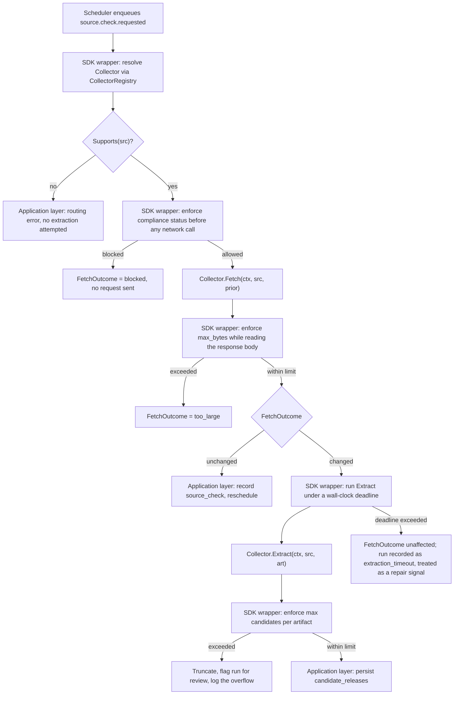

# Collector SDK

> Expands [blueprint §13](blueprint.md#13-collector-sdk). Authoritative for the `Collector` contract, its supporting types, and how a contributor writes and tests a collector. The companion specification for configuration-driven collectors (the common case) is [collector-config-spec.md](collector-config-spec.md); the practical, example-first walkthrough is [`docs/collectors/developing-collectors.md`](../collectors/developing-collectors.md).

## 1. Why a collector SDK exists at all

FirmScout's central economic claim (blueprint §1) is that monitoring tens of thousands of vendor sources is boring, not exceptional. That claim only survives contact with reality if the thing that talks to a vendor site is cheap to run, safe to run against attacker-influenceable input, and produces output that can be trusted without re-deriving trust from the network every time. The SDK is where those three properties are enforced mechanically rather than left to each collector author's discipline.

The SDK has three jobs:

1. Define the `Collector` interface and the value types collectors exchange, so every collector — config-driven or hand-written — looks the same to the rest of the platform.
2. Enforce resource limits and the fetch/extract separation around whatever a collector implementation does, so a misbehaving or malicious collector cannot exceed a byte budget, a time budget, or a publishing privilege it was never granted.
3. Give a contributor a fixture-testing harness that makes "does this collector still work" a millisecond-scale, offline question.

## 2. The `Collector` interface

```go
// Package collector defines the contract every FirmScout collector — whether
// generated from a YAML configuration or hand-written as Go — must satisfy.
// A Collector never talks to a repository and is never given one; it is
// structurally incapable of publishing (see §6).
package collector

import "context"

// Collector turns a registered Source into candidate release observations.
// Implementations must be safe for concurrent use: the worker may run the
// same Collector value against many sources concurrently.
type Collector interface {
	// ID returns a stable identifier for this collector implementation, for
	// example "html_selectors", "text_regex", or "vendor.fortinet.docs" for
	// a hand-written collector. ID must never change once a collector has
	// produced evidence in production: evidence rows reference it, and a
	// changed ID makes past extractions unexplainable. Renaming a collector
	// means registering a new ID and migrating sources to it explicitly,
	// not editing ID() in place.
	ID() string

	// Version returns the collector's behavioural version, for example "3"
	// or "2026-08-14". It must be bumped whenever a change to this
	// collector could produce different candidates from the same artifact
	// than a prior version would have: a new or changed selector, a
	// different date-parsing rule, a new field being extracted, a changed
	// transform. It must NOT be bumped for changes with no behavioural
	// effect (a comment, a reordered struct field, a refactor with
	// identical output on every existing fixture). Version is recorded on
	// every Evidence value this collector produces (§4.5), which is what
	// lets a reviewer look at an old candidate and know exactly which
	// extraction logic produced it, months or years later.
	Version() string

	// Vendor returns the vendor slug this collector is specific to, or ""
	// for a generic, reusable engine (the config-driven engines are all
	// vendor-agnostic and return ""). A hand-written collector that only
	// ever makes sense for one vendor's site returns that vendor's slug.
	Vendor() string

	// Supports reports whether this collector is capable of handling src.
	// It must be cheap and side-effect-free: no network call, no file I/O,
	// no allocation proportional to anything but src itself. The
	// CollectorRegistry calls Supports to route a Source to a collector,
	// including trying several candidates in ambiguous cases, so a slow or
	// side-effecting Supports implementation is a routing-time cost paid
	// on every scheduling pass, not just once.
	Supports(src Source) bool

	// Fetch retrieves the current state of src and reports what changed.
	// prior is the FetchState recorded from this source's last successful
	// check, or nil if this is the first check. Fetch MUST issue a
	// conditional request (If-None-Match / If-Modified-Since) whenever src
	// and prior make one possible — this is verified by the SDK's shared
	// Fetcher and by the collector contract test, not left to each
	// implementation's discretion, because an implementation that always
	// re-fetches the full body defeats the entire cost model.
	//
	// Fetch owns the network access. Extract (below) never gets any.
	// A collector that needs multiple HTTP requests to assemble one
	// artifact (pagination, a two-step API) does all of that inside
	// Fetch and returns one assembled Artifact — Extract still only ever
	// sees the result.
	Fetch(ctx context.Context, src Source, prior *FetchState) (Artifact, FetchOutcome, error)

	// Extract turns a fetched Artifact into candidate release observations.
	// Extract is a pure function of (src, art) — see §5 for exactly what
	// that means and why it is not negotiable. It returns as many
	// candidates as the artifact actually supports; returning zero
	// candidates from a successfully fetched artifact is a valid and
	// common result (a changelog page with no new entries since the
	// selector last matched), not an error.
	Extract(ctx context.Context, src Source, art Artifact) ([]CandidateRelease, error)
}
```

Every method's contract above is enforced somewhere concrete: `Supports` and `ID`/`Version`/`Vendor` stability by the collector contract test (`collectortest.RunContract`, run once per collector in CI); the conditional-request requirement on `Fetch` by the shared `Fetcher` that config-driven and well-behaved code collectors use, and by a contract test that runs a collector twice against an unchanged fixture server and asserts the second call sent `If-None-Match` or `If-Modified-Since`; purity of `Extract` by the fact that it is literally not given the means to violate it (§5); and the publishing prohibition by the type system (§6).

## 3. Supporting types

These are the value types that flow through the interface above. All of them live in `collectors/sdk` and are plain data — no methods that reach outside the package, no embedded interfaces to infrastructure.

### 3.1 `Source`

```go
// Source is the read-only view of a registered source a Collector operates
// against. It is assembled by the application layer from the sources
// registry table (itself synchronised from dataset/sources/ YAML) and
// passed in — a Collector never loads its own Source.
type Source struct {
	ID       string // stable source id, e.g. "mikrotik.changelogs"
	Vendor   string // vendor slug, e.g. "mikrotik"
	URL      string // the source URL to fetch
	Kind     SourceKind // html, text, json, xml, pdf, rss_atom
	Config   json.RawMessage // the collector-config document for this source, if any (§ collector-config-spec.md); nil for code collectors
	Compliance ComplianceStatus // robots and terms status; a Collector must refuse to Fetch a source whose Compliance forbids it
}

// SourceKind is a coarse hint at the source's content shape, used for
// routing and for choosing a default fetch Accept header. It is not a
// substitute for checking the actual Content-Type returned.
type SourceKind string

const (
	SourceKindHTML    SourceKind = "html"
	SourceKindText    SourceKind = "text"
	SourceKindJSON    SourceKind = "json"
	SourceKindXML     SourceKind = "xml"
	SourceKindPDF     SourceKind = "pdf"
	SourceKindRSSAtom SourceKind = "rss_atom"
)

// ComplianceStatus mirrors the source registry's robots_policy_status and
// terms_review_status fields (DATA_SOURCES.md). A Collector — and the SDK
// wrapper around it — must treat anything other than Allowed as a reason
// to refuse Fetch, not merely a warning.
type ComplianceStatus struct {
	RobotsPolicy RobotsPolicyStatus // allowed | disallowed | not_checked
	TermsReview  TermsReviewStatus  // pending | reviewed_ok | reviewed_blocked
}
```

`Source` is deliberately a read model, not the domain `Source` entity. It carries only what a collector needs to do its job, so a collector cannot reach into fields (internal scheduling state, health-check history) that are none of its business.

### 3.2 `Artifact`

```go
// Artifact is exactly what was retrieved from a Source at a point in time:
// the raw bytes and the response metadata needed to reason about them. It
// carries no interpretation — no parsed HTML, no extracted fields.
type Artifact struct {
	Body            []byte
	ContentType     string
	StatusCode      int
	ETag            string    // from the response, empty if not sent
	LastModified    time.Time // zero value if not sent
	FetchedAt       time.Time // when this artifact was retrieved; set by Fetch, read (never computed) by Extract
	ContentHash     string    // SHA-256 of Body, hex-encoded; computed once by the SDK wrapper, not by each collector
	URLAfterRedirects string  // the final URL after following redirects, for evidence
}
```

`FetchedAt` is the one place a clock value legitimately enters this pipeline: it is stamped by `Fetch` (or by the SDK's `Fetcher` on its behalf) at the moment of retrieval, then carried as plain data. `Extract` reads it but never calls `time.Now()` itself — see §5.

### 3.3 `FetchState`

```go
// FetchState is what a Collector needs from the prior successful check to
// make this one conditional. It is loaded by the application layer from
// the last source_checks row and passed to Fetch; a Collector never reads
// or writes source_checks itself.
type FetchState struct {
	ETag         string
	LastModified time.Time
	ContentHash  string // the prior artifact's content hash, for collectors relying on normalised-section hashing rather than conditional HTTP (developing-collectors.md, "cheapest change signal")
}
```

### 3.4 `FetchOutcome`

```go
// FetchOutcome classifies the result of Fetch beyond the raw HTTP status,
// so the application layer can decide what happens next (reschedule,
// extract, or raise a repair signal) without re-deriving that decision
// from status codes scattered across the codebase.
type FetchOutcome string

const (
	FetchUnchanged             FetchOutcome = "unchanged"              // 304, or hash matched FetchState.ContentHash
	FetchChanged               FetchOutcome = "changed"                // new content, Artifact is populated and worth extracting
	FetchAuthenticationRequired FetchOutcome = "authentication_required" // source demands auth FirmScout does not have; a legitimate, expected outcome for some sources (e.g. Fortinet firmware downloads), not a failure to alert on
	FetchNotFound              FetchOutcome = "not_found"              // 404 or equivalent; candidate signal that the source relocated
	FetchBlocked               FetchOutcome = "blocked"                // robots or compliance status forbade the request; Fetch must return this instead of attempting the request at all
	FetchTooLarge              FetchOutcome = "too_large"              // response exceeded the configured max_bytes before completion
	FetchFailed                FetchOutcome = "failed"                 // transport error, timeout, unexpected content type, or any other retryable problem
)
```

### 3.5 `CandidateRelease`

```go
// CandidateRelease is everything a Collector believes it observed about
// one release. It is not a Release: it has no ID, no publication status,
// and no say in whether it becomes one. ValidateCandidateRelease and
// PublishRelease (application-layer use cases) decide that, using the
// gates in blueprint §16.
type CandidateRelease struct {
	RawVersion        string          // exactly as it appeared at the source; never reformatted
	NormalizedVersion string          // whitespace/casing normalised only; may equal RawVersion; never semver-parsed (blueprint §3.5, ADR-0017)
	ReleaseDate       PartialDate     // the precision the source actually supports — never upgraded
	ReleaseType       string          // constrained vocabulary, e.g. "embedded_os", "bios", "bmc_firmware", "driver"
	Channel           string          // constrained vocabulary, e.g. "stable", "long_term", "testing", "development"; "" if the source does not distinguish channels
	Applicability     Applicability   // which product(s)/variant(s) this candidate is believed to apply to
	Evidence          Evidence        // provenance for this specific candidate
	Confidence        float64         // in [0,1]; a Collector's own estimate of extraction reliability, input to (not a substitute for) the validation gates
}
```

Two absences are deliberate and load-bearing: there is no `ReleaseID` field (a candidate cannot reference a release it did not create), and there is no `PublishedAt` or `Status` field (publication state belongs to the domain `CandidateRelease` entity that the application layer constructs from this SDK value, not to the collector's output).

### 3.6 `Evidence`

```go
// Evidence is the provenance record a candidate (and later, a published
// Release) carries. Every fact FirmScout publishes must be traceable back
// to one of these (blueprint principle: "evidence first").
type Evidence struct {
	SourceURL        string    // exact URL fetched, after redirects
	RetrievedAt      time.Time // == Artifact.FetchedAt; not recomputed
	ContentHash      string    // == Artifact.ContentHash
	Excerpt          string    // the minimal text supporting this candidate; concise, never the full document (licensing.md §"third-party content")
	CollectorID      string    // == Collector.ID()
	CollectorVersion string    // == Collector.Version(), at the time this candidate was produced
	DiscoveryMethod  string    // "conditional_http" | "section_hash" | "feed" | "api" — how the change was detected, for cost auditing (developing-collectors.md, "cheapest change signal")
}
```

### 3.7 `PartialDate`

```go
// PartialDate is a date carrying its own precision, so a collector that
// only ever observed a month cannot accidentally claim a day (blueprint
// principle: "no invented precision"). Zero value is the invalid state;
// use the constructors.
type PartialDate struct {
	precision DatePrecision
	year      int
	month     int // 1-12; 0 if precision < MonthOnly
	day       int // 1-31; 0 if precision < ExactDay
}

type DatePrecision string

const (
	PrecisionExactDay  DatePrecision = "exact_day"
	PrecisionMonthOnly DatePrecision = "month_only"
	PrecisionYearOnly  DatePrecision = "year_only"
	PrecisionUnknown   DatePrecision = "unknown"
)

// NewExactDate constructs a PartialDate with day precision. Returns an
// error if the calendar date is invalid.
func NewExactDate(year, month, day int) (PartialDate, error)

// NewMonthDate constructs a PartialDate with month precision. There is
// intentionally no way to later ask this value for a day: Day() panics
// unless Precision() == PrecisionExactDay, and JSON/DB encoders must
// check precision before serialising, per blueprint §11's DB constraint
// that mirrors this rule.
func NewMonthDate(year, month int) (PartialDate, error)

// NewYearDate constructs a PartialDate with year precision only.
func NewYearDate(year int) (PartialDate, error)

// UnknownDate returns the explicit "no usable date" value. This is
// distinct from a zero PartialDate: UnknownDate() is a valid, constructed
// value that renders as "date omitted", never as an error or as 0001-01-01.
func UnknownDate() PartialDate

func (d PartialDate) Precision() DatePrecision
func (d PartialDate) Year() int  // valid whenever Precision() != PrecisionUnknown
func (d PartialDate) Month() int // panics unless Precision() is ExactDay or MonthOnly
func (d PartialDate) Day() int   // panics unless Precision() is ExactDay
```

A collector never has a reason to fabricate a day it did not observe. If a config's `regex` only captures `YYYY-MM`, the config must declare `precision: month_only` (collector-config-spec.md §"date precision handling"), and the engine constructs a `PartialDate` via `NewMonthDate`, which has no path to a day value at all.

### 3.8 `Applicability`

```go
// Applicability is the Collector's best-effort statement of which
// product(s) and variant(s) a candidate applies to. It is a hint, not a
// resolved product reference: identity resolution against the product
// catalogue (exact match, alias match, or "ambiguous, route to review")
// is validation gate 1 in blueprint §16, performed by the application
// layer, never by the collector.
type Applicability struct {
	ProductHint      string // slug or free-text hint the collector believes identifies the product, e.g. "mikrotik-routeros"
	FamilyHint       string // product-family hint, when a candidate applies to a whole family rather than one product
	HardwareRevision string // "" if not applicable or not stated by the source
	Region           string // "" if not region-specific
	DeploymentMode   string // "" if not applicable, e.g. "cloud", "on_prem", "container" for products with meaningfully different builds
}
```

## 4. Lifecycle of a collector run



The wrapper — not the collector — owns every box in this diagram labelled "SDK wrapper" or "Application layer". A collector implementation only ever supplies the four interface methods; everything that keeps a misbehaving or compromised collector from harming the platform sits outside it, in code the collector cannot see or influence:

- **Max artifact bytes** (`fetch.max_bytes` in config, or a code collector's declared limit): the wrapper's `io.LimitedReader` stops reading before a collector's `Fetch` implementation can buffer an unbounded response, regardless of whether the collector itself would have checked.
- **Extraction wall-clock limit**: `Extract` runs with a `context.Context` carrying a deadline the wrapper sets, and the wrapper does not trust `Extract` to respect it cooperatively — it is invoked from a goroutine the wrapper can abandon (recording a timeout) if the deadline passes, which matters for defending against pathological regex backtracking against attacker-controlled HTML.
- **Max candidates per artifact**: the wrapper truncates and flags rather than trusting a collector not to return an implausible flood of candidates from one artifact — this is a defence against both bugs and a maliciously crafted source trying to overwhelm the validation pipeline.

This mirrors the architectural rule the rest of the platform follows: a limit that lives only inside the thing being limited is not a limit.

## 5. Why `Extract` is a pure function of `(Source, Artifact)`

`Extract` receives no `Clock`, no repository, and no network handle — not as an oversight, but because each of those, if available, would quietly let extraction logic depend on something outside the artifact it was given:

- **No clock.** If `Extract` could call `time.Now()`, two runs of the same collector against the same artifact, on different days, could produce different `RetrievedAt` values or different plausibility judgements. `FetchedAt` is already on the `Artifact`, stamped once by `Fetch`; that is the only "now" extraction ever needs, and it is data, not a capability.
- **No repository.** If `Extract` could query "does this product exist" or "is this a duplicate", extraction would silently start doing the validation layer's job (blueprint §16, gates 1 and 4), and a fixture test's outcome would depend on database state the fixture file cannot express. Identity resolution and duplicate detection stay in the application layer, where they belong and where they are testable with fakes instead of fixtures.
- **No network.** All network access already happened inside `Fetch`. If `Extract` could make its own requests, an artifact would stop being a complete, replayable input — the same "artifact" could extract differently depending on what a follow-up request returned at run time.

**What this buys, concretely:** a fixture recorded once — an HTML file, a JSON body, a plain-text response — pinned next to an `expected.json`, will produce byte-identical `CandidateRelease` output five years from now, on any machine, with no network access, regardless of what changed elsewhere in the system. That is what makes `collectortest.RunFixtures` (§8) a meaningful regression test rather than a snapshot that happens to pass today. It also makes a collector's behaviour fully auditable from its fixtures: reading the fixture pairs tells a reviewer everything `Extract` does, without reading the implementation.

## 6. Why collectors cannot publish — a type constraint, not a guideline

The prohibition on collectors publishing releases is not a code-review rule anyone has to remember. It is structural:

- `Collector.Extract` returns `[]CandidateRelease` (§3.5), and `CandidateRelease` has no field that could reference or construct a `releases` row — no `ReleaseID`, no `PublishedAt`, no persistence method.
- Collector adapters — both the config-driven engine and any hand-written `collectors/vendors/<vendor>` package — are constructed and invoked with **no repository handle at all**. There is no `ReleaseRepository`, no `*sql.DB`, no `UnitOfWork` reachable from inside a `Collector` implementation, because nothing in the `Collector` interface or the SDK wrapper around it passes one in. A collector cannot call a method it was never given a receiver for.
- Publication happens exclusively through `ValidateCandidateRelease` and `PublishRelease`, application-layer use cases that hold the real `ReleaseRepository` and apply the ten gates in blueprint §16. Those use cases accept a `CandidateRelease` value, not a `Collector`, and have no code path that lets a collector's output skip validation.

The consequence: even a maliciously crafted collector configuration, or a hand-written collector with a bug that fabricates a thousand candidates, cannot write a single row to `releases`. The worst it can do is produce bad candidates, which the validation gates and, where they are insufficient, a human reviewer, are positioned to catch. This is the same reasoning as `internal/archtest`'s dependency check (blueprint §7.2) applied one layer down: a rule enforced by the type system survives a tired contributor and a code-review miss; a rule enforced by a comment does not.

## 7. Versioning `Version()`

Bump `Version()` when, and only when, a change could alter what `Extract` produces from an artifact that previously produced something:

**Bump for:**
- A changed, added, or removed selector, XPath, regex, or JSON path in a code collector (the equivalent change to a *config* bumps `metadata.version` in the config file instead — see collector-config-spec.md §"versioning policy" — but the running engine's own `Version()` is bumped when the *engine's* interpretation of that config changes).
- A changed date-parsing rule, precision inference, or channel/release-type mapping.
- A changed normalisation step that affects `NormalizedVersion` or the section hash used for change detection.
- A bug fix that changes output for any previously-passing fixture.

**Do not bump for:**
- A refactor with identical output on every existing fixture (verified by running the fixture suite before and after).
- A comment, log message, or internal variable rename.
- A performance change with no output difference.

**Where the version is recorded:** every `CandidateRelease.Evidence.CollectorVersion` (§3.6) is stamped with the exact `Version()` value that produced it, at extraction time, and that value is carried through to the published `Release`'s evidence row unchanged. A reviewer looking at a release published eight months ago can look up `collector_version` on its evidence, find that exact version's fixtures in version control history, and know precisely what extraction logic ran — without needing the current `main` branch's collector to still behave the same way. This is what makes "explain this past extraction" a solved problem rather than an archaeology exercise.

## 8. The fixture test helper: `collectortest.RunFixtures`

```go
// RunFixtures runs c against every fixture found in dir and compares the
// result to that fixture's expected.json. It is the standard, and for
// most collectors the only, test a contributor writes.
func RunFixtures(t *testing.T, c Collector, dir string)
```

**Directory convention:**

```
testdata/fixtures/<vendor>/<source-id>/
  001-basic/
    README.md            # provenance: source URL, retrieval timestamp, content hash
    artifact.html         # (or .json / .txt / .xml) the trimmed, recorded response body
    expected.json          # the CandidateRelease slice this artifact must produce
  002-month-only-date/
    README.md
    artifact.html          # synthetic, labelled as such in README.md
    expected.json
  003-layout-change-selector-miss/
    README.md
    artifact.html          # synthetic: deliberately broken structure
    expected.json           # expected.json declares zero candidates and, where applicable, an expected error
```

`RunFixtures(t, collector, "testdata/fixtures/mikrotik/changelogs")` walks every numbered subdirectory, reads `artifact.<ext>` as the `Artifact.Body` (with `ContentType` inferred from the extension unless the fixture's `README.md` front matter overrides it), calls `Extract` (never `Fetch` — fixtures are extraction tests, not network tests), and diffs the result against `expected.json`, field by field, with a readable diff on mismatch.

**`expected.json` format:**

```json
{
  "candidates": [
    {
      "rawVersion": "7.24.2",
      "normalizedVersion": "7.24.2",
      "releaseDate": { "precision": "exact_day", "value": "2026-09-02" },
      "releaseType": "embedded_os",
      "channel": "stable",
      "applicability": { "productHint": "mikrotik-routeros" },
      "evidenceExcerptContains": "7.24.2",
      "confidenceAtLeast": 0.8
    }
  ]
}
```

`releaseDate.value` is formatted per its own `precision` (`YYYY-MM-DD`, `YYYY-MM`, or `YYYY`; omitted for `unknown`), matching the API rendering rule in [api.md](api.md#date-rendering-discipline) so a contributor internalises the same discipline in both places. `evidenceExcerptContains` and `confidenceAtLeast` are intentionally loose assertions rather than exact-match, because an excerpt's exact boundaries and a confidence score's exact float are the kind of thing that should be free to improve without rewriting every fixture; the fields that must match exactly — version, date, type, channel, applicability — are compared exactly.

**Adding a collector, in practice:** for the common config-driven case, a contributor adds a `collectors/config/<vendor>/<source>.yaml` file (collector-config-spec.md) and one fixture pair under `testdata/fixtures/<vendor>/<source>/`. No Go code is written or reviewed for the extraction logic itself — the engine (`html_selectors`, `text_regex`, …) is already tested against its own fixture corpus. Adding a hand-written collector additionally means implementing the four `Collector` methods and registering it with the `CollectorRegistry`, but the testing story is identical: `RunFixtures` against the same directory convention.

## 9. Recording a fixture responsibly

A fixture is a piece of a vendor's published page, checked into a public, permissively licensed repository, forever (or until deliberately removed). That has real constraints:

- **Trim to the minimum.** Do not commit a full 400 KB page when the extraction logic only ever looks at one `<div class="changelog-header">`. Keep enough surrounding structure that the selector or regex is exercised realistically (including the elements around the target, so a selector that's accidentally too greedy would be caught), and delete the rest — navigation chrome, unrelated page sections, tracking scripts, anything not load-bearing for the test.
- **Record provenance in `README.md`**, at minimum: the exact source URL fetched, the retrieval timestamp (UTC), and the SHA-256 content hash of the *original, untrimmed* response, so a maintainer can later verify the trimmed fixture is a faithful excerpt rather than silently drifted or fabricated. State plainly whether the fixture is a **recorded** excerpt of a real response or a **synthetic** one constructed to exercise an edge case (a missing field, a month-only date, a deliberately broken selector target) — never leave a reader to guess which.
- **Never commit a full copyrighted document.** Release notes, changelogs, and PDFs are the vendor's copyrighted text. A trimmed fixture exercising the extraction path is fair use territory for a test artifact; a complete mirrored document is not, and it is also unnecessary — extraction logic needs structure, not content completeness. This is the same discipline as the evidence excerpt rule in [licensing.md](licensing.md#third-party-content): concise, for verification, never a full copy.
- **Never make a test depend on a live site.** This is repeated because it is the rule most tempting to break under time pressure — "just fetch the real page in the test, it's easier" — and it is the rule §7.8 of the blueprint calls absolute. A collector test suite that can fail because a vendor redesigned their site teaches contributors to ignore CI failures, which is a worse outcome than the fixture going briefly stale.

## 10. Choosing configuration-driven versus code

Default to a configuration-driven collector (collector-config-spec.md) for any new source. Reach for a code collector — a hand-written `collectors/vendors/<vendor>` package implementing `Collector` directly — only when a concrete signal says a declarative engine cannot express the source:

| Signal | Why config cannot express it |
| --- | --- |
| **Authentication beyond a static header** | Login flows, OAuth, session cookies, or CSRF-token dances need imperative control flow a selector/regex config has no vocabulary for. (Note: per DATA_SOURCES.md, this only applies to authentication FirmScout is actually authorised to automate — most authenticated download portals stay out of scope entirely, e.g. Fortinet's firmware downloads.) |
| **Complex pagination** | "Follow the next-page link until a stop condition observed in the response" is a loop with a termination check, not a selector. |
| **Request signing** | HMAC signatures, timestamp-bound tokens, or vendor-specific request signing require code, not declarative field mapping. |
| **Multi-page joins** | Correlating a version listed on page A with a release date only present on page B is a join the config engines do not support (a signal that a new engine capability might be worth proposing, per developing-collectors.md, rather than defaulting straight to code). |
| **Vendor-specific normalisation** | A vendor whose version strings need bespoke parsing beyond the `transform` vocabulary (collector-config-spec.md §"transform vocabulary") — for example, a compound identifier that encodes both a build number and a hardware SKU that must be split with vendor-specific logic. |
| **PDF or proprietary formats** | Until `pdf_text` ships as a config engine (collector-config-spec.md §"engines"), any PDF-based source (Poly/HP release notes) needs a code collector, or waits for that engine. |

The rule of thumb from developing-collectors.md is worth restating here because it is the failure mode to avoid: if a config starts wanting `if`/`else`, loops, or string manipulation beyond a `transform` pipeline, that is a sign the *source* needs a code collector — not a sign the config engine should grow an ad hoc scripting capability. An unreviewable YAML-flavoured programming language is a worse outcome than an honest Go package.

## 11. Worked walkthrough: writing a code collector

This walks through the shape of a hand-written collector for a hypothetical source that needs two HTTP requests to assemble one artifact — a JSON index listing release IDs, and a per-release detail fetch — which no MVP config engine expresses.

```go
package fortinetpsirt

import (
	"context"
	"crypto/sha256"
	"encoding/hex"
	"time"

	"github.com/macimottin/firmscout/collectors/sdk"
)

// Collector implements sdk.Collector for Fortinet's PSIRT advisory feed.
// It is a code collector because the feed's follow-up detail fetch (a
// second request per advisory) is a join no config engine expresses yet.
type Collector struct {
	fetcher sdk.Fetcher // the shared, SSRF-guarded fetcher; injected, never constructed internally
}

func New(fetcher sdk.Fetcher) *Collector {
	return &Collector{fetcher: fetcher}
}

func (c *Collector) ID() string     { return "vendor.fortinet.psirt" }
func (c *Collector) Version() string { return "1" }
func (c *Collector) Vendor() string  { return "fortinet" }

func (c *Collector) Supports(src sdk.Source) bool {
	return src.Vendor == "fortinet" && src.Kind == sdk.SourceKindRSSAtom
}

func (c *Collector) Fetch(ctx context.Context, src sdk.Source, prior *sdk.FetchState) (sdk.Artifact, sdk.FetchOutcome, error) {
	// The shared Fetcher enforces the conditional-request contract; this
	// collector only decides *what* to fetch, never bypasses it.
	resp, outcome, err := c.fetcher.Get(ctx, src.URL, prior)
	if err != nil || outcome != sdk.FetchChanged {
		return sdk.Artifact{}, outcome, err
	}
	// Assemble one Artifact from the feed body; any follow-up requests
	// this source needs happen here too, before Extract ever runs, so
	// Extract still receives one complete, replayable Artifact.
	sum := sha256.Sum256(resp.Body)
	return sdk.Artifact{
		Body:          resp.Body,
		ContentType:   resp.ContentType,
		StatusCode:    resp.StatusCode,
		ETag:          resp.ETag,
		LastModified:  resp.LastModified,
		FetchedAt:     resp.FetchedAt,
		ContentHash:   hex.EncodeToString(sum[:]),
	}, sdk.FetchChanged, nil
}

func (c *Collector) Extract(ctx context.Context, src sdk.Source, art sdk.Artifact) ([]sdk.CandidateRelease, error) {
	entries, err := parseRSS(art.Body) // pure parsing, no I/O
	if err != nil {
		return nil, err
	}
	candidates := make([]sdk.CandidateRelease, 0, len(entries))
	for _, e := range entries {
		date, precision := parseAdvisoryDate(e.PubDate) // pure; falls back to a coarser PartialDate rather than guessing a day
		candidates = append(candidates, sdk.CandidateRelease{
			RawVersion:        e.AffectedVersion,
			NormalizedVersion: normalizeVersion(e.AffectedVersion), // trim/case only, never semver
			ReleaseDate:       date,
			ReleaseType:       "advisory",
			Channel:           "",
			Applicability:     sdk.Applicability{ProductHint: e.ProductHint},
			Evidence: sdk.Evidence{
				SourceURL:        art.URLAfterRedirects,
				RetrievedAt:      art.FetchedAt,
				ContentHash:      art.ContentHash,
				Excerpt:          truncate(e.Summary, 400),
				CollectorID:      c.ID(),
				CollectorVersion: c.Version(),
				DiscoveryMethod:  "feed",
			},
			Confidence: 0.9,
		})
	}
	return candidates, nil
}
```

Notes on why this is shaped the way it is:

- `Fetch` takes a `Fetcher` by dependency injection rather than constructing its own `http.Client`; this is what lets the SDK wrapper's size and SSRF guards apply uniformly, and what lets a contract test substitute a fake `Fetcher` to verify the conditional-request behaviour without a live server.
- Everything inside `Extract` — `parseRSS`, `parseAdvisoryDate`, `normalizeVersion` — is pure: no `time.Now()`, no HTTP, no database. `parseAdvisoryDate` explicitly returns a coarser `PartialDate` rather than fabricating a day when the feed's date field is ambiguous, matching §5's rule and the "no invented precision" principle.
- The collector never imports anything from `internal/adapters/postgres` or any repository package — there is nothing to import, because nothing in this file needs one, which is the concrete, file-level expression of §6.
- Testing this collector is `RunFixtures(t, fortinetpsirt.New(fakeFetcher), "testdata/fixtures/fortinet/psirt")` — the same harness as any config-driven collector, exercising only `Extract` against recorded fixture bodies.
