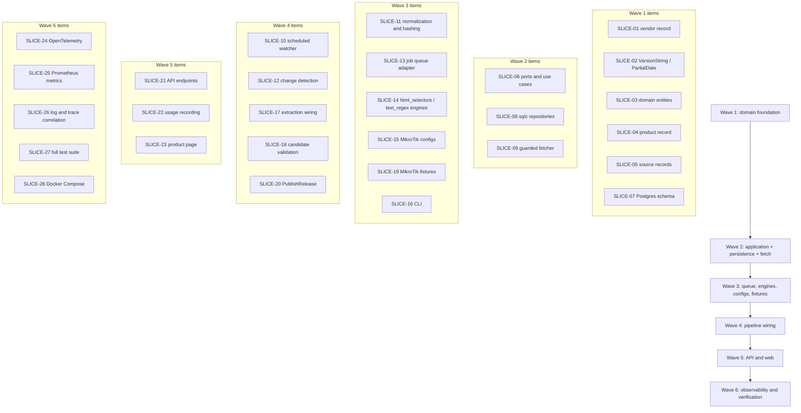

# First sprint backlog

> The concrete, ordered backlog for [mvp-roadmap.md](mvp-roadmap.md) Phase 1 — the MikroTik RouterOS vertical slice. Each item below corresponds to one of the twenty steps the brief lays out for the vertical slice: vendor record → product record → official source record → scheduled watcher → conditional HTTP request → content normalisation → change detection → deterministic extraction → candidate creation → candidate validation → release persistence → product API endpoint → product page → API usage recording → OpenTelemetry instrumentation → Prometheus metrics → structured logs → distributed trace → tests → Docker Compose execution.

## 1. Backlog

| ID | Title | Description | Acceptance criteria | Dependencies | Size |
| --- | --- | --- | --- | --- | --- |
| **SLICE-01** | Vendor record | Add `dataset/vendors/mikrotik.yaml` (slug, name, website) and its JSON Schema under `packages/schemas/`. | File validates against the schema; `firmscout registry sync` (once it exists, SLICE-16) inserts one `vendors` row with `managed_by = 'registry'`. | None | S |
| **SLICE-02** | Domain value objects: `VersionString`, `PartialDate` | Implement `internal/domain/version` and `internal/domain/partialdate` with constructors that make an invalid state unrepresentable (no day accessor below `exact_day` precision; version plausibility check, never ordering). | Table-driven unit tests cover every `DatePrecision` value and at least one plausible/implausible version-transition pair; `go vet` and `go test ./internal/domain/...` pass with zero external imports. | None | S |
| **SLICE-03** | Domain entities: `Vendor`, `Product`, `Source`, `CandidateRelease`, `Release`, `Evidence` | Implement the entities and state machines from blueprint §7.1/§7.6 in `internal/domain`, with invariants enforced in constructors and transition methods. | Table-driven tests for each state machine's legal and illegal transitions (e.g. `published → discovered` is unrepresentable, per blueprint §7.6); zero external imports (`internal/archtest` passes once SLICE-08 exists). | SLICE-02 | M |
| **SLICE-04** | Product record | Add `dataset/products/mikrotik/routeros.yaml` (slug `mikrotik-routeros`, vendor ref, category, `release_type`). | Validates against schema; references `mikrotik` vendor slug from SLICE-01; `registry sync` inserts one `products` row. | SLICE-01 | S |
| **SLICE-05** | Official source records | Add `dataset/sources/mikrotik/newest-stable.yaml` and `dataset/sources/mikrotik/changelogs.yaml`, each with `robots_policy_status`, `terms_review_status` filled in honestly per DATA_SOURCES.md's measured values. | Both validate against schema; `terms_review_status = pending` is accepted by schema (not a validation failure — pending is a legitimate, if not-yet-collectable, state) but `registry sync` will not mark either `enabled = true` until it is `reviewed_ok`, matching DATA_SOURCES.md's rule. | SLICE-04 | S |
| **SLICE-06** | Application ports and use cases (fakes only) | Define the ports in blueprint §7.3 needed for the slice (`VendorRepository`, `ProductRepository`, `SourceRepository`, `CandidateRepository`, `ReleaseRepository`, `ArtifactStore`, `Fetcher`, `Normalizer`, `CollectorRegistry`, `JobQueue`, `Clock`, `IDGenerator`, `UnitOfWork`, `EventPublisher`); implement `CheckSource`, `ExtractCandidateRelease`, `ValidateCandidateRelease`, `PublishRelease`, `GetProduct`, `GetLatestRelease`, `ListReleases`, `SearchProducts` against in-memory fakes. | A fakes-only test exercises the full check → extract → validate → publish flow with no network and no database, per blueprint §7.8; `internal/application` imports only `internal/domain` and stdlib. | SLICE-03 | L |
| **SLICE-07** | PostgreSQL schema (initial migration) | Write `database/migrations/0001_initial.sql` covering the tables blueprint §11 names for the MVP slice (`vendors`, `product_families`, `products`, `product_aliases`, `categories`, `release_types`, `sources`, `source_checks`, `source_artifacts`, `collector_definitions`, `candidate_releases`, `validation_results`, `releases`, `release_product_mappings`, `review_items`, `jobs`, `api_consumers`, `api_keys`, `usage_records`, `analytics_events`, `audit_events`, `ai_runs`, `product_summaries`), with the date-precision `CHECK` constraint and append-only fact-table discipline from §11 rules 2 and 4. | `firmscout migrate up` (once SLICE-16 exists) applies cleanly to a fresh Postgres 17 instance; a manual `INSERT` violating the date-precision `CHECK` constraint (e.g. `month_only` with day ≠ 1) is rejected by the database itself, not just application code. | None (parallel to SLICE-01–06) | M |
| **SLICE-08** | sqlc queries and generated repositories | Write `database/queries/*.sql` for the ports in SLICE-06 that need real persistence, run `sqlc generate`, and implement the `internal/adapters/postgres` repository types satisfying those ports. | `sqlc diff` is clean (generated code matches committed code); adapter tests against the Compose Postgres (skipped with an explicit message if `FIRMSCOUT_TEST_DATABASE_URL` is unset) pass for each repository's CRUD path relevant to the slice. | SLICE-06, SLICE-07 | M |
| **SLICE-09** | Guarded HTTP fetcher (SSRF guard, conditional GET) | Implement `internal/adapters/fetch` per blueprint §8.3's component table: DNS resolution and validation before connecting, blocking private/loopback/link-local ranges, re-validation after each redirect hop, conditional request support (`If-None-Match`/`If-Modified-Since`), `max_bytes` enforcement via a limited reader, timeout, and `robots.txt` checking. | `httptest`-based tests cover: a private-IP target is refused before any request is sent; a redirect to a private IP is refused; a response exceeding `max_bytes` is truncated-and-rejected, not silently truncated-and-returned; a second request against an unchanged fixture sends `If-None-Match` and receives/handles a `304`. | SLICE-06 | M |
| **SLICE-10** | Scheduled watcher / `CheckSource` wiring | Wire the worker's scheduler loop (blueprint §7.7, `apps/worker`) to enqueue `source.check.requested` jobs for enabled sources on their `NextCheckPolicy` interval, and to invoke `CheckSource` (SLICE-06) using the real `Fetcher` (SLICE-09) when dequeued. | Given a source with `enabled = true` and a due `run_after`, the worker enqueues and processes a check within one scheduler tick in a test using a fake clock; a source with `enabled = false` (e.g. a Dell-shaped fixture) is never enqueued. | SLICE-09, SLICE-13 (job queue) | M |
| **SLICE-11** | Content normalisation and section hashing | Implement `internal/adapters/normalize`: HTML normalisation (strip scripts/comments/volatile attributes per `normalize.strip`), section-scoped hashing (`normalize.section_selector`), and the plain-text pass-through path for `text_regex` sources. | Given two HTML fixtures differing only outside the configured `section_selector`, the computed hash is identical; given two differing inside it, the hash differs; unit tests, no network. | SLICE-06 | S |
| **SLICE-12** | Change detection (`unchanged`/`changed`/`failed` outcomes) | Implement the `CheckSource` use case's decision logic: conditional-request result plus (when applicable) SLICE-11's hash comparison against the prior `source_checks` row determines `FetchOutcome`, and only `changed` enqueues extraction. | A fake `Fetcher` returning `304` produces `unchanged` and no extraction job; a fake `Fetcher` returning `200` with an unchanged normalised hash also produces `unchanged` (the section-hash fallback path); a genuinely changed body produces `changed` and one `candidate.extract.requested` job. | SLICE-09, SLICE-11 | S |
| **SLICE-13** | PostgreSQL job queue adapter | Implement `internal/adapters/postgres` queue: `Enqueue` with `idempotency_key` uniqueness, `Dequeue` via `SELECT ... FOR UPDATE SKIP LOCKED`, attempt counting, exponential backoff via `run_after`, and a logical dead-letter state after N attempts (blueprint §3.1, ADR-0015). | Concurrent `Dequeue` calls from multiple goroutines against the same queue never return the same row twice (verified by a race-enabled test, `go test -race`); a job enqueued twice with the same idempotency key results in one row, not two; a job failing N+1 times reaches `dead_lettered_at`. | SLICE-07, SLICE-08 | M |
| **SLICE-14** | `html_selectors` and `text_regex` engines | Implement the two MVP config-driven engines in `internal/adapters/collectors`, interpreting the field reference in collector-config-spec.md §3, including the `map` hard-fail-on-unmapped rule and the date-precision consistency check (collector-config-spec.md §6). | Each engine has its own fixture corpus (independent of any vendor's fixtures) exercising every transform in §5 of the config spec and both success and hard-failure paths (unmapped channel, precision/date_format mismatch rejected at load time). | SLICE-03 | L |
| **SLICE-15** | MikroTik collector configs | Author `collectors/config/mikrotik/changelogs.yaml` and `collectors/config/mikrotik/newest-stable.yaml` exactly as specified in collector-config-spec.md §8.1–§8.2. | Both validate against `packages/schemas/collector-config.schema.json`; `firmscout collector test` (SLICE-16) passes for both against their fixtures (SLICE-19). | SLICE-14, SLICE-05 | S |
| **SLICE-16** | CLI: `migrate`, `registry sync`, `check-source`, `collector test` | Implement `apps/cli` subcommands: `firmscout migrate up`, `firmscout registry sync` (loads `dataset/` + `collectors/config/` into Postgres, marking rows `managed_by = 'registry'` per blueprint §11 rule 1), `firmscout check-source --id <source-id>` (manual trigger, for local verification without waiting on the scheduler), `firmscout collector test <config-path>` (collector-config-spec.md §7). | Running all four against the Compose Postgres in sequence (`migrate up` → `registry sync` → `collector test` on both MikroTik configs → `check-source --id mikrotik.changelogs`) succeeds and leaves at least one `releases` row when run against the fixture-backed local server described in SLICE-19. | SLICE-08, SLICE-13, SLICE-15 | M |
| **SLICE-17** | Deterministic extraction: `ExtractCandidateRelease` | Wire the `CheckSource` → `ExtractCandidateRelease` handoff in the worker: on a `changed` outcome, dequeue the extraction job, resolve the collector via `CollectorRegistry`, call `Extract`, and persist the resulting `CandidateRelease` rows. | Given a `changed` MikroTik changelog fixture, the worker produces `candidate_releases` rows matching the fixture's `expected.json` (SLICE-19) with `collector_id`/`collector_version` populated from the engine's `ID()`/`Version()`. | SLICE-13, SLICE-14, SLICE-15 | M |
| **SLICE-18** | Candidate validation: `ValidateCandidateRelease` | Implement the ten gates from blueprint §16 as a single use case, each gate independently testable, producing either a publish-eligible result, a rejection, or a `review_items` row. | Table-driven tests, one per gate, each with a passing and a failing fixture case (e.g. gate 6's implausible version transition, gate 8's confidence threshold, gate 5's date-precision/future-date check); a MikroTik candidate from an official source at default confidence clears all ten gates in the happy-path test. | SLICE-06, SLICE-17 | M |
| **SLICE-19** | MikroTik fixtures | Record and author `testdata/fixtures/mikrotik/changelogs/` and `testdata/fixtures/mikrotik/newest-stable/`, each with at least one recorded (trimmed, provenance-documented) fixture and one synthetic edge-case fixture (a layout-broken changelog entry; a `newest-stable` body with no epoch), per collector-sdk.md §8–§9. | `collectortest.RunFixtures` passes for both source's configs against these fixtures; each `README.md` states source URL, retrieval timestamp (UTC), and content hash per collector-sdk.md §9; no fixture is a full, untrimmed copy of the source page. | SLICE-15 | S |
| **SLICE-20** | Release persistence: `PublishRelease` | Implement the `PublishRelease` use case exactly as blueprint §16 describes it: one `UnitOfWork` transaction inserting the release, product mapping, evidence, transitioning the candidate to `published`, refreshing `product_summaries`, and emitting `release.published`. | An integration test against the Compose Postgres verifies all five effects happen atomically — a forced failure partway through (e.g. via a test hook) leaves zero effects, not a partial write; `product_summaries` reflects the new release immediately after commit. | SLICE-08, SLICE-18 | M |
| **SLICE-21** | Product API endpoints | Implement `GET /api/v1/products/{slug}`, `/products/{slug}/releases`, `/products/{slug}/latest`, `/vendors`, `/vendors/{slug}`, `/search`, `/releases/{id}`, `/healthz` in `internal/adapters/httpapi`, matching `docs/api/openapi.yaml` exactly, with RFC 9457 errors, cursor pagination, `ETag`/`Cache-Control`, and rate-limit headers even when unauthenticated. | `httptest`-based handler tests with fake use cases cover every status code listed in api.md §2 for each endpoint; a contract test asserts every handler has a matching `openapi.yaml` entry (api.md §10). | SLICE-06, SLICE-20 | M |
| **SLICE-22** | API usage recording | Implement `UsageRecorder` (application port) and its PostgreSQL adapter, called on every handled request (keyed or anonymous) per blueprint §7.3, writing a `usage_records` row with consumer identity (or `anonymous`), endpoint, status, and timestamp. | A request against any endpoint in SLICE-21 produces exactly one `usage_records` row, including for anonymous requests and for requests that error. | SLICE-21 | S |
| **SLICE-23** | Product page | Build the MikroTik RouterOS product page in `apps/web` (`/products/[slug]`): name, vendor, family, release type, latest observed version with correctly precision-rendered date, release history, official source link(s), last-verified timestamp. | `npm run build`, `npm run lint`, `npm run typecheck` pass; the page renders MikroTik RouterOS data fetched from SLICE-21's live API in a Compose environment, with `releaseDatePrecision` visibly affecting date rendering (matching api.md §4) rather than always showing a full date. | SLICE-21 | M |
| **SLICE-24** | OpenTelemetry instrumentation | Wire `otelhttp` on every HTTP handler, span instrumentation through the worker's job processing (`source.check` → `candidate.extract` → `validate` → `publish` as a linked or nested span chain), and the `slog` OTel bridge for structured logs, per blueprint §7's telemetry adapter. | A single `check-source` run against MikroTik produces one trace spanning fetch → normalize → extract → validate → publish, visible in Tempo (or its local OTLP-compatible backend) with no orphaned spans. | SLICE-10, SLICE-17, SLICE-18, SLICE-20 | M |
| **SLICE-25** | Prometheus metrics | Instrument the pipeline's key counters/histograms (checks run, outcomes by type, extraction duration, candidates produced, publications, HTTP request duration and status by endpoint, queue depth) and expose them for scraping. | Prometheus (Compose) scrapes `api` and `worker` successfully; a Grafana panel (or a raw Prometheus query) shows a nonzero count for `source_checks_total` and `releases_published_total` after a manual `check-source` run. | SLICE-24 | S |
| **SLICE-26** | Structured logs and distributed trace correlation | Ensure every log line emitted during a request or job carries `request_id`/`trace_id` (correlated to SLICE-24's spans), in JSON, via `slog`. | A log line for a given HTTP request, grepped by its `X-Request-Id`, is found alongside the correct trace in Tempo by trace id — manually verified once as part of this item's acceptance, and asserted programmatically in at least one test that checks the log record contains a non-empty `trace_id` field during an active span. | SLICE-24 | S |
| **SLICE-27** | Full test suite | Ensure `go test ./...` covers domain, application, adapters (Postgres + fetch + collectors), archtest, and collector fixtures, and that `internal/archtest` actually fails on an introduced forbidden import (verified once, then reverted). | `go test ./...` green; a deliberately introduced `internal/domain` → `internal/adapters` import, added temporarily, fails `internal/archtest` (proving the test is not a no-op) and is then removed. | SLICE-01 through SLICE-26 | S |
| **SLICE-28** | Docker Compose execution | Finalise `infrastructure/docker/docker-compose.yml` (postgres:17, api, worker, web, otel-collector, prometheus, loki, tempo, grafana with provisioned datasources/dashboard) and verify full-stack startup. | `docker compose up --build` brings up every service healthy; `curl localhost:8080/healthz` returns `200`; `curl localhost:8080/api/v1/products/mikrotik-routeros` returns a valid `Product` JSON body once `registry sync` and at least one `check-source` run have populated data; Grafana's provisioned dashboard loads without manual datasource configuration. | SLICE-16, SLICE-21, SLICE-25 | M |

## 2. Dependency order

The table below groups the backlog into waves that can proceed in parallel within a wave, strictly after the wave before it completes. This is the practical execution order, distinct from the acceptance-criteria dependency column above (which is per-item and sometimes narrower than the wave it sits in).

**Why this order:** the domain (Wave 1) has no dependencies on anything and is cheapest to get right early, since every later layer builds on its invariants (blueprint §7.2's inward-dependency rule made literal in build order, not just import order). Application ports and their two real adapters — persistence and fetch (Wave 2) — come next because the pipeline wiring in Wave 4 needs both a place to store state and a way to reach a source. Wave 3 (queue, engines, configs, fixtures) is the last thing that can be built and fully unit/fixture-tested in isolation, without the pipeline wired together — deliberately sequenced before Wave 4's wiring so that by the time the watcher, extraction, validation, and publication use cases are connected end to end, every component they connect has already been independently proven correct, and an end-to-end failure in Wave 4 is very likely a wiring bug, not a latent bug in an untested component. The API and web layer (Wave 5) depend on Wave 4 because they read data the pipeline produces — building them earlier against fakes was already covered inside Wave 2/4's own use-case tests, so Wave 5 is specifically about the real, wired path. Observability and final verification (Wave 6) come last on purpose: instrumenting a pipeline that does not yet work correctly produces traces and metrics describing bugs, not confirming their absence — SLICE-24 through SLICE-26 are meant to observe a slice that Wave 4 has already made functionally correct, and SLICE-27/28 are the sprint's actual "done" gates, run only once everything they depend on exists.
