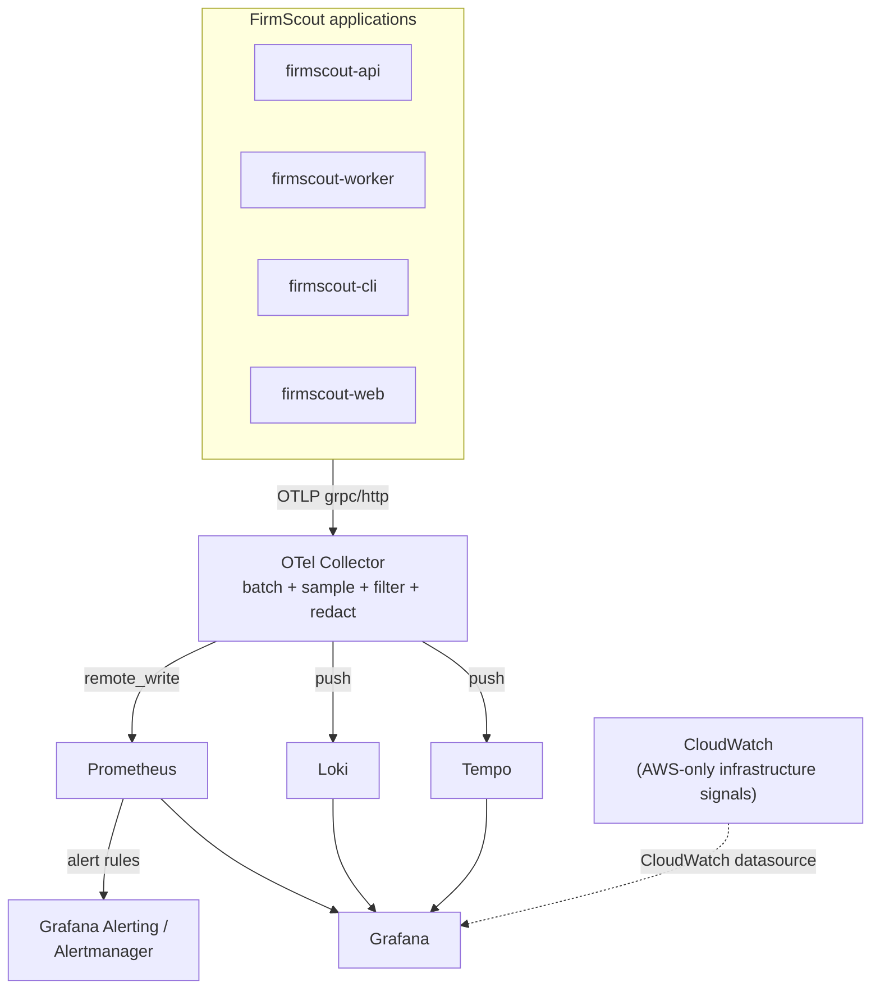

# Observability

> Companion to [`blueprint.md`](blueprint.md) (§6 decision 11, [ADR-0011](../adr/0011-open-source-observability.md)). Diagram: [`docs/diagrams/observability.md`](../diagrams/observability.md). Dashboards built on the metrics defined here: [`grafana-dashboards.md`](grafana-dashboards.md). Product-facing events are a separate concern: [`analytics.md`](analytics.md).

This document is the contract. Every metric name, label, log field, and span name introduced here is authoritative and is reused verbatim in [`grafana-dashboards.md`](grafana-dashboards.md) — dashboards do not invent their own metric names.

---

## 1. Why open-source observability

FirmScout runs at low idle cost and is meant to be self-hosted by people who are not FirmScout's operator. Both facts point away from a proprietary SaaS observability platform for the MVP:

- **Vendor neutrality.** A self-hoster running FirmScout on their own infrastructure gets the *identical* signals the hosted operator gets — the same dashboards, the same alert conditions, the same traces. If observability lived behind a commercial vendor's agent and API key, self-hosting would be a second-class experience by construction, which contradicts the project's own [ADR-0009](../adr/0009-code-and-data-licensing.md) stance that self-hosting is a real distribution channel, not a fallback.
- **Cost predictability.** Commercial observability SaaS platforms price on ingested volume, host count, or seats — dimensions that grow with exactly the kind of usage FirmScout wants to encourage (more sources, more checks, more self-hosters). A self-hosted stack's marginal cost is storage and compute the operator already controls, which is the same "low idle cost" principle applied to the control plane, not just the product ([ADR-0013](../adr/0013-cost-minimization.md)).
- **Auditability.** An open-source project whose own operational visibility is a black box invites the obvious question. Anyone can read the Collector configuration, the Prometheus rules, and the Grafana dashboards in this repository and know exactly what is measured and what is not.
- **No lock-in on the differentiator.** FirmScout's moat is the dataset and the operating discipline (§1 of the blueprint), not proprietary tooling. Observability data is operational exhaust, not product IP; it does not need a platform with data-egress friction.

**What is deliberately rejected for the MVP:** Datadog, New Relic, Honeycomb, Grafana Cloud, and similar. None are rejected on technical merit — they are all capable products — they are rejected because their pricing model is incompatible with "identical stack locally and on AWS at near-zero idle cost," and because requiring a commercial account to see FirmScout's own health metrics would contradict what FirmScout asks of its self-hosters. Managed hosting of the *same* open-source components (a managed Grafana, a managed Prometheus) remains on the table later if operating them becomes more expensive than paying for management — that threshold is revisited in §9, not ruled out.

---

## 2. Architecture

Every FirmScout binary (`firmscout-api`, `firmscout-worker`, `firmscout-cli`, `firmscout-web`) emits traces, metrics, and logs over OTLP to a local OpenTelemetry Collector. The Collector is the only component that talks to the backends; application code never writes to Prometheus, Loki, or Tempo directly.



**What the Collector does, in pipeline order:**

1. **Receive** — OTLP/gRPC and OTLP/HTTP receivers accept traces, metrics, and logs from every service.
2. **Batch** — the `batch` processor groups signals before export, so the Collector makes a handful of efficient calls to each backend instead of one call per span or metric point.
3. **Redact** — an `attributes`/`redaction` processor strips or hashes any attribute matching a deny-list (API keys, `Authorization` headers, tokens, cookies — see §6). This runs *before* export, so a redaction bug in one backend's export path cannot leak a secret through another.
4. **Filter attributes** — a second `attributes` processor drops or truncates high-cardinality attributes that must never become a Prometheus label (see the cardinality warning in §5) while leaving them intact on the trace and log signals that can safely carry them.
5. **Sample** — traces are sampled per §7; metrics and logs are not sampled by the Collector (application-side sampling, where it exists, happens before emission — see §6).
6. **Export** — metrics go to Prometheus (via `remote_write` or Prometheus's own scrape of the Collector's `prometheusremotewrite` exporter endpoint), logs go to Loki, traces go to Tempo.

**Local (Docker Compose) versus AWS — what stays identical and what changes:**

| Aspect | Local (Docker Compose) | AWS |
| --- | --- | --- |
| Application code | Same binaries, same OTel SDK setup | Identical — no build-time flag differentiates telemetry code |
| OTLP endpoint | `otel-collector:4317` service in Compose | Same Collector binary, run as a sidecar-equivalent (a small always-on ECS task or, for Lambda, a Lambda extension layer running the Collector in-process) |
| Collector config | `infrastructure/observability/otel-collector-config.yaml` | The same file; only the exporter endpoints and any AWS-specific credentials differ, injected by environment |
| Prometheus / Loki / Tempo / Grafana | Docker Compose services with local volumes | The same container images, run on a small persistent compute footprint (self-hosted, not a managed observability product), with object storage (S3) backing Loki and Tempo chunk storage instead of local disk |
| Infrastructure-level signals (Lambda cold starts, API Gateway 5xx before it reaches the app, ALB/CloudFront metrics, RDS/EBS-level metrics, WAF decisions) | Not applicable — there is no Lambda, API Gateway, or WAF locally | **CloudWatch remains authoritative for these.** The OTel Collector only sees what the application emits; it cannot see a request that API Gateway rejected before invoking the Lambda, or a WAF block. Grafana adds a CloudWatch datasource so these can sit next to the OTel-derived dashboards, but they are a genuinely separate signal source, not something the Collector pipeline replaces. |

The rule that makes this work is simple: **the Collector configuration and the application's OTel SDK setup are environment-agnostic.** Only exporter destinations and credentials are environment-specific, and those are supplied by configuration, never by conditional code paths. This is the same discipline the blueprint applies to the job queue and the runtime (§3.1, §3.4 of the blueprint): one contract, swappable adapters underneath.

---

## 3. Instrumentation conventions

### Semantic conventions

FirmScout follows [OpenTelemetry semantic conventions](https://opentelemetry.io/docs/specs/semconv/) wherever a convention exists, rather than inventing names:

- HTTP: `http.request.method`, `http.route`, `http.response.status_code`, `url.path` (via `otelhttp` middleware on the server side and `otelhttp.Transport` on the client side used by the `Fetcher` adapter).
- Database: `db.system` (`postgresql`), `db.operation.name`, `db.collection.name` (via a `pgx` tracer hook).
- Messaging (the PostgreSQL-backed job queue): `messaging.system` (`postgresql_queue`), `messaging.operation.name` (`publish` / `receive`), `messaging.destination.name` (the job type, e.g. `source.check.requested` — a bounded, enumerable set, not a per-message identifier).
- Resource attributes on every signal: `service.name`, `service.version` (build SHA or semver), `service.namespace` (`firmscout`), `deployment.environment.name` (`local` / `staging` / `production`), and `service.instance.id`.

### Service naming

| Binary | `service.name` | Notes |
| --- | --- | --- |
| `apps/api` | `firmscout-api` | HTTP API server |
| `apps/worker` | `firmscout-worker` | Scheduler loop + job runner |
| `apps/cli` | `firmscout-cli` | Migrations, registry sync, ad-hoc `check-source`, `apikey` |
| `apps/web` | `firmscout-web` | Next.js public site (server-side spans and Web Vitals via the OTel JS SDK) |

`firmscout-cli` invocations are short-lived; each run is its own trace and its own batch export, flushed synchronously before exit rather than relying on a background exporter that a process exit could truncate.

### The dependency rule applies to telemetry too

`internal/domain` has zero external imports, including OpenTelemetry — this is not a special case, it is the same rule that keeps SQL and HTTP out of the domain. Domain types (state machines, value objects) do not need instrumentation: they have no I/O, so their behaviour is exercised by table-driven unit tests, not traces.

`internal/application` **may not import the OTel SDK directly** either, for the same reason it may not import `pgx`. Instead it defines a narrow port it owns:

```go
// internal/application/ports/telemetry.go
type Telemetry interface {
    StartSpan(ctx context.Context, name string, attrs ...Attr) (context.Context, EndSpanFunc)
    RecordCounter(ctx context.Context, name string, delta int64, attrs ...Attr)
    RecordHistogram(ctx context.Context, name string, value float64, attrs ...Attr)
}

type EndSpanFunc func(err error)
type Attr struct{ Key, Value string }
```

`internal/adapters/telemetry` implements `Telemetry` using the real OTel SDK (`otel.Tracer`, `otel.Meter`) and converts the application's plain `Attr` values into `attribute.KeyValue` at the boundary. Use cases call `telemetry.StartSpan(ctx, "release.publish", ...)`, never `tracer.Start(ctx, ...)` directly. This means:

- A use-case test can pass a no-op `Telemetry` fake and assert on business behaviour without any OTel machinery.
- Swapping the tracing SDK (which has happened industry-wide before, and OTel itself is not guaranteed to be the last word) touches one adapter, not every use case.
- `internal/archtest` enforces this the same way it enforces every other layer rule: `go list -deps` on `internal/application/...` must never resolve to `go.opentelemetry.io/otel`.

HTTP and database instrumentation (`otelhttp`, the `pgx` tracer) live entirely inside `internal/adapters` and are wired in `internal/platform` — they instrument the boundary, not the business logic, and so never need the port at all.

---

## 4. Correlation

Every request carries two correlation identifiers end to end: a human-friendly **`request_id`** (a ULID, echoed on every API response per the blueprint's API design principles, §12) and the **W3C trace context** (`traceparent` / `tracestate`), which is what actually links spans across services in Tempo. `request_id` is also stamped as a `firmscout.request_id` attribute on every span and as a field on every log line, so a support conversation ("here is my request ID") and a trace lookup use the same value.

| Hop | Mechanism | Carrier |
| --- | --- | --- |
| Browser → `firmscout-web` | New request | `firmscout-web` generates `request_id` and a root `traceparent` if none is present (first hop of the system) |
| `firmscout-web` → `firmscout-api` | Outbound `fetch` call | `traceparent`, `tracestate`, and `X-Request-Id` HTTP headers (`otelhttp.Transport` propagates the first two automatically; `X-Request-Id` is added explicitly) |
| `firmscout-api` middleware | Extract or generate | If a client calls the API directly with no headers, the API generates both — anonymous API access is a supported path (blueprint §12), and it must be traceable too |
| `firmscout-api` → job queue (`Enqueue`) | Job row columns | The `JobQueue` adapter stores `trace_id`, `span_id` (or the full `traceparent` string) and `request_id` as columns on the `jobs` row — this is the queue-message-attribute analogue for a table-backed queue. **This is the point trace context is usually lost**, because a naive queue adapter only serialises the job payload and forgets the ambient trace. |
| `firmscout-worker` → `Dequeue` | Extract from job row | The worker reads `trace_id` / `span_id` / `request_id` back out of the row and starts its job-processing span as a **span link** to the original request span, not as a child span |
| Worker → `CheckSource`, `ExtractCandidateRelease`, `ValidateCandidateRelease`, `PublishRelease` | `context.Context` propagation in-process | Standard Go `context.Context` carries the active span through every use case call in the same goroutine |
| Use case → database | `pgx` tracer hook | Reads the span from `context.Context` automatically; no manual propagation needed |
| `PublishRelease` → webhook notification (Professional/Enterprise) | Outbound `fetch` call | `traceparent` and `X-Request-Id` set on the outbound webhook request, started as a child span of the publish span (this leg is synchronous, so parent/child is correct here, unlike the queue hop) |

**Why a span link, not a parent span, across the queue hop:** the producer's HTTP request (`firmscout-api` handling `POST` that enqueues a job) completes and returns a response before the worker ever picks the job up — sometimes seconds later, sometimes after a scheduled delay. Making the job's span a *child* of the request span would either keep that request's trace artificially "open" for the wait, or misreport the job's processing time as part of the request's latency, neither of which is true. A span link records "this span is related to that span" without claiming a parent/child duration relationship, and Tempo's UI lets you jump from one to the other in one click. This is the standard OpenTelemetry pattern for queue and pub/sub boundaries, and it is the concrete mechanism that keeps correlation intact across the one hop that most systems lose it at.

**Logs correlate the same way:** every structured log line includes `request_id`, `trace_id`, and `span_id` (see §6), so a log line found by grepping for a `request_id` a user reported can be pivoted straight into the matching trace in Tempo without re-deriving anything.

---

## 5. Metrics catalogue

All custom FirmScout metrics use the `firmscout_` prefix. Instrument types are named as they are created in the OTel SDK; the Prometheus exposition naming (`_total` suffix on counters, `_bucket`/`_sum`/`_count` on histograms) follows automatically and is not repeated in the table. Units follow OTel's UCUM-style annotations (`s`, `By`, `1` for a dimensionless ratio, `{request}` for a countable unit, `usd` for money).

### API

| Metric | Instrument | Unit | Labels | Purpose |
| --- | --- | --- | --- | --- |
| `firmscout_api_requests_total` | Counter | `{request}` | `method`, `route`, `status_code`, `api_tier` | Request count, and — filtered by `status_code=~"5.."` — error rate; `rate()` of this metric is throughput |
| `firmscout_api_request_duration_seconds` | Histogram | `s` | `method`, `route`, `status_code` | Request duration distribution; `histogram_quantile` gives p50/p95/p99 latency |
| `firmscout_api_payload_size_bytes` | Histogram | `By` | `route`, `direction` (`request`/`response`) | Payload size distribution |
| `firmscout_api_rate_limit_events_total` | Counter | `{event}` | `route`, `scope` (`ip`/`api_key`) | Requests throttled by the in-process token bucket |
| `firmscout_api_quota_violations_total` | Counter | `{violation}` | `route`, `api_tier` | Requests rejected for exceeding a persisted monthly quota |
| `firmscout_api_cache_results_total` | Counter | `{result}` | `route`, `result` (`hit`/`miss`) | Cache hit/miss ratio is `hit / (hit + miss)` |

*Error rate* and *throughput* are deliberately not separate instruments — they are `rate()`/ratio expressions over `firmscout_api_requests_total`, which is the idiomatic Prometheus approach and avoids two counters going out of sync with each other.

### Database

| Metric | Instrument | Unit | Labels | Purpose |
| --- | --- | --- | --- | --- |
| `firmscout_db_query_duration_seconds` | Histogram | `s` | `query_name`, `operation` | Query duration distribution |
| `firmscout_db_queries_total` | Counter | `{query}` | `query_name`, `operation`, `outcome` | Query volume and error count |
| `firmscout_db_slow_queries_total` | Counter | `{query}` | `query_name`, `operation` | Incremented when a query exceeds the configured slow-query threshold |
| `firmscout_db_pool_connections` | UpDownCounter (gauge-like) | `{connection}` | `state` (`active`/`idle`/`waiting`) | Connection pool usage |
| `firmscout_db_pool_max_connections` | Gauge (async) | `{connection}` | — | The configured pool ceiling, so saturation can be expressed as a ratio in PromQL |
| `firmscout_db_locks_waiting` | UpDownCounter | `{lock}` | `lock_type` | Lock contention |
| `firmscout_db_storage_bytes` | Gauge (async) | `By` | `table_group` (`registry`/`fact`/`observation`) | Storage growth, sampled periodically from `pg_total_relation_size` grouped by the table categories in blueprint §11 |

`query_name` is a short, enumerable identifier assigned per sqlc query (e.g. `get_product_by_slug`, `insert_release`) — never the raw SQL text and never an interpolated value.

### Collector

| Metric | Instrument | Unit | Labels | Purpose |
| --- | --- | --- | --- | --- |
| `firmscout_collector_checks_total` | Counter | `{check}` | `vendor`, `source_type`, `outcome` (`changed`/`unchanged`/`failed`) | Checks, successful checks (`outcome!="failed"`), failed checks, changed sources, and unchanged sources — all as filters/aggregations of one counter |
| `firmscout_collector_extraction_failures_total` | Counter | `{failure}` | `vendor`, `source_type`, `reason` | Extraction stage failures |
| `firmscout_collector_validation_failures_total` | Counter | `{failure}` | `vendor`, `gate`, `outcome` (`rejected`/`review`) | Validation gate failures, by which of the ten gates in blueprint §16 tripped |
| `firmscout_collector_publications_total` | Counter | `{publication}` | `vendor`, `release_type` | Successful publications |
| `firmscout_collector_duplicate_candidates_total` | Counter | `{candidate}` | `vendor` | Candidates rejected as exact duplicates (gate 4) |
| `firmscout_collector_execution_duration_seconds` | Histogram | `s` | `vendor`, `stage` (`fetch`/`normalize`/`extract`/`validate`/`publish`) | Per-stage execution time |

### AI

| Metric | Instrument | Unit | Labels | Purpose |
| --- | --- | --- | --- | --- |
| `firmscout_ai_agent_executions_total` | Counter | `{execution}` | `agent` (`discovery`/`repair`/`validation`/`classification`/`source_quality`), `outcome` (`success`/`schema_invalid`/`budget_exceeded`/`error`) | Agent executions; filtered by `agent` and `outcome`, this is also repair success rate, discovery success rate, and validation success rate |
| `firmscout_ai_tokens_total` | Counter | `{token}` | `agent`, `model_id`, `token_type` (`input`/`output`) | Token consumption |
| `firmscout_ai_cost_usd_total` | Counter | `usd` | `agent`, `model_id`, `vendor` | Cost; divided by executions this is cost per execution, aggregated by `vendor` this is cost per vendor |
| `firmscout_ai_proposals_rejected_total` | Counter | `{proposal}` | `agent`, `reason` | Proposals a deterministic validation pass or a human reviewer rejected |
| `firmscout_ai_budget_cap_usd` | Gauge (async) | `usd` | `period` (`daily`/`monthly`) | The currently configured budget ceiling, so burn-down can be expressed as spend ÷ this gauge |

`vendor` is safe on `firmscout_ai_cost_usd_total` under the cardinality rule below because the vendor set is small, curated registry data (blueprint §3.3), not an unbounded per-entity identifier.

### Infrastructure

| Metric | Instrument | Unit | Labels | Purpose |
| --- | --- | --- | --- | --- |
| `firmscout_queue_depth` | UpDownCounter (gauge-like) | `{message}` | `queue_name` (job type), `status` (`pending`/`processing`) | Queue depth |
| `firmscout_queue_oldest_message_age_seconds` | Gauge (async) | `s` | `queue_name` | Age of the oldest undelivered message — the metric that catches a stalled worker even when depth looks fine |
| `firmscout_queue_dead_letter_total` | Counter | `{message}` | `queue_name`, `reason` | Dead-letter volume |
| `firmscout_background_task_duration_seconds` | Histogram | `s` | `task_name` (job type), `outcome` | Background job execution duration |
| `firmscout_data_transfer_bytes_total` | Counter | `By` | `direction` (`ingress`/`egress`), `component` (`fetcher`/`api`/`web`) | Application-observed data transfer — an estimate; the cloud provider's own billing figure is authoritative for egress cost |
| `firmscout_analytics_events_rejected_total` | Counter | `{event}` | `event_name`, `reason` (`schema_invalid`/`privacy_filter_dropped`) | Events the analytics pipeline ([`analytics.md`](analytics.md) §3) dropped before storage |

CPU, memory, and disk are **not** custom `firmscout_` metrics. They are host/container-level signals collected by the OTel Collector's `hostmetrics` receiver (exposing standard semantic-convention names such as `system.cpu.utilization`, `system.memory.utilization`, `system.filesystem.utilization`) locally, and by CloudWatch on AWS per the table in §2. Instrumenting CPU/memory inside application code would duplicate a signal the platform already provides more accurately.

### FinOps

| Metric | Instrument | Unit | Labels | Purpose |
| --- | --- | --- | --- | --- |
| `firmscout_cost_rate_usd` | Gauge (async) | `usd` | `unit_type` (`search`/`api_request`/`source_check`/`published_release`/`storage_gb_month`) | The currently configured estimated cost per unit of activity, read from `infrastructure/observability/cost-rates.yaml`, exposed so the [Cost and FinOps dashboard](grafana-dashboards.md#6-cost-and-finops) can multiply consumed units (e.g. `firmscout_collector_checks_total`) by a rate in pure PromQL, without hardcoding a number into a query |

This is a *configuration* value re-exposed as a gauge, not a measurement — the estimates it produces are exactly that, estimates, reconciled against actual billing on the cadence described in the [Cost and FinOps dashboard](grafana-dashboards.md#6-cost-and-finops). `firmscout_ai_cost_usd_total` (above) is more precise than anything derived from this gauge, because AI cost is computed from actual token usage and provider pricing per run, not from a flat per-unit rate.

### ⚠️ Cardinality warning

**Never attach a product slug, a source ID, an API key (or its prefix), a customer identifier, or a URL as a Prometheus label — on any metric, ever.** Each of those is effectively unbounded or grows with the catalogue, and Prometheus (and Loki, for stream labels — see §6) creates a new time series per unique label combination. A `firmscout_collector_checks_total` labelled by `source_id` would create one time series per monitored source; at the catalogue sizes the blueprint targets (T3, T4: hundreds of thousands of products), that turns one metric into a cardinality incident, degrades every query against it, and can take down the Prometheus instance that everyone else's dashboards depend on.

**Safe dimensions** (small, enumerable, known in advance): `vendor` (curated registry data, low hundreds at most), `source_type`, `outcome`/`status`, `route` — meaning the **route pattern** (`/api/v1/products/{slug}`), never the resolved path with an actual slug in it, `method`, `status_code`, `api_tier`, `release_type`, `agent`, `model_id`, `query_name`.

**Per-entity detail belongs in logs and traces, not in metric labels.** A trace attribute or a structured log field can carry the exact `source_id`, `product_slug`, or `request_id` that identifies *this one* event, because logs and traces are queried by full-text/label filtering over a bounded time window, not aggregated into a permanent time series index the way a Prometheus label is. If you need "which sources failed" as a list, that is a Loki query or a `SELECT` against `sources`/`source_checks` (see the Postgres-backed panels in [`grafana-dashboards.md`](grafana-dashboards.md)), not a new label on a counter.

---

## 6. Logging

Every FirmScout binary logs structured JSON via Go's standard `log/slog`, bridged to OpenTelemetry so log records carry trace context automatically. There is exactly one logging library in the codebase; nothing writes to stdout with `fmt.Println` or an ad-hoc format.

**Standard fields on every log record:**

| Field | Example | Notes |
| --- | --- | --- |
| `time` | `2026-09-03T18:30:00Z` | RFC 3339, UTC |
| `level` | `INFO` | See levels below |
| `msg` | `"source check completed"` | Short, human-readable, stable across occurrences (varies by field, not by wording) |
| `service.name` | `firmscout-worker` | Matches §3's service naming |
| `service.version` | `a1b2c3d` | Build SHA |
| `deployment.environment.name` | `production` | |
| `request_id` | `01J...` | Present whenever the log is inside a traced operation |
| `trace_id`, `span_id` | | Injected by the slog↔OTel bridge |
| Context-specific fields | `vendor`, `source_id`, `product_slug`, `candidate_id`, … | Free to be per-entity, precisely because these are log fields (queried via `| json` in LogQL) and **not** Loki stream labels — see the cardinality note below |

**Loki stream labels are deliberately minimal:** `service_name`, `deployment_environment`, and `level`. Loki indexes by stream label the same way Prometheus indexes by label, so the cardinality warning in §5 applies here too — everything else (`request_id`, `vendor`, `source_id`, and so on) lives in the JSON log body and is filtered with `| json | field="value"` pipeline stages, not baked into the stream identity.

**Levels and when to use them:**

| Level | When |
| --- | --- |
| `DEBUG` | Per-item extraction detail, selector match traces, raw (redacted) request/response summaries during development. Disabled by default in production; enabled per-service via config when actively debugging. |
| `INFO` | Normal lifecycle events: a check completed, a candidate was created, a release was published, a job was dequeued. |
| `WARN` | Retryable failures, a candidate routed to human review, a source transitioning toward `broken`, a rate limit or quota rejection. Nothing here paged anyone; it is the trail an on-call engineer reads *after* an alert fires. |
| `ERROR` | Unhandled failures, a recovered panic, a dead-lettered job, an AI run that failed schema validation. Every `ERROR` log is expected to correspond to something visible in a metric (a counter increment) — a log with no metric counterpart is a gap to close, not a substitute for one. |

**Sampling for high-volume paths:** the large majority of source checks return `unchanged` (T2 in the blueprint) — logging every one at `INFO` would dominate log volume with the least interesting outcome. `unchanged` check completions are logged at `DEBUG` (off by default) with only a metric increment at `INFO`-equivalent visibility; `changed` and `failed` outcomes are always logged at `INFO`/`WARN` regardless of volume, because those are exactly the events worth reading individually. The same principle applies to `firmscout-api`: successful, fast, cache-hit requests are not logged individually in production (they are fully represented by the metrics in §5); slow requests, errors, and rate-limit/quota rejections always are.

**Absolute redaction list — never logged, at any level, in any environment:**

- API keys, tokens, session identifiers, and credentials of any kind (including in URLs, headers, or error messages that might embed them)
- The plaintext content of `Authorization`, `Cookie`, and `X-Api-Key` headers
- Customer inventory contents (uploaded fleet/asset data — Professional/Enterprise inventory comparison feature)
- Authenticated portal contents fetched by a collector operating under stored credentials (Fortinet-style "portal difficult" sources, per the blueprint's pilot notes)
- Full request or response bodies — logs carry sizes, content types, and hashes, never bodies
- Anything on the OTel Collector's redaction deny-list is enforced a second time at the Collector (§2, step 3) as defence in depth, in case an adapter's own redaction has a gap

---

## 7. Tracing

**Span naming** follows `<domain-concept>.<operation>`, lowercase, dot-separated, matching the use-case and adapter names in the codebase rather than inventing a parallel vocabulary:

| Span | Where it starts | Notable attributes |
| --- | --- | --- |
| `http.server.request` | `otelhttp` middleware (default semconv name) | `http.route`, `http.request.method`, `http.response.status_code` |
| `source.check` | `CheckSource` use case | `firmscout.vendor`, `firmscout.source_id`, `firmscout.source_type` |
| `fetch.get` | `Fetcher` adapter | `http.request.method`, `url.path` (never the full URL with query parameters that could contain a token) |
| `content.normalize` | `Normalizer` adapter | `firmscout.section_selector`, output hash (truncated) |
| `collector.extract` | `ExtractCandidateRelease` use case | `firmscout.vendor`, `firmscout.collector_id`, `firmscout.collector_version`, candidate count |
| `candidate.validate` | `ValidateCandidateRelease` use case | `firmscout.candidate_id`, each gate's pass/fail as span events |
| `release.publish` | `PublishRelease` use case | `firmscout.release_id`, `firmscout.product_slug` |
| `db.query` | `pgx` tracer hook (default semconv name `db.query`) | `db.operation.name`, `db.collection.name` |
| `ai.run` | Agent adapter (post-MVP) | `firmscout.agent`, `firmscout.model_id`, token counts, cost |

Per-entity identifiers (`source_id`, `candidate_id`, `product_slug`, full evidence excerpts) are attached freely as span attributes — spans are not aggregated into permanent indexed time series the way Prometheus labels are, so the cardinality rule in §5 does not apply to them. It does still apply to *metric* labels derived from spans (span metrics generation, if ever enabled, must reuse the same safe-dimension set as §5).

**Sampling strategy:** a bounded trace volume without losing the traces that matter is the actual goal, not a flat percentage. FirmScout combines:

1. **Head-based probabilistic sampling** at the SDK: 100% in local development, a configurable low percentage (illustrative starting point: 10%) in production, so most services only pay the CPU/network cost of tracing for a fraction of requests.
2. **Tail-based sampling in the Collector**, evaluated after a trace's spans have been buffered for a short window, with policies that override the head-based decision:
   - **Always keep** any trace containing a span with an error status.
   - **Always keep** any trace whose root span duration exceeds a configured slow-request threshold.
   - **Always keep** any trace belonging to an AI agent run (`ai.run` present) — these are comparatively rare and each one is worth being able to inspect for cost/behaviour review.
   - **Randomly sample the remainder** at the low rate from step 1.

This is what "keeps cost bounded but always retains traces for errors and for slow requests" means concretely: the 90% of traces discarded are, overwhelmingly, fast successful requests that a metric already fully describes; the traces someone will actually open in Tempo — an error, a slow path, an AI run — are the ones tail-based sampling is biased to keep.

---

## 8. Alerting

Alerts are defined as code in `infrastructure/observability/grafana/provisioning/alerting/` and route through Grafana Alerting (Alertmanager-compatible). The numeric thresholds below are sensible starting points, not measured facts — they are tuned against real baselines once FirmScout has traffic, and that tuning is itself tracked in the same version-controlled files.

| Alert | Condition | Severity | Why it matters | First response |
| --- | --- | --- | --- | --- |
| API error rate high | `sum(rate(firmscout_api_requests_total{status_code=~"5.."}[5m])) / sum(rate(firmscout_api_requests_total[5m])) > 0.05` for 5m | **Page** | Users of the free site and the API are seeing failures right now | Check the API operations dashboard for the failing route; check recent deploys; check DB and AI dependency health; roll back if correlated with a release |
| API latency high | `histogram_quantile(0.95, sum by (le) (rate(firmscout_api_request_duration_seconds_bucket[5m]))) > 1` for 10m | **Page** | Responsiveness SLO breach, usually cascading from the database or a synchronous downstream call | Check DB pool saturation; check for a slow query; check whether a single route is responsible |
| Queue depth high | `firmscout_queue_depth > 500` for 15m | Ticket (page if `> 2000`) | Workers are falling behind producers | Check worker process health and count; check for a poison message stuck at the head |
| Oldest queue message age | `firmscout_queue_oldest_message_age_seconds > 900` for 5m | **Page** | Distinguishes a *stalled* worker from a merely busy one — depth can look fine while the oldest job never gets processed | Check worker logs for a repeatedly failing job; check for a deadlock or crash loop |
| Dead-letter arrivals | `increase(firmscout_queue_dead_letter_total[15m]) > 0` | Ticket (page if `> 10` in 15m) | Jobs are being permanently abandoned, not just delayed | Inspect the dead-lettered payloads; usually points to a collector bug or a schema mismatch |
| Collector failure rate per vendor | `sum by (vendor) (rate(firmscout_collector_checks_total{outcome="failed"}[1h])) / sum by (vendor) (rate(firmscout_collector_checks_total[1h])) > 0.5` for 1h | Ticket | A vendor's source has likely relocated or changed layout | Route to the collector-health dashboard and the collector maintenance backlog |
| Sources newly broken | Source health state machine transitions to `broken` (via the `SourceBroken` analytics event, or `N` consecutive `outcome="failed"` checks for one source) | Ticket | Early signal before a collector fully fails, letting maintenance happen before AI repair is needed | Check the specific source's recent check history and the collector's fixture tests |
| Publication rate falling to zero | `sum(rate(firmscout_collector_publications_total[24h])) == 0` while `sum(rate(firmscout_collector_checks_total[24h])) > 0` | **Page** | A **silent failure** — checks are running, nothing else looks broken, but nothing is being published. No error surfaces this on its own. | Check `firmscout_collector_validation_failures_total` by `gate` for a spike; a regression in `ValidateCandidateRelease` is the usual cause |
| AI budget thresholds | `sum(increase(firmscout_ai_cost_usd_total[24h])) / firmscout_ai_budget_cap_usd{period="daily"} > 0.8` | Ticket (page at `> 1.0`) | Runaway AI spend, or the escalation path firing far more than expected | Check which `agent`/`vendor` combination is driving spend; verify the circuit breaker engaged at the cap |
| Database connection saturation | `firmscout_db_pool_connections{state="active"} / firmscout_db_pool_max_connections > 0.9` for 5m | **Page** | Imminent request failures once the pool is exhausted | Check for a connection leak or a slow query holding connections open |
| Storage growth | `predict_linear(firmscout_db_storage_bytes[6h], 14*24*3600)` projected to exceed allocated disk | Ticket | Gives days of lead time to resize or clean up before an outage | Check retention policies in §9 are actually running; plan a volume resize |
| Certificate expiry | TLS certificate on a public endpoint expires within 14 days | Ticket (page within 3 days) | An expired certificate is a full outage with no warning otherwise | Renew via the automated issuance path; a manual renewal is itself a signal automation broke |

**Page versus ticket:** an alert pages when the condition means users are affected *right now* and the situation gets worse the longer it is unaddressed (error rate, stalled worker, DB saturation, a silent zero-publication rate). An alert tickets when the condition is a leading indicator or a maintenance item that can wait for business hours without harming a user this minute (a single vendor's collector degrading, a growing-but-not-yet-critical queue, a budget approaching but not exceeding its cap).

---

## 9. Retention and cost

| Signal | Retention | Notes |
| --- | --- | --- |
| Metrics (Prometheus) | 15 days locally by default | Long-term trend analysis (month-over-month catalogue growth, cost trends) reads from the PostgreSQL rollups in [`analytics.md`](analytics.md) and from periodic snapshots, not from raw Prometheus retention |
| Logs (Loki) | 14 days | `DEBUG` logs, where enabled, are not retained beyond a few days even within that window — configured via a separate, shorter retention label |
| Traces (Tempo) | 7 days | Deliberately shorter than logs: traces are for active debugging of a recent incident, not historical analysis; tail-based sampling (§7) already keeps the *rate* of stored traces low relative to raw request volume |
| Analytics events (`analytics_events`, raw) | 90 days | See [`analytics.md`](analytics.md) §6 — aggregated rollups outlive the raw rows |

**Trace sampling rate:** an illustrative 10% head-based rate in production, with the tail-based overrides in §7 ensuring errors, slow requests, and AI runs are retained regardless of the head-based coin flip. The effective stored-trace rate is therefore higher than 10% in absolute terms for the traces worth looking at, and lower for the ones that are not.

**Cardinality budget:** the metrics catalogue in §5 is designed to keep every metric's total time-series count bounded by the *registry* size (vendors, route patterns, agents, models — all small, curated, known in advance), never by the *catalogue* size (products, sources, releases) or by request-level identifiers. As a rough operating target: no single metric should exceed a few thousand active time series in the MVP's expected vendor/route count, and any label addition is reviewed against the cardinality warning in §5 before merging.

**Relative cost:** locally, the stack's marginal cost is disk space on the developer's or self-hoster's own machine, bounded entirely by the retention settings above — there is no per-seat, per-host, or per-GB-ingested bill. On AWS, cost is dominated by the small persistent compute footprint running Prometheus/Loki/Tempo/Grafana (or their Lambda-adjacent equivalents) and by S3 storage for Loki/Tempo chunks, both of which scale with retention × log/trace volume rather than with headcount or a commercial vendor's pricing tiers — the same "cost per unit of activity, not per seat" property the blueprint applies to the product itself (§1). This is the concrete version of the claim in §1: self-hosting the same three backends the operator uses is not a downgrade, it is the same cost curve.

---

## 10. What the MVP implements versus what is planned

**Implemented in the MVP vertical slice:**

- OTel SDK wired into `firmscout-api` and `firmscout-worker` (traces, metrics, and logs via the `slog` bridge), with the `Telemetry` port in `internal/application` and the adapter in `internal/adapters/telemetry` per §3.
- OTLP export to a Collector running in Docker Compose; Collector configured to fan out to Prometheus, Loki, and Tempo.
- Grafana provisioned with all three datasources and a first "Platform overview" dashboard (§1 of [`grafana-dashboards.md`](grafana-dashboards.md)), loaded automatically on container start.
- `request_id` and W3C trace context propagation through the HTTP layer and across the one PostgreSQL-backed queue hop (§4), including the span-link pattern.
- A working subset of the metrics catalogue in §5 covering the API and Collector groups, since those are exercised by the vertical slice's request and check paths.

**Explicitly not yet implemented, and honestly so:**

- Tail-based sampling in the Collector — the MVP ships head-based sampling only (100% locally, since traffic is trivially low); tail-based policies are configured but not yet load-tested against real error/slow-request volume.
- The full alert rule set in §8 — a small subset (API error rate, queue depth, oldest message age) is codified first; the remainder is written as the corresponding subsystems (AI agents, certificate management, storage projections) come online.
- CloudWatch integration and the AWS-specific Collector deployment path in §2 — designed, not built, because there is no AWS environment running yet.
- Pyroscope (continuous profiling) — not included; the blueprint's decision explicitly makes it conditional on a justified need (a specific, otherwise-unexplained CPU or memory hotspot), which has not arisen.
- Long-term metrics retention beyond local Prometheus TSDB retention (e.g. remote storage such as Thanos or Mimir) — not needed at MVP scale; §9's 15-day figure is the honest current ceiling.
- The AI metrics group (`firmscout_ai_*`) is fully specified but has no live data source yet, because AI agents themselves are ports and fakes only in the MVP (blueprint §15) — the metrics exist so the AI adapter has a contract to emit against on day one of implementation.
