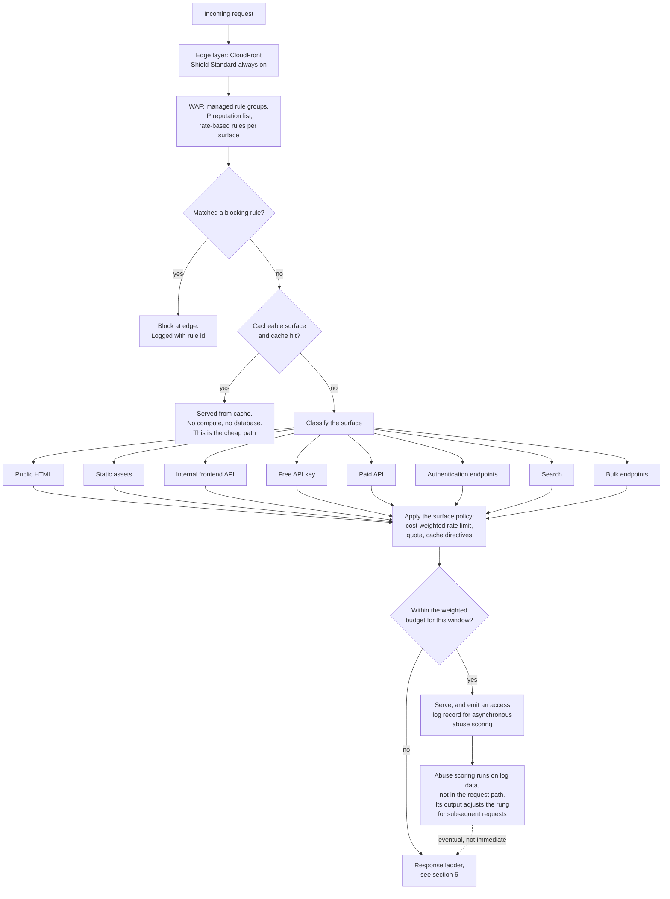
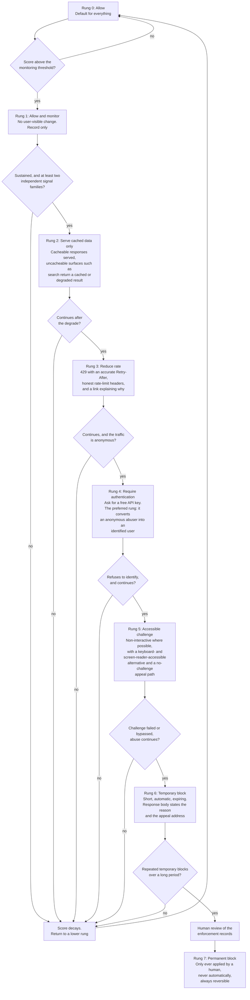
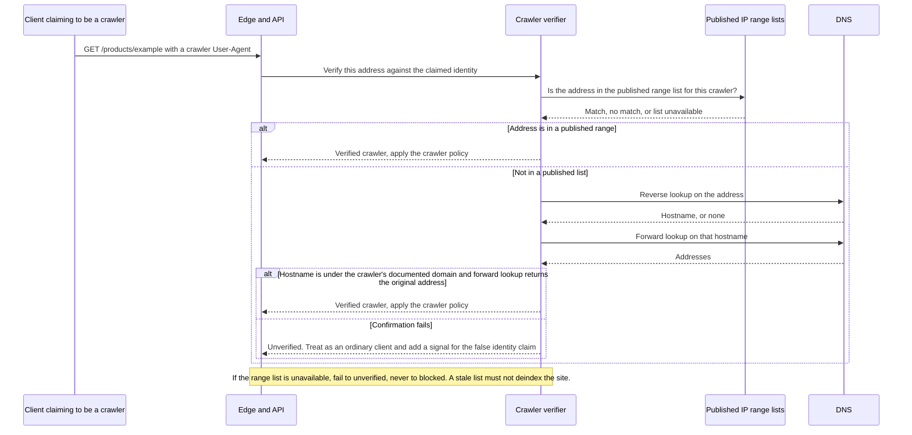

# FirmScout — Scraping Resilience

> Status: **Draft v0.1** — design only. No edge, application, or scoring control described here is deployed.
> Companion: [blueprint.md](blueprint.md) (authoritative), [ADR-0008](../adr/0008-scraping-resilience.md), [security.md](security.md), [cost-controls.md](cost-controls.md).

FirmScout publishes a catalogue for free, in server-rendered HTML, on purpose. That decision is not negotiable — organic search is the acquisition channel (blueprint P4), and the public site is the product's credibility. It also means the entire catalogue is, and will remain, extractable by anyone willing to write a loop.

This document is about what to do with that fact. Its central claim is that **bulk extraction is the wrong thing to optimise against**. The thing worth defending is availability for legitimate users and a bounded AWS bill, and those two goals produce a very different set of controls than "stop the scrapers" would.

---

## 1. The actual risk

The feared scenario: a competitor, or someone building a free clone, extracts the whole catalogue from the public HTML instead of paying for API access.

**What it costs the scraper.** Take an illustrative catalogue of 50,000 product pages — a figure to be replaced with a real one once the catalogue exists. At a polite one request per second, a full sweep takes about fourteen hours on a single machine. At ten per second it takes under ninety minutes. The compute cost is a rounding error: a small cloud instance for a day, or a laptop and some patience. If FirmScout forces distribution across many source addresses, the scraper's cost becomes residential proxy bandwidth, which is priced per gigabyte and is genuinely the dominant line item for a determined extractor — but even that is measured in tens of dollars for a catalogue this size, not thousands.

**There is no threshold of friction that makes a one-off full extraction uneconomic.** Any control calibrated to prevent it would have to be so aggressive that it broke the site for real users. This is the arithmetic that drives every other decision in this document.

**What it costs FirmScout.** Here the arithmetic is more interesting, because the cost is not uniform across requests. The dominant variable is not "was this request a scraper?" but "**did this request hit the cache?**":

| Request shape | What it consumes | Relative cost |
| --- | --- | --- |
| Product page, CDN cache hit | Edge request charge, egress | Baseline — call it 1 |
| Product page, cache miss | Edge, Lambda invocation, database read, egress | 10 to 100 |
| Search with a novel query | Edge, Lambda, full-text query, uncacheable | 10 to 100, and unbounded in tail latency |
| Cache-busting variant of a cached page | Same as a cache miss, plus cache pollution and reduced hit ratio for everyone else | Worse than a miss |
| Blocked at WAF | Edge request charge, WAF evaluation | Well below 1, but not zero |

Two consequences follow, and they are the load-bearing ideas of this document.

**First: a scraper served entirely from cache costs FirmScout roughly what a search-engine crawl costs, which is to say, not much.** A full catalogue sweep of cacheable pages is an annoyance, not a financial event. So the primary defensive objective is not to stop the sweep — it is to *make sure the sweep hits the cache*, and to make the uncacheable surfaces (search, bulk, deep pagination, parameterised URLs) the ones that are tightly governed.

**Second: the expensive abuser and the aggressive scraper are not the same client.** Someone paginating through `/search?q=<random string>` at fifty requests per second is a cost event whether or not they are building a competing catalogue. Someone pulling every product page once a week from cache is a competitor, and cheap. Controls aimed at "scraping" would catch the second and miss the first. Controls aimed at *cache-miss cost* catch the first, which is the one that matters.

**What extraction actually costs FirmScout competitively.** A scraped snapshot is a photograph of a moving object. Its value decays within days, because the product is *freshness and history*, neither of which a single sweep provides. To keep a scraped clone current, a competitor must run continuous extraction against a site that changes shape, repair their extractors when it does, and do so for every product — which is precisely the engineering cost FirmScout has industrialised and sells as a service. The realistic competitive damage of a one-off scrape is therefore bounded and much smaller than intuition suggests. Continuous scraping is a real competitive threat; it is also self-limiting, because at that point the scraper is running a worse version of FirmScout's own operation.

---

## 2. Scraping cannot be prevented

**Anything sent to a browser can be extracted.** A headless browser is a browser. Any transformation applied on the client can be applied by the extractor, because the extractor has the same code — and in FirmScout's case, has it in a public repository under Apache-2.0.

Therefore the following are rejected as designs, not merely deprioritised:

- Rendering the catalogue only via JavaScript so that "simple" scrapers fail. It costs SEO, costs accessibility, costs page weight for every honest user, and delays the extractor by the length of one `npm install`.
- Encoding, encrypting, or splitting data client-side so it must be "assembled" in the browser. The assembly code ships with the page.
- Requiring an account to see catalogue data. This destroys the acquisition channel, which is worth more than the data.
- Any design whose security argument is "they would have to reverse-engineer it". They would, once, for an afternoon.

The honest framing: **FirmScout's public data is public. The defensible assets are freshness, completeness, history, provenance, and the operation that maintains them** — none of which fit in an HTML page.

---

## 3. Goals, in priority order

Ordered, because they conflict, and an unordered list of goals is a way of avoiding the decision.

| # | Goal | What we will sacrifice for it |
| --- | --- | --- |
| 1 | **Protect availability for legitimate users** | Everything below. A control that risks blocking real users loses to this goal every time |
| 2 | **Control AWS spend** | Response completeness under load (degrade to cached data), and latency (shed load) |
| 3 | **Preserve legitimate manual access** | Detection coverage. A human clicking around fast must never be enforced against |
| 4 | **Preserve SEO** | Any control that risks deindexing is rejected outright, including all forms of cloaking |
| 5 | **Preserve accessibility** | CAPTCHAs as a default, honeypot links, and JavaScript requirements |
| 6 | **Make the official API the path of least resistance** | Free-tier revenue. A generous free API tier is a *defensive* investment, not a cost |
| 7 | **Avoid invasive tracking** | Detection accuracy. Fingerprinting would improve detection and is forbidden anyway |

Goal 6 deserves emphasis because it is the only goal on this list that reduces the problem rather than managing it. **Every hour spent making the API cheap, well-documented, generous and pleasant removes more scraping than an equivalent hour spent on detection.** People scrape because scraping is easier than the alternative. Making the alternative easier is the highest-leverage control in this entire document, and it is a product decision rather than a security one.

---

## 4. Layered controls

Three layers, in increasing order of cost-to-build and decreasing order of cost-effectiveness.

### 4.1 Edge layer — cheapest protection per unit

CloudFront absorbs cacheable traffic before it becomes compute. AWS Shield Standard is always on and handles network- and transport-layer floods. WAF adds managed rule groups (common exploits, bad inputs, known-bad IP reputation, anonymous-proxy lists used as a *signal* rather than a block), plus rate-based rules scoped per surface rather than globally. Everything is logged, because an unlogged block is an unexplainable one, and §10 depends on being able to explain every enforcement decision.

The edge is where volumetric abuse must die, because it is the only layer whose per-request cost is materially below the cost of serving.

### 4.2 Application layer — the tuning knobs

Cost-weighted rate limits, durable quotas in PostgreSQL for billing-relevant monthly counts, in-process token buckets for per-second smoothing (with the honest N-instances caveat from blueprint §3.9), aggressive and correct cache headers, and the abuse score of §5.

**One design consequence is worth stating loudly: the abuse score is computed asynchronously from access logs, not synchronously in the request path.** Scoring inline would require a counter write per request, which is itself a per-request database cost — the abuse control would become the cost problem it exists to prevent. The consequence is that enforcement lags behind behaviour: an abuser gets a burst of requests through before the score catches up. Given goal 1 and the cost analysis in §1, that lag is not merely acceptable, it is *preferable*, because it also means a legitimate user's brief unusual burst has expired before anything acts on it.

### 4.3 Product layer — highest leverage, lowest run-rate

An API that is free at a useful volume, documented in one page, keyed in thirty seconds, and priced comprehensibly is the control with the best return. It costs engineering time, not monthly spend, and it converts adversaries into users — including into *paying* users, which no rate limit has ever done.

### 4.4 Per-surface policies

A single global rate limit is wrong, and it is worth being precise about why, because it is the default thing to build.

1. **It must be calibrated to one endpoint's cost.** Calibrate to the cheapest and the expensive surfaces stay exposed; calibrate to the most expensive and normal browsing is throttled. There is no correct single number.
2. **It ignores a hundredfold cost spread.** One novel search query costs what dozens of cached page views cost. Counting them as one request each prices the abuse wrong in exactly the direction that hurts.
3. **It punishes normal browsing.** One page view fans out into several asset requests. A global per-request limit charges a human for rendering a page.
4. **It cannot express the product.** Free versus paid is the business model. A single number either undercuts the paid tier or degrades the free site.
5. **It cannot distinguish shared egress from an individual.** A university behind three egress addresses and one abuser look identical to a global per-IP counter (§10).

So limits are expressed in **cost units per window**, not requests per window, with a weight per surface reflecting cache-miss cost.

| Surface | Cache policy | Anonymous policy | Keyed policy | Weight | Reasoning |
| --- | --- | --- | --- | --- | --- |
| **Public HTML** (product, vendor, family pages) | Long TTL, invalidated on publish; high hit ratio expected | Generous burst, enforced mainly by edge rate rules | n/a | 1 | Cheap when cached. This is the SEO surface and the human surface; it is deliberately the most permissive |
| **Public static assets** | Immutable, very long TTL, content-hashed filenames | Effectively unlimited | n/a | 0 | Excluded from all counting and scoring. Fetching assets is a *positive* signal, and charging for them punishes real browsers |
| **Internal frontend API** (the site's own data calls) | Short TTL, same-origin | Moderate, keyed to a session identifier where one exists | n/a | 2 | An `Origin` check is friction, not a control — it is trivially forged and is treated as a weak signal only |
| **Free API key** | `private`, short | n/a | Monthly quota plus per-minute burst | 2 | The conversion surface. Generous enough to be genuinely useful, per goal 6 |
| **Paid API** | `private`, `no-store` for tenant data | n/a | Per-plan quota, overage by contract rather than by hard cutoff | 2 | A paying customer is never hard-blocked without a human conversation |
| **Authentication endpoints** (key creation, account) | Never cached | Very strict, per address *and* per account, exponential backoff | Same | 20 | Credential stuffing is the threat, not scraping. Strictness here costs nothing in legitimate throughput because no real user authenticates in a loop |
| **Search** | Short TTL keyed on the *normalised* query; novel queries uncacheable | Strictest anonymous limit in the system | Higher, metered | 10 | Highest cache-miss cost per request and unbounded query space. This is where denial of wallet lives |
| **Bulk lookup** | Never cached | Not available | Professional and above, cost-weighted by items per call | 5 per item | Bulk is the paid product. Its absence from the anonymous tier is a product boundary, not an anti-scraping measure |

Normalising the search cache key (lowercasing, trimming, collapsing whitespace, sorting parameters, dropping unknown parameters) does double duty: it improves the hit ratio for real users and it removes the cheapest cache-busting technique.

---

## 5. Abuse risk scoring

The score is **additive, explainable, and auditable**. It is not a machine-learning model, and that is a deliberate refusal: a model output cannot be appealed by the person it affected, cannot be explained to them, and cannot be debugged when it develops a systematic bias against, say, users of a particular assistive technology. Every point in a FirmScout abuse score traces to a named signal with a stated weight.

**All weights below are starting points to be tuned against real traffic. None of them is evidence-based yet, because there is no traffic.** They are written down so that tuning is a change to a number with a history, rather than a re-argument from first principles.

| Signal | Weight | Why it indicates abuse | Why it also fires on legitimate users |
| --- | --- | --- | --- |
| Sequential product enumeration (slugs in catalogue or alphabetical order) | 25 | Humans do not traverse a catalogue in index order | A sitemap-driven research tool does |
| Pagination depth far beyond human use | 15 | Nobody reads page 340 | Archival crawlers do |
| Catalogue-wide traversal breadth in a window | 20 | Distinct products far exceeding any browsing session | A monitoring tool checking a large fleet — *our target customer* |
| Requests without accompanying asset fetches | 10 | Real browsers fetch CSS, fonts, images | Text browsers, screen readers with images disabled, aggressive ad blockers, prefetch, reader mode. **Deliberately low-weighted for this reason** |
| Highly regular request intervals (variance below a floor) | 15 | Metronomic timing is machine timing | A cron-driven check by a legitimate user; also a page auto-refresh |
| Distributed identical behaviour across addresses in one network | 20 | The signature of a proxy pool sweeping a catalogue | A corporate NAT where many employees use the same internal tool. **Applied to the group, never to an individual address** |
| Cache-busting parameters on cacheable URLs | 20 | Defeating the CDN has no legitimate purpose at volume | Some analytics and link-tracking parameters do this accidentally |
| High-volume expensive search | 20 | Directly the denial-of-wallet vector | A user pasting many part numbers in succession |
| One API key used concurrently from many unrelated networks | 25 | A leaked or shared key | A customer's distributed CI fleet — which is a *conversation*, not an enforcement |
| Repeated authentication failures | 30 | Credential stuffing | A misconfigured integration |

**The rules that govern the score matter more than the weights.**

- **No single signal is decisive.** Enforcement above the "monitor" rung requires the score to cross a threshold *and* at least two independent signal families to have contributed. Any single signal, at any magnitude, can raise the score but cannot on its own trigger an action.
- **Per-family contribution is capped**, so one noisy detector cannot dominate.
- **The score decays** — halving on a timescale of tens of minutes — so a brief burst does not brand a client for a day, and so a legitimate user who did something unusual once is back to zero before they return.
- **Every enforcement action writes a record**: the subject (a hashed address or a key identifier), the score, the itemised signals and their weights, the evaluation window, the action taken, and the policy version that produced it. This record is what makes an appeal (§10) answerable with "here is what we saw" instead of "the system decided". It is also what makes a policy change measurable.
- **Scoring never uses browser fingerprinting**, and never uses any signal derived from personal characteristics.

**Honest assessment of efficacy.** Every signal above is evadable by a competent extractor: randomise intervals, fetch assets, shuffle the traversal order, spread across residential proxies, keep per-address volume low. **The score catches careless abuse and cost anomalies. It does not catch a funded competitor, and it is not designed to.** Given §1 — that a funded competitor's full sweep is cheap for us if it hits cache — this is an acceptable, and in fact correct, design centre.

---

## 6. The response ladder

Enforcement escalates. Each rung is reversible, and de-escalation is automatic as the score decays.

Two properties of this ladder are load-bearing.

**Rung 4 is the goal, not rung 7.** Asking an anonymous heavy user for a free API key converts them into an identified user with a quota, a contact address, and a path to a paid plan. It is the only rung that makes the situation better rather than merely less bad, and the ladder is shaped to reach it early and stay there.

**The rung is per-surface, not per-client.** The same client can be at rung 0 on product pages and rung 3 on search, because the cost profiles differ by two orders of magnitude. A client that browses normally and searches abusively should be throttled only on search.

---

## 7. Explicitly forbidden countermeasures

Each of these is a technique that other catalogues use and that FirmScout will not.

**Never serve false firmware or security data.** Not to suspected scrapers, not as a watermark, not as a tarpit, not ever. Three reasons, any one of which would be sufficient. First, someone could act on it: install the wrong image, or believe they are patched when they are not. FirmScout exists to prevent exactly that outcome; producing it deliberately would be self-refuting. Second, a "suspected scraper" is sometimes a real user (§10), and the cost of being wrong is that we lied to a customer. Third, it destroys our own observability: once responses can be intentionally false, no monitoring, evidence chain, or bug report can distinguish a poisoned response from a defect. This rule is absolute and admits no threshold argument.

**Never poison scraped datasets.** The watermarking variant of the above — seeding false records to prove provenance later — fails for the same reasons, because a false record is a false record whoever reads it, and the person who reads it is a real user on a real product page. The narrow acceptable version is a *true* canary: an obscure but genuine product whose presence in a competitor's catalogue is evidence. Even that has costs (weak evidentiary value, and it complicates caching), so it is not planned; it is merely not forbidden.

**No hidden traps that harm accessibility.** Honeypot links hidden with CSS are followed by screen readers, by keyboard navigation, by link checkers, and by legitimate crawlers. A trap that a blind user falls into and a scraper avoids is not a security control; it is a bug with a security rationale. If a honeypot is ever used, it must be `robots.txt`-disallowed, `aria-hidden`, removed from the tab order, and — critically — **hitting it must never be sufficient to trigger enforcement**, only to contribute to a score.

**No dependence on browser fingerprinting.** Four independent reasons. It is tracking, and goal 7 forbids it. In the EU it requires consent under the ePrivacy regime, which converts a security control into a consent-banner problem. It does not work: headless browsers spoof fingerprints, and the commercial anti-detect browser market exists precisely to defeat it. And it is backwards for *this* audience — FirmScout's users are infrastructure and security engineers, the population most likely to run hardened browsers, resist-fingerprinting modes, content blockers and VPNs. A fingerprinting-based control would systematically penalise the users FirmScout most wants.

**No collection of unnecessary personal information.** Anti-abuse is not a licence to collect. Addresses are hashed for counting, retained briefly, and not joined to identity. There is no reason for a firmware catalogue to know anything about a visitor.

**JavaScript obfuscation is not a security control.** It delays an extractor by hours, breaks accessibility tooling and non-JavaScript clients, damages SEO, and adds page weight that every honest user pays for. FirmScout is also open source, so the deobfuscation instructions ship in the same repository as the obfuscator.

**No blanket blocking of ASNs, countries, or cloud provider ranges.** The false-positive rate is enormous, the geopolitical implications are unpleasant, and it does not stop anyone who can rent a residential proxy. Cloud provider ranges may raise a score; they may not, alone, block.

**Never require JavaScript to read catalogue data.** It is not a control (§2), and it costs SEO and accessibility, which are goals 4 and 5.

---

## 8. SEO versus scraping

**The tension, stated plainly.** The properties that make a page indexable — complete content in the initial HTML response, no authentication, a stable canonical URL, fast and reliable delivery — are precisely the properties that make it scrapable. There is no configuration that serves a search engine fully and an extractor partially, because from the server's perspective they issue the same request. The only technique that would separate them is cloaking, which violates every major search engine's guidelines, risks deindexing, and would end the acquisition channel that the entire business plan rests on (blueprint P4). It is also, in the limit, the same act as serving different data to different clients, which §7 forbids.

**The accepted trade:** the public HTML is fully extractable, deliberately, and FirmScout defends cost and availability rather than exclusivity. This is stated as an accepted trade rather than an oversight so that nobody re-litigates it under pressure after a competitor appears.

**Crawler identity is never trusted from the User-Agent header.** `User-Agent: Googlebot` is a string anyone can send, and an unverified claim to be a crawler is a *negative* signal — a client that lies about its identity has told us something useful. Verification uses two mechanisms together:

Verified crawlers receive a distinct, generous policy and are exempt from enumeration and traversal scoring, because sweeping the catalogue is exactly what we want them to do. Verification results are cached for a bounded period so the DNS round trips do not sit in the request path.

**Crawl budget and cost control are the same problem.** `robots.txt` allows product, vendor and family pages; disallows parameterised search URLs, deep pagination, and faceted permutations. This is not hiding data — every fact remains reachable through the canonical pages and the sitemap — it is directing crawlers away from the surfaces whose cache-miss cost is high, which improves crawl efficiency and reduces spend simultaneously. Sitemaps carry `lastmod` so crawlers refetch what changed instead of sweeping everything, and canonical URLs plus strict unknown-parameter handling prevent an infinite crawl space, which would otherwise be both an SEO defect and a cost defect.

---

## 9. Accessibility analysis

**CAPTCHAs must not be the default rung, and the asymmetry is the reason.** A commercial solving service handles a CAPTCHA for a fraction of a cent, so a funded scraper barely notices. A user with a visual impairment, a motor impairment, a cognitive disability, or a slow connection may simply not get in. The control is cheap for the adversary and expensive for the legitimate user — the exact inversion of what a good control does. Most CAPTCHA products also embed a third-party tracker, which collides with goal 7.

If a challenge is deployed at rung 5, it must satisfy all of the following: a non-interactive mechanism (proof of work, or a privacy-preserving attestation) preferred over an interactive puzzle; full keyboard operability and correct labelling for assistive technology; never a media-only challenge with no alternative; generous timing, because short timers are themselves an accessibility failure; and **always a no-challenge appeal path** — an address a person can write to and be unblocked by a human. The appeal path is not a courtesy; it is the mechanism that makes the whole ladder safe to deploy.

**Privacy-preserving browsers are not blocked by default.** Tor exit nodes, VPN egress, iCloud Private Relay and hardened browser configurations may contribute a small signal at most. Blocking them would target FirmScout's own audience.

**Assistive technology and slow connections must not be misread as abuse.** Several of the §5 signals fire on legitimate accessibility patterns: a screen reader may traverse pages in an order that looks systematic; a browser with images and CSS blocked produces no asset fetches; a user on a poor connection retries, generating duplicates; browser prefetch, prerender and reader modes generate machine-shaped request patterns without the user doing anything. This is precisely why the "no asset fetches" signal carries a low weight and why no single signal can trigger enforcement.

**Archival and text-only tools are allowed.** Blocking the Internet Archive to inconvenience a scraper damages the public record for a negligible gain.

---

## 10. False-positive analysis

This section drives the thresholds, so it is the most consequential section in the document.

**Who gets caught by mistake.** Corporate NAT, where thousands of employees egress through a handful of addresses. University networks, where an entire campus can sit behind a small block. Carrier-grade NAT, which is how a large share of mobile users reach the internet — one address can represent hundreds of unrelated people. Shared VPN and privacy-relay egress. Cloud addresses used by legitimate tooling. And, most painfully, **an infrastructure team's own script checking their own fleet against FirmScout — which is our target customer doing exactly the thing we built the product for, a week before they would have asked about an API key.**

**The cost asymmetry, quantified in kind if not in currency.**

| | False positive | False negative |
| --- | --- | --- |
| **What happens** | A real user is throttled or blocked | Some already-public data is extracted |
| **Do they tell us?** | **No.** They conclude the site is broken and leave. Support tickets capture a small fraction of blocked users | n/a |
| **Cost** | The lifetime value of a lost customer, plus the referrals they would have made, plus reputational damage in a community that talks to itself | The marginal serving cost of the requests, which §1 shows is small when cached, plus a bounded and decaying competitive loss |
| **Reversible?** | Only if they come back, which they mostly do not | Yes — the data was going to be public anyway |
| **Detectable?** | Poorly, by design of the failure | Yes, in logs |

The asymmetry is not close. A false negative costs fractions of a cent and some pride. A false positive costs a customer, silently, with no feedback loop to tell us it happened. **The thresholds are therefore biased hard toward permissiveness**, to the point where the expected number of legitimate users enforced against per day should be approximately zero even at the cost of letting substantial scraping through.

Concretely, that bias produces these rules:

- Never enforce on a single signal, at any magnitude.
- Require sustained behaviour over a long window, not a burst.
- Make the first enforcement action non-destructive: rung 2 (serve cached) or rung 3 (reduce rate), never a block.
- **Prefer "ask for a free API key" over "block"** — it converts rather than rejects, and it is reversible by the user in thirty seconds.
- Every 4xx enforcement response carries a human-readable explanation and an appeal address in the body, not just a status code.
- **Prefer per-key and per-session enforcement over per-address wherever an identifier exists.** Per-address enforcement is the last resort precisely because addresses are shared. Honest limitation: FirmScout cannot reliably identify which addresses are shared corporate egress. Known CGNAT ranges, Private Relay ranges, and published shared-egress lists can be treated as shared; an arbitrary company's NAT cannot. So the general rule is to assume an address may be shared unless proven otherwise.

**Appeal path.** A documented address in every enforcement response and in the public documentation, a stated response target, and — the part that makes it work — the enforcement record from §5, so a human can answer "you were rate-limited on search because of X, Y and Z over this window" instead of "the system flagged you". An appeal that cannot be answered specifically is not an appeal.

**The metrics to monitor.** In order of usefulness:

1. **Enforcement actions against clients that subsequently authenticate or convert.** This is the direct false-positive proxy: we throttled someone who turned out to be a real user. It should be near zero, and a rise in it is the primary signal that thresholds are too tight.
2. **Synthetic legitimate canaries.** Scripted sessions shaped like a screen-reader user, a slow-connection user, a text-browser user and a fast-clicking human, run continuously. **If a canary is ever enforced against, that is a page-worthy alert.** This is the strongest available control against silent over-blocking, because it does not depend on a wronged user complaining.
3. Appeals received and the proportion upheld. A high uphold rate means the thresholds are wrong; zero appeals means the appeal path is invisible, which is also a failure.
4. Enforcement actions per day by rung and by contributing signal, to see which detector is doing the damage.
5. Unique-visitor volume by network after any policy change, to catch a whole organisation disappearing.

---

## 11. What this costs to run

In relative terms only; no figures are invented here, and the real ones belong in [cost-controls.md](cost-controls.md) once measured.

| Layer | Build cost | Run cost | Protection per unit of cost |
| --- | --- | --- | --- |
| CDN caching and correct cache keys | Low | **Negative** — it reduces spend | Highest. This is the control that matters most and it is also the one that pays for itself |
| WAF managed rules and rate rules | Low | Moderate: a monthly charge per rule group plus a per-request evaluation charge | High for volumetric abuse, low for careful scraping |
| Shield Standard | None | Included | High for its narrow scope |
| Access logging and asynchronous scoring | Moderate | Low if logs are sampled and retention is short; **potentially significant if not**, since log storage is a real line item | Moderate |
| Rate limiting and quotas in the application | Moderate | Low — quota counters are cheap relative to the requests they govern | Moderate |
| Abuse scoring, tuning, and appeal handling | **High and ongoing** — this is human time, not compute | Low compute, ongoing operational attention | Low per unit of cost, which is why it sits last |
| A generous, well-documented API | Moderate one-off | Free-tier serving costs | **Highest overall**, because it removes demand for scraping rather than resisting it |

What all of this protects: a bounded compute and database bill under abuse, availability for people who came to look up a firmware version, and the paid API's value proposition. What it explicitly does not protect: exclusive possession of the catalogue, which §2 establishes is not defensible and §1 establishes is not worth much.

---

## 12. Controls implemented versus planned

**Nothing in this document is deployed.** There is no AWS account in use, no CloudFront distribution, no WAF, no edge logging, and no scoring pipeline; `infrastructure/terraform/` contains no resources. The most that will exist after the first vertical slice is in-process rate limiting and cache headers running on a laptop. The table below exists so that this fact survives contact with a roadmap.

| Control | Status | Note |
| --- | --- | --- |
| CloudFront distribution and cache policies | **Planned** | Terraform skeleton only |
| WAF managed rule groups and IP reputation | **Planned** | |
| WAF rate-based rules, per surface | **Planned** | Requires the surface taxonomy in §4.4 to exist as routes first |
| Shield Standard | **Planned (automatic)** | Enabled by default once anything is deployed |
| Edge and application access logging | **Planned** | Prerequisite for everything in §5 |
| In-process token-bucket rate limiting | **Planned — first vertical slice** | Listed in the slice's middleware chain; approximate per instance, per blueprint §3.9 |
| Durable quota counters in PostgreSQL | **Planned** | Schema designed; write path not built |
| Cost-weighted limits rather than request counts | **Planned** | Design decided here; not implemented |
| Cache headers and normalised search cache keys | **Planned — first vertical slice** | The middleware exists in the slice design |
| Asynchronous abuse scoring | **Planned — later** | Deliberately not in the MVP; it needs real traffic to tune against and would be tuned against noise if built first |
| Response ladder | **Planned — later** | Rungs 0, 1 and 3 arrive first; rungs 4 to 7 require identity and appeal infrastructure |
| Enforcement records and appeal path | **Planned** | Must ship in the *same release* as the first automatic enforcement, not after it |
| Verified-crawler identification | **Planned** | Until it exists, no crawler-specific policy is applied at all, which is the safe default |
| `robots.txt`, sitemaps, canonical URLs | **Planned — first vertical slice** | Cheap, and both an SEO and a cost control |
| Synthetic accessibility canaries | **Planned** | Required before any automatic enforcement is enabled |
| Challenge mechanism | **Not designed** | No challenge will be deployed before the accessibility review in [security.md §8](security.md#8-open-questions-requiring-specialist-review) |

The sequencing rule that follows from §10: **enforcement records, the appeal path, and the accessibility canaries must ship before or alongside the first control capable of blocking a request — never after it.** Shipping enforcement first and observability second is how a system silently loses users for a quarter before anyone notices.
