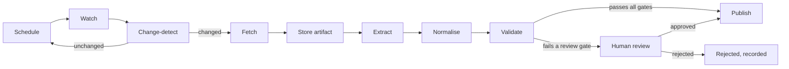
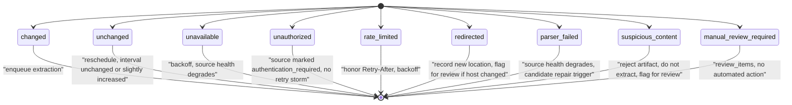

# Update pipeline

> The deep dive behind [blueprint.md](blueprint.md) §16, and the most operationally important document in this set — this is what runs, unattended, thousands of times a day. Diagrams: [`docs/diagrams/update-decision-tree.md`](../diagrams/update-decision-tree.md), [`docs/diagrams/release-state-machine.md`](../diagrams/release-state-machine.md), [`docs/diagrams/source-health-state-machine.md`](../diagrams/source-health-state-machine.md), [`docs/diagrams/collector-sequence.md`](../diagrams/collector-sequence.md).

## The pipeline, stage by stage

| Stage | Input | Output | Failure modes | Idempotency guarantee | Timeout | Cost profile |
| --- | --- | --- | --- | --- | --- | --- |
| **Schedule** | A source's check history, current health state | A `source.check.requested` job, `run_after` set by `scheduling.NextInterval` | Scheduler crash mid-tick (mitigated: next tick re-evaluates from persisted state, nothing is lost) | Enqueue uses an idempotency key derived from `(source_id, scheduled_window)`, so a duplicate scheduler tick cannot double-enqueue the same window | N/A (in-process loop tick, sub-second) | Negligible — no network call |
| **Watch** | The source's watcher mechanism config, prior `ETag`/`Last-Modified`/hash | A `FetchOutcome` (see the ladder below) | DNS failure, TLS error, timeout, unexpected content-type | The watch itself has no side effect until the outcome is recorded — safe to retry | Per-request timeout (default 10s connect + 20s read, configurable per source) | The cheapest stage by design — most watches never download a full body |
| **Change-detect** | The watch outcome plus the prior stored hash | `unchanged` or `changed`, transitioning the source's state | A normaliser bug producing a false `changed` on every check (silent cost inflation) or false `unchanged` (silent missed releases) | Comparing a freshly computed hash to a stored one is naturally idempotent — running it twice on the same artifact yields the same verdict | Bounded by the Watch stage's timeout | CPU only, no network |
| **Fetch** | A source URL, guard configuration (size/MIME limits, SSRF guard) | Raw response bytes + response metadata | Oversized response (aborted at `max_bytes`), disallowed MIME type, redirect to a disallowed host, SSRF-guard rejection | A conditional `GET` is naturally idempotent server-side; client-side, `CheckSource` records the check outcome exactly once per job attempt via the job's own dedup | Same as Watch; large-body fetches get a longer read timeout, still bounded (default 30s) | Egress-dominated; this is the expensive stage, which is why Watch exists to avoid running it unnecessarily |
| **Store artifact** | Raw fetched bytes | An `ArtifactRef` (content hash + storage location) | Storage write failure | **Fully idempotent by construction** — content-addressed storage means writing the same bytes twice yields the same ref and is a no-op on the second write | Storage adapter's own timeout (default 5s) | Storage volume only |
| **Extract** | A `Source` and an `Artifact` (never a live re-fetch) | `[]CandidateRelease` | Selector miss (layout change), malformed content causing a parse error, resource-limit trip (max candidates, wall-clock) | **Pure function of `(Source, Artifact)`** per the Collector SDK contract (blueprint §13) — running it twice on the same artifact produces identical candidates, always | SDK-enforced wall-clock cap (default 5s) per artifact | CPU only, proportional to artifact size |
| **Normalise** | Raw candidate fields (version string, date string, channel label) | Normalised fields (`NormalizedVersion`, `PartialDate`, mapped `Channel`) | A normalisation rule that silently drops precision (treating `"February 2026"` as day-precise) | Deterministic function of its input — idempotent | Sub-millisecond, in-process | Negligible |
| **Validate** | A `CandidateRelease` plus repository lookups (existing releases, product registry) | A verdict: publish / reject / review, against each of the ten gates below | A gate with a logic bug that silently lets bad data through (mitigated by gate-level test coverage, not by this pipeline's structure) | Read-only against current state; re-running validation on the same candidate before it is consumed yields the same verdict | Bounded by its DB queries, typically <100ms | DB reads only |
| **Publish or review** | A validated candidate | A `releases` row (publish) or a `review_items` row (review) | A crash mid-transaction (mitigated by `UnitOfWork` atomicity — see [clean-architecture.md](clean-architecture.md)) | See "Idempotency" section below — the guarantee is *exactly one release per distinct fact*, not merely "safe to retry" | Single DB transaction, typically <100ms | DB write + summary refresh |

## The watcher mechanism ladder, cheapest first

Watchers are tried in this order; a source's registered watcher mechanism is the *cheapest one the source actually supports*, not a fixed choice per source type. FirmScout never falls back to a more expensive mechanism unless the cheaper one is unavailable for that specific source.

| Mechanism | HTTP semantics | Applies when | Cost |
| --- | --- | --- | --- |
| **Vendor webhook** | Vendor `POST`s to a FirmScout-owned endpoint on publish | The vendor offers one (rare among the pilot vendors) | Lowest possible — zero polling, push-driven |
| **RSS/Atom feed** | `GET` a feed URL, compare the newest `<item>`/`<entry>` `guid`/`id` and `pubDate`/`updated` to the last-seen value | The vendor publishes a feed for the content type (e.g. Fortinet's PSIRT feed at `fortiguard.com/rss/ir.xml`, RSS 2.0, redirecting to `filestore.fortinet.com/...`) | Low — small, cacheable body |
| **API cursor / updated timestamp** | `GET` an API endpoint, compare a `updated`/`modified` field or an opaque cursor to the last-seen value | The vendor exposes a structured API (e.g. Ubiquiti's `fw-update.ubnt.com/api/firmware-latest`, which carries `created`/`updated`) | Low — JSON, typically small |
| **HTTP `ETag`** | Conditional `GET` with `If-None-Match: <prior ETag>`; a `304 Not Modified` means unchanged, a `200` with a new `ETag` means changed | The endpoint returns an `ETag` header (measured: MikroTik's `upgrade.mikrotik.com/routeros/NEWESTa7.stable` does) | Very low — a `304` response has no body |
| **`Last-Modified`** | Conditional `GET` with `If-Modified-Since: <prior Last-Modified>`; same `304`/`200` semantics | The endpoint returns `Last-Modified` but no `ETag`, or as a secondary check alongside `ETag` | Very low, same shape as `ETag` |
| **Conditional GET (generic)** | Either or both of the above, sent together where the endpoint supports both | Default for any endpoint advertising cache validators | Very low |
| **Sitemap `lastmod`** | `GET` the vendor's `sitemap.xml`, compare the `<lastmod>` of the relevant `<url>` entry | The vendor maintains an accurate sitemap covering the page in question | Low — one shared fetch can watch many pages' `lastmod` at once |
| **Targeted section hash** | Full `GET` of the page, but hash only a configured sub-tree (e.g. `div.changelog-header`) after normalisation | The page has no reliable validator (no `ETag`, `Cache-Control: private`) but a stable, extractable sub-section exists — MikroTik's changelog page, measured 2026-09-03, is exactly this case | Medium — full body download, but change detection avoids triggering extraction on noise |
| **Normalised full-content hash** | Full `GET`, normalise the entire body (strip volatile content per below), hash the result | No stable sub-section can be isolated, but the whole-page noise can still be normalised away | Medium — same download cost, slightly more normalisation work, and more false-change risk than a targeted section |
| **Full comparison** | Full `GET`, structural diff against the prior stored artifact (not just a hash) | Last resort: content that resists both selection and hashing stability (e.g. content whose insignificant whitespace/attribute order genuinely varies) | Highest — the most CPU and most false-positive-prone; used sparingly and flagged for collector-config review when it's the only option |

A source's watcher choice is recorded in its `collector_definitions` config and re-evaluated whenever a Repair agent run (see [ai-agents.md](ai-agents.md)) proposes a better one — for example, discovering that a page the registry currently full-hashes actually has a stable sitemap entry.

## Content normalisation before hashing

Hashing raw bytes produces constant false `changed` outcomes on any page that embeds non-content noise, which wastes the entire extraction budget on nothing. Before a hash is computed (targeted-section or full-content), the normaliser strips:

- **Analytics identifiers** — query-string tracking parameters, embedded session/analytics IDs in inline scripts.
- **Advertisement blocks** — third-party ad iframes/containers, which rotate content on every load.
- **Session tokens** — CSRF tokens, per-request nonces embedded in forms or data attributes.
- **Cookie banners** — consent-management widgets, which vary by region/cookie-state and have nothing to do with page content.
- **Randomised HTML attributes** — framework-generated IDs (`wire:id`, `x-data` state blobs, hashed CSS-module class suffixes) that change on every server render without any content change.
- **Navigation menus, headers, footers** — shared chrome present on every page of the site, irrelevant to the specific content being watched.
- **Unrelated timestamps** — "page generated at," "you are visitor #," server response-time widgets.
- **Personalisation blocks** — "recommended for you," geolocation-based banners, A/B test variant markers.

### The measured MikroTik case for the targeted-section approach

`mikrotik.com/download/changelogs`, measured 2026-09-03: 409 KB, server-rendered with Livewire/Alpine (hence the `wire:id`/`x-data` attributes above), `Cache-Control: private`, no `ETag`. Hashing the *whole page* would produce a false `changed` outcome on essentially every check — Livewire's wire IDs and Alpine's client-state attributes regenerate per render even when the visible content is identical, and `Cache-Control: private` means there's no shared cache layer smoothing that out. The collector config (`collectors/config/mikrotik/changelogs.yaml`) instead sets `normalize.section_selector: "div.changelog-header"`, hashing only the 46 changelog entries' structured content — version, channel badge, date — after stripping the volatile attributes listed above. That hash is stable across repeated fetches of unchanged content and changes exactly when a new entry (or an edit to an existing one) appears. This is the concrete instance of the "targeted section hash" row in the ladder above, and it is why that row exists rather than jumping straight to "normalised full-content hash": a *known-stable* sub-tree is strictly better than *hoping* normalisation of the entire page converges to stability.

## The nine watcher outcomes

| Outcome | Meaning | Triggers |
| --- | --- | --- |
| `unchanged` | Validator (ETag/hash/etc.) matches the prior value | Reschedule at the normal or slightly lengthened interval; no extraction |
| `changed` | Validator differs from the prior value | Enqueue `Extract`; store the new artifact and validator state |
| `unavailable` | Network/DNS/TLS failure, timeout, or 5xx | Exponential backoff on this source; repeated occurrences degrade source health toward `broken` |
| `unauthorized` | 401/403, or a login wall detected | Source is marked `authentication_required` — a legitimate terminal state, not retried as if transient (Fortinet's firmware downloads are the pilot example) |
| `rate_limited` | 429, or a vendor-specific rate-limit signal | `Retry-After` is honoured exactly; if absent, a conservative default backoff is used; the source's next-check interval is lengthened |
| `redirected` | The URL now resolves elsewhere (permanent redirect, or repeated same-target redirect) | The new location is recorded; if the redirect crosses to a different registered host, it's flagged for compliance review before the new host is auto-adopted (a redirect must not silently bypass the compliance boundary — see [system-context.md](system-context.md)) |
| `parser_failed` | The response was fetched but the watcher's own parsing (e.g. reading a feed, evaluating a selector against expected structure) failed | Source health degrades; a repeated `parser_failed` is exactly the trigger condition for the Repair agent (see [ai-agents.md](ai-agents.md)) |
| `suspicious_content` | The response is anomalous in a way that suggests a CAPTCHA/block page, a honeypot, or content wildly outside expected size/shape | The artifact is **not** extracted from; flagged for review — extracting from a block page risks fabricating a "release" out of a CAPTCHA challenge's HTML |
| `manual_review_required` | A condition the deterministic watcher cannot resolve on its own (e.g. ambiguous redirect target, content-type mismatch) | No automated action; a `review_items` row is created |

## Politeness and resilience

- **Exponential backoff with jitter** on every retryable outcome (`unavailable`, `rate_limited` without `Retry-After`), bounded by a per-source maximum interval so a persistently broken source doesn't spin.
- **Retry limits**: a bounded number of consecutive failures before a source's health transitions to `broken` and checks pause pending investigation or a Repair run — retries do not continue indefinitely.
- **Per-domain concurrency limits**: FirmScout caps simultaneous in-flight requests to any single vendor domain, independent of how many sources are registered under it, so a vendor with dozens of registered products never receives a thundering herd.
- **Vendor-specific rate limits**: where a vendor documents an explicit limit (requests/minute, etc.), the fetcher enforces it client-side rather than discovering it via 429s.
- **`Retry-After` support**: honoured exactly as returned, whether a delta-seconds or an HTTP-date value, and takes precedence over the default backoff schedule.
- **Job deduplication**: every enqueued job carries an idempotency key (source ID + scheduled window, or artifact hash for extraction jobs), so a scheduler hiccup or an at-least-once queue delivery cannot produce duplicate work.
- **Timeouts** at every network boundary (connect, read, and an overall per-job ceiling), so a hung connection cannot occupy a worker slot indefinitely.
- **Circuit breakers** per source: after a run of consecutive failures, the source's health state itself becomes the circuit — no separate circuit-breaker component is needed because the state machine already encodes "stop trying so often."

**The absolute prohibitions, restated because this is the section where the temptation to bend them appears:** FirmScout never evades authentication, CAPTCHAs, access controls, rate limits, `robots.txt`, or a website's terms of service. Not with a different user agent, not with a residential proxy, not by finding an undocumented endpoint that happens to route around a block. A source that requires any of that stays `unavailable` or `authentication_required` — permanently, if that's what it takes — rather than being circumvented.

## The ten validation gates

Expanding blueprint §16's table, each gate stated as an exact rule with its rejection and review conditions:

| # | Gate | Exact rule | Rejects when | Routes to review when |
| --- | --- | --- | --- | --- |
| 1 | Product identity resolved | The candidate's product hint (from `Applicability`) resolves to exactly one registered product or family via slug or a known alias | No product or family matches at all | More than one candidate product matches and no disambiguating signal (hardware revision, region) breaks the tie |
| 2 | Non-empty version | `RawVersion`, after whitespace trimming, is non-empty | Empty after trimming | — (never a review case; an empty version is unambiguously unusable) |
| 3 | Source compliance | The source's current `active` state and compliance status (`robots_policy_status = allowed`, `terms_review_status = reviewed_ok`) both hold at validation time, not merely at collection time | Source is not `active`, or compliance status has since changed to disqualifying | — |
| 4 | Exact duplicate | `(product_id, normalized_version, channel)` does not already match a published, non-withdrawn release | Exact match found | — (not a review case: the existing release's `last_verified_at` is refreshed instead of creating a duplicate row) |
| 5 | Date validity | `PartialDate` precision is one of the four valid values; if precision implies a concrete date, that date is not more than a small tolerance (default: a few days, to absorb timezone/publication-lag noise) in the future, and not before the vendor's founding/product-launch floor | Precision is malformed, or the date is implausibly in the past (before the floor) | The date is future-dated beyond tolerance — plausible (a scheduled release) but unusual enough to confirm |
| 6 | Version transition plausibility | `VersionString`'s plausibility check (token-shape comparison, not ordering — blueprint §3.5/§7.1) judges the transition from the current latest-observed version for this product+channel as a normal increment, not a wild jump or shape change | — (implausibility is never an outright reject — it might be a legitimate major rebrand) | A large regression (e.g. `7.24.2` → `1.0`) or a token-shape change (`7.24.2` → `CollabOS 2.1.B`) is detected |
| 7 | Evidence retained | The candidate carries a non-empty artifact reference, a non-empty excerpt, and a content hash | Any of the three is missing | — |
| 8 | Confidence threshold | The candidate's confidence score, as set by the collector or Classification agent, meets the auto-publish threshold — default `0.85` for official sources; community/trusted-third-party sources are **always** routed to review regardless of confidence | — (never an outright reject; confidence below threshold is a review case, not a rejection) | Confidence below the threshold, or the source's quality class is anything other than "official manufacturer source" |
| 9 | Applicability consistency | `Applicability` fields (hardware revision, region, channel) are each either unset or a value consistent with the resolved product's own definition | A field's value is inconsistent with the product definition (e.g. a channel the product doesn't offer) | A field is present in the candidate but has no equivalent in the product's own definition — ambiguous, not wrong |
| 10 | Multi-source agreement | When more than one `active` source covers the same product, their most recent observations for the same channel agree on version and date | — (never an outright reject; disagreement is a review case) | Two active sources disagree on version or date for the same product+channel — surfaced as a conflict, never silently resolved by picking one (see `docs/diagrams/multi-source-conflict.md`) |

A candidate that clears all ten gates proceeds to `PublishRelease`. A candidate that fails a *reject* condition is recorded, marked `rejected`, and never re-attempted from the same artifact (a new artifact triggers a fresh candidate). A candidate that trips a *review* condition is recorded, a `review_items` row is created, and it waits for a maintainer decision — which itself flows through the same `PublishRelease` or `RejectCandidateRelease` use case a deterministic pass would use, so there is exactly one path into `releases`, whether the decision was automated or human.

## Publication mechanics, withdrawal, correction, supersession, rollback

- **Publication** (`PublishRelease`, detailed with its transaction shape in [clean-architecture.md](clean-architecture.md)) inserts a new `releases` row, maps it to one or more products via `release_product_mappings`, marks the previous latest-observed row for that product+channel as no longer latest (a flag on a derived column — the fact itself is untouched), refreshes `product_summaries`, invalidates the relevant CDN cache path, and emits `release.published`.
- **Withdrawal never deletes.** It inserts a `withdrawn` marker referencing the original release, with a reason and evidence. The release remains queryable with `withdrawn = true` — a query for "was this ever the latest?" still returns it, correctly flagged.
- **Correction** inserts a *new* row with `corrects_release_id` pointing at the row being corrected, plus an audit trail of who approved the correction and why. The original row is never mutated.
- **Supersession** is the ordinary case of a newer version becoming latest-observed — handled by the "mark previous latest as no longer latest" step of ordinary publication, not a separate mechanism.
- **Rollback of a bad import** is a bulk withdrawal keyed on `collector_run_id`. Every release records the collector run that produced it specifically so that "a config change published twelve wrong candidates before anyone noticed" is a single, precise, reviewable bulk withdrawal — `UPDATE ... SET withdrawn ... WHERE collector_run_id = ?` in spirit, expressed as individual withdrawal rows so each retains its own reason and audit trail, not a blanket flag flip.

## The queries the brief's questions resolve to

FirmScout answers these by query against already-stored, immutable facts — never by reconstructing history from log replay:

| Question | Query shape |
| --- | --- |
| Latest observed version | `SELECT * FROM product_summaries WHERE product_id = ?` — a precomputed row, refreshed on every publish, carrying the release flagged latest for the default channel |
| Latest recommended version | Same row, `recommended` field — `NULL` unless the vendor explicitly designated one; never derived by picking the newest |
| All known versions | `SELECT * FROM releases JOIN release_product_mappings ... WHERE product_id = ? ORDER BY first_observed_at` — the full append-only history, `withdrawn` rows included and flagged |
| Which release was latest on a historical date `D` | `SELECT * FROM releases WHERE product_id = ? AND first_observed_at <= D AND (withdrawn_at IS NULL OR withdrawn_at > D) ORDER BY first_observed_at DESC LIMIT 1` — the newest row observed by `D` that had not yet been withdrawn as of `D` |
| When was a release first observed | `releases.first_observed_at` — a column, not a derived value |
| Which source supports a fact | `SELECT * FROM evidence WHERE release_id = ?` — the evidence join, carrying `source_url`, `retrieved_at`, `content_hash`, `excerpt` |
| Whether a release was withdrawn | `releases.withdrawn` (boolean) plus the withdrawal marker row for the reason and evidence |
| Which products share a release | `SELECT product_id FROM release_product_mappings WHERE release_id = ?` — the mapping table, which is exactly why applicability is modelled as a mapping rather than a foreign key on `releases` (blueprint §11) |

## Idempotency: how a job that runs twice produces exactly one release

Every stage above states its own idempotency guarantee; the property that matters end to end is that **running the entire pipeline twice against the same source state produces exactly one release, not two.** This holds because idempotency is enforced at three independent points, not just one:

1. **Job-level dedup.** The enqueue idempotency key means a duplicate `source.check.requested` (from, say, an at-least-once queue redelivering after a slow ack) collapses to one job.
2. **Content-addressed artifacts.** Even if two separate check jobs both fetch the same unchanged content, they produce the same `ArtifactRef` — storing it twice is a no-op, not two artifacts.
3. **Gate 4, exact duplicate.** This is the decisive backstop: even if extraction somehow ran twice against the same artifact (e.g. a worker crash and job retry after extraction succeeded but before the job was acknowledged), the second `CandidateRelease` for the same `(product_id, normalized_version, channel)` is caught by the duplicate gate and resolved as a `last_verified_at` refresh on the existing release, never as a second `releases` row.

The combination means no single point needs to be perfectly exactly-once for the system as a whole to behave as if it were — job dedup makes the common case cheap, content addressing makes storage cheap and safe, and the duplicate gate is the correctness guarantee of last resort that holds even if the first two are bypassed by an unusual failure sequence.
