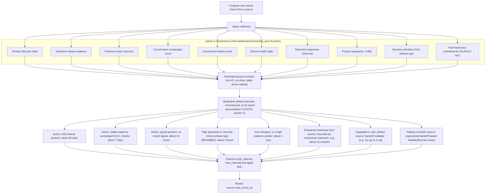

# Adaptive watcher scheduling

This diagram answers: what determines how soon FirmScout checks a source again, and why does that interval range from minutes to a month? It documents the pure function described in §7.1 as "Scheduling policy — the pure function from source history to next check interval", the single piece of domain logic standing between "monitoring tens of thousands of sources" and a bill nobody can afford (§1).

## What this shows

Ten inputs feeding one pure function, `NextInterval`, which the domain layer owns precisely because it must be testable with table-driven tests and no clock (§7.8) — a scheduling bug that only reproduces against a live vendor site is undebuggable. The eight illustrative outcomes are examples of the function's output range, not a specification: they are explicitly labelled as defaults to be tuned, because assumptions T1, T2, and T6 in §2 are marked unvalidated or medium-confidence and depend on measurements ("ratio of `changed` outcomes to actual new releases", "breakage rate per source per quarter") that only exist once sources have run for a while. Every output still passes through a clamp-and-jitter step so no combination of inputs can schedule a check more often than `min_interval` allows or let a stale source silently drift past `max_interval`.

## Assumptions

- The function is pure and deterministic given its inputs, per §7.1 and §7.8 (domain tests: "None — no DB, no network, no clock"); anything stochastic (jitter) is applied after the function returns, not inside it, so the function itself remains reproducible.
- Paid freshness commitments (I10) can only *shorten* an interval, never lengthen one past what a free-tier source would get — this follows from §5's rule that correctness and the displayed current version are never paywalled, only automation and guarantees are.
- The specific numbers in `E1`–`E8` are illustrative placeholders chosen for this diagram to be concrete; the actual defaults live in configuration, not in domain code, and are expected to change based on T1/T2/T6 measurements.

## Failure modes

- Consecutive-failure backoff (`E8`) that is too aggressive can leave a genuinely-recovered source under-checked for longer than necessary — mitigated by the source health state machine's `broken → active` transition resetting the failure counter.
- Popularity and security-criticality (`I8`, `I9`) pulling in opposite directions from cost minimisation (ADR-0013) is the central tension this function resolves; if the weighting is wrong, either cost or freshness suffers, which is why the outputs are marked "to be tuned" rather than fixed.
- A source with no historical cadence data (a brand-new registration) has no `I2` signal — the function must have a documented cold-start default rather than dividing by zero or defaulting to the most aggressive interval.

## Related ADRs

- [ADR-0005 — Deterministic collectors](../adr/0005-deterministic-collectors.md)
- [ADR-0013 — Cost minimisation](../adr/0013-cost-minimization.md)
- [ADR-0015 — Job queue port](../adr/0015-job-queue-port.md)

## Implementing code

**Implemented.** This diagram describes code that exists and is covered by tests.

- `internal/domain/scheduling.go` — a pure function, tested without a clock
- `internal/application/checksource.go` — where the decision is applied

The default intervals are unmeasured starting points.

See [the architecture consistency report](../architecture/consistency-report.md) for what is verified by execution and what is not.
