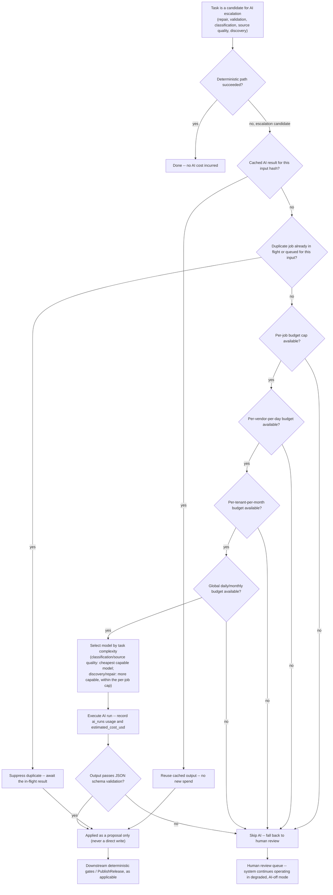

# AI cost escalation

This diagram answers: before FirmScout ever spends money on an AI call, what checks does it run, in what order, and what happens if any of them says no? It is the mechanism that makes "AI as escalation only, with budgets" (§6, decision 6) an operational reality rather than a policy statement, and it exists to prove the claim in the objective that the system keeps operating without AI.

## What this shows

The escalation path is a chain of cheap-to-expensive checks, in the exact order the objective specifies: try deterministic first (`B`), then a cache lookup, then duplicate-job suppression, then four nested budget checks (per-job, per-vendor-per-day, per-tenant-per-month, global) before a model is even selected. Only after all of that does an actual AI run happen (`M`), and its output is still not trusted outright — it must pass schema validation (`N`) before it is allowed to become a proposal at all, per the run envelope in §15 ("An output that fails schema validation is a failed run, recorded and billed, and the fallback is human review — never a retry loop"). Every rejection path — cache miss handled, duplicate suppressed, any budget exhausted, or schema validation failed — converges on the same human review queue (`Q`), and the diagram states explicitly what that queue means operationally: FirmScout keeps running in a degraded, AI-off mode rather than blocking.

## Assumptions

- Budget checks are ordered from narrowest to broadest (`per-job → per-vendor-per-day → per-tenant-per-month → global`) so that a single job never needs to consult the global counter unless it has already cleared its own and its vendor's allocation, minimising contention on the widest-scoped counter.
- "Cached AI result for this input hash" implies AI outputs are content-addressed by their input (source artifact reference plus prompt version), so a re-run of the same check against unchanged content never re-spends, independent of the job-level duplicate suppression that follows it.
- Model selection by task complexity (`L`) is an adapter-level decision (§15: "Provider choice is an adapter decision; the domain sees `AgentRun` and `Proposal`"), so this diagram names task categories, not specific model identifiers.

## Failure modes

- A budget counter itself becomes unavailable (e.g. the quota store is down) — this should fail closed into `H` (skip AI, fall back to review), the same as an exhausted budget, never fail open into an unbudgeted AI call.
- Schema validation passes but the *content* of a proposal is still wrong (a hallucinated but well-formed URL) — this diagram only shows the mechanical gate; correctness is the job of the human review step and, for release candidates, the deterministic gates in §16.
- Cache poisoning (a bad cached result reused indefinitely) is a risk the cache key design must address by including prompt version, so a prompt fix invalidates stale cached outputs rather than perpetuating them.

## Related ADRs

- [ADR-0006 — AI as escalation](../adr/0006-ai-as-escalation.md)
- [ADR-0013 — Cost minimisation](../adr/0013-cost-minimization.md)

## Implementing code

**Not implemented.** This diagram documents an intended design.

The budget ladder is designed; no agent runtime exists to spend against it.

See [the architecture consistency report](../architecture/consistency-report.md) for what is verified by execution and what is not.
