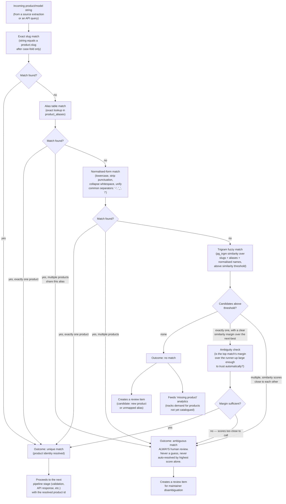

# Alias resolution

This diagram answers: when an incoming product name or model string arrives — from a collector's extracted candidate, or from a search/lookup API call — how does FirmScout decide which catalogue product it identifies, and when does it refuse to guess?

## What this shows

Resolution proceeds through increasingly permissive match strategies — exact slug, exact alias, normalised-form, then trigram fuzzy — each one tried only after the stricter ones fail, and each one capable of independently producing an ambiguous result if more than one product qualifies. The pipeline has exactly three terminal outcomes: a unique match that can proceed automatically, a no-match that both opens a review item and feeds product-demand analytics, and an ambiguous match that is never resolved by picking the highest-scoring candidate — it always goes to a human.

## Assumptions

- The alias table (`product_aliases`) is registry data synchronised from Git, so adding a known alternate name or model string is a reviewable pull request, not a runtime side effect of resolution.
- Trigram similarity thresholds and the ambiguity margin are tuned parameters, not domain constants — they live in configuration and are expected to be revisited as false-positive/false-negative rates are measured (T3-style validation).
- A resolution performed for an API search query and a resolution performed for a collector's extracted candidate share the same pipeline; the only difference is what happens on `ambiguous` (a search response can surface disambiguation choices to the caller, while a candidate's ambiguous match always creates a `review_items` row).
- "No match" and "ambiguous match" are semantically different: no match means the catalogue plausibly lacks this product; ambiguous match means the catalogue plausibly has it, but resolution cannot tell which entry.

## Failure modes

- Two genuinely distinct products with near-identical model strings (a common pattern in rebadged OEM hardware) will legitimately and repeatedly hit `ambiguous`. This is intended, not a bug to silently work around — an accumulation of the same ambiguous pair is itself a signal that the alias table needs a disambiguating rule (e.g. a hardware-revision-qualified alias).
- A trigram threshold set too low turns near-misses into false unique matches (wrong product silently resolved); set too high, it turns real matches into no-match noise. Both directions are why the ambiguity-margin check exists as a second, independent guard on top of the raw similarity threshold.
- A collector normalisation bug could feed a string with the vendor name embedded (e.g. "MikroTik RouterOS RB750" instead of the catalogued model token), which the normalised-form pass may or may not catch depending on the separator rules — a resolution near-miss here is symptomatically similar to an alias table gap and is triaged the same way.

## Related ADRs

- [ADR-0016 — Hybrid dataset](../adr/0016-hybrid-dataset.md)

## Implementing code

**Partially implemented.**

- `internal/adapters/postgres/product_repo.go` — slug and alias matching
- `internal/application/ingest.go` — the ambiguity branch
- `internal/domain/slug.go` — `NormalizeAlias`

Trigram fuzzy matching is used by search but not by product resolution.

See [the architecture consistency report](../architecture/consistency-report.md) for what is verified by execution and what is not.
