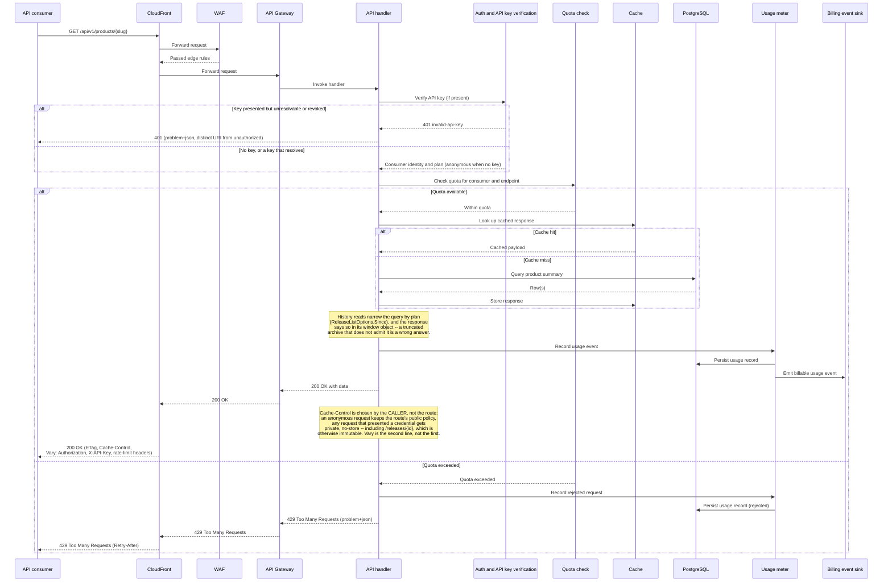

# API request sequence

This diagram answers: what is the exact sequence of calls a single API request makes through the platform, and what changes when a consumer has exhausted their quota?

## What this shows

The full round trip for one read endpoint, including the two paths that matter most for the commercial model: a normal response, and a quota-exceeded rejection.

Two properties of this sequence are load-bearing and easy to lose. **Every cacheable response carries `Vary: Authorization, X-API-Key`,** on the 304 as well as the 200, because the same URL returns a different body to an anonymous caller and to a Professional one — a shared cache without that header serves one plan's answer to another. It is set unconditionally rather than only on the responses that currently differ, because a header that appears when a body happens to vary is a header a proxy has already cached without. **The plan is applied as a query bound, not as a filter over a fetched page:** `ListReleases` passes `ReleaseListOptions{Since: HistoryWindow(plan, now)}` down to the repository, so a windowed caller never reads rows they are not entitled to, and a full page stays a full page. That bound is deliberately over-inclusive for a reduced-precision date: the query compares the *end* of the period the vendor's published precision denotes, so a release dated only `2025` is inside a window opening in September 2025 — comparing the stored 1 January anchor instead would hide it and assert a day the vendor never published (ADR-0017). The `channel` and `releaseType` filters are *not* pushed down; they narrow the page after the cursor is minted, so a filtered page can be empty while `nextCursor` is non-null. Both paths still write a usage record — rejected requests are metered too, because they are the evidence a consumer needs to see their own quota state and the evidence FirmScout needs to size plans correctly. Caching sits inside the handler's control flow, after entitlement is confirmed and before the database is touched, so an over-quota consumer never reaches PostgreSQL at all.

## Assumptions

- API key verification is fast enough to run on every request without a network round trip beyond PostgreSQL (a hashed key lookup, per §11 of the blueprint).
- Quota checks read from durable PostgreSQL counters, not from an in-memory approximation, because quota correctness has billing consequences (§3.9).
- Anonymous requests (no API key) still pass through the same sequence with a default low-tier quota; there is no separate code path for anonymous traffic. Anonymous and Free callers see a twelve-month history window; Professional and above see the whole archive.
- Every problem response uses a URI from one closed catalogue (ADR-0022). A 401 for "no credential presented" and a 401 for "this key is revoked" are different URIs, because a client that cannot tell them apart retries the wrong one.
- The billing event sink in the MVP is the same `analytics_events`/usage-record mechanism used elsewhere; a dedicated billing platform integration is a later adapter, not a new sequence.
- Cache invalidation on publish is handled elsewhere (§16 of the blueprint); this sequence only shows lookup and store.

## Failure modes

- A quota check that races with a burst of concurrent requests from the same key can allow a small overshoot; the PostgreSQL counter update should be atomic (`UPDATE ... RETURNING`) to bound this to one request's worth of slack.
- If the usage meter write fails after a successful response has already been sent, usage undercounts for that request — this must be logged as a metering gap, never silently dropped, since it affects both product analytics and billing.
- A cache store that succeeds but a database read that partially failed could cache an incomplete response; the handler must only cache after a fully successful read.
- The internal reviewer surface (`/internal/review/...`) is not on this diagram and shares none of it: no API key, no usage metering, no quota, no cache headers — only rate limiting and route tagging. It performs unauthenticated writes and must never be exposed to the internet. **Three switches bear on it, on two different hosts**, and this bullet named only the first two until the closing pass of Phase 2: `FIRMSCOUT_REVIEW_API_ENABLED` and the presence of all three use cases, both on the API server, and `FIRMSCOUT_REVIEW_UI_ENABLED` on the public Next.js app. The third is the one that mattered: a first-party client that calls these endpoints on a visitor's behalf sits, by definition, somewhere that can reach them, so switching it on in a public deployment reaches the surface without either API-server switch being wrong. The write path has since been removed from `apps/web`. See ADR-0021 and `docs/architecture/api.md` §11 for the full table.
- If the billing event sink is unavailable, request handling must not block on it — usage recording to PostgreSQL is the durable source of truth, and forwarding to the billing sink can retry asynchronously.

## Related ADRs

- [ADR-0007: public web, paid API](../adr/0007-public-web-paid-api.md)
- [ADR-0014: stdlib HTTP router](../adr/0014-stdlib-http-router.md)
- [ADR-0013: cost minimisation](../adr/0013-cost-minimization.md)
- [ADR-0019: public domain shape](../adr/0019-public-domain-shape.md)
- [ADR-0021: asserted reviewer identity](../adr/0021-asserted-reviewer-identity.md)
- [ADR-0022: canonical problem types](../adr/0022-canonical-problem-types.md)

## Implementing code

**Partially implemented.** Everything through the response is built; CloudFront, WAF, API Gateway and the billing sink are deployment concerns that do not exist yet.

- `internal/adapters/httpapi/router.go` — the route tables and both middleware chains
- `internal/adapters/httpapi/middleware.go` — `APIKey` (including the 401 split), `Quota`, `Usage`, `RateLimit`, and the `Vary` header on both the 200 and the 304
- `internal/adapters/httpapi/handlers.go`, `presenter.go` — the handlers and the DTOs, including `hasSourceConflict` and the history `window`
- `internal/adapters/httpapi/problem.go` — the closed problem-type catalogue
- `internal/application/queries.go`, `entitlements.go` — the read use cases, their documented page bounds (`DefaultReleasePageSize` 20 / `MaxReleasePageSize` 100), and `HistoryWindow`
- `internal/domain/partialdate.go` — `PartialDate.PeriodEnd`, the end of the period a published precision denotes; the window comparison's honest bound in every layer
- `internal/adapters/postgres/release_repo.go` — `ListForProduct`, which applies that same rule in SQL (`CASE … month_only → release_date + 1 month − 1 day …`) against the boundary reduced with `AT TIME ZONE 'UTC'`
- `docs/api/openapi.yaml` — the contract, held to the router by `router_test.go`, which fails if a registered route is undocumented or a documented path is served by no handler

Billing events are not emitted. Three of the ten `/api/v1` rows in `api.md` §2 — `advisories`, `POST /lookup`, `usage` — are design and not routed; the router serves seven, plus `/healthz`, `/readyz`, `/metrics`.

See [the architecture consistency report](../architecture/consistency-report.md) for what is verified by execution and what is not.
