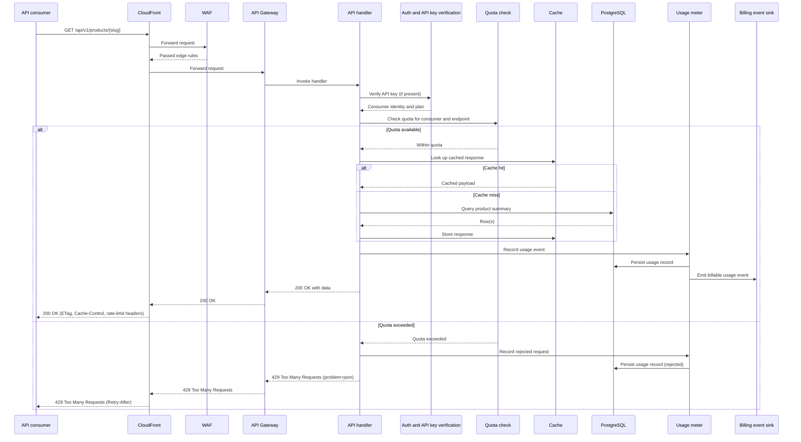

# API request sequence

This diagram answers: what is the exact sequence of calls a single API request makes through the platform, and what changes when a consumer has exhausted their quota?

## What this shows

The full round trip for one read endpoint, including the two paths that matter most for the commercial model: a normal response, and a quota-exceeded rejection. Both paths still write a usage record — rejected requests are metered too, because they are the evidence a consumer needs to see their own quota state and the evidence FirmScout needs to size plans correctly. Caching sits inside the handler's control flow, after entitlement is confirmed and before the database is touched, so an over-quota consumer never reaches PostgreSQL at all.

## Assumptions

- API key verification is fast enough to run on every request without a network round trip beyond PostgreSQL (a hashed key lookup, per §11 of the blueprint).
- Quota checks read from durable PostgreSQL counters, not from an in-memory approximation, because quota correctness has billing consequences (§3.9).
- Anonymous requests (no API key) still pass through the same sequence with a default low-tier quota; there is no separate code path for anonymous traffic.
- The billing event sink in the MVP is the same `analytics_events`/usage-record mechanism used elsewhere; a dedicated billing platform integration is a later adapter, not a new sequence.
- Cache invalidation on publish is handled elsewhere (§16 of the blueprint); this sequence only shows lookup and store.

## Failure modes

- A quota check that races with a burst of concurrent requests from the same key can allow a small overshoot; the PostgreSQL counter update should be atomic (`UPDATE ... RETURNING`) to bound this to one request's worth of slack.
- If the usage meter write fails after a successful response has already been sent, usage undercounts for that request — this must be logged as a metering gap, never silently dropped, since it affects both product analytics and billing.
- A cache store that succeeds but a database read that partially failed could cache an incomplete response; the handler must only cache after a fully successful read.
- If the billing event sink is unavailable, request handling must not block on it — usage recording to PostgreSQL is the durable source of truth, and forwarding to the billing sink can retry asynchronously.

## Related ADRs

- [ADR-0007: public web, paid API](../adr/0007-public-web-paid-api.md)
- [ADR-0014: stdlib HTTP router](../adr/0014-stdlib-http-router.md)
- [ADR-0013: cost minimisation](../adr/0013-cost-minimization.md)

## Implementing code

**Partially implemented.**

- `internal/adapters/httpapi/router.go`, `middleware.go`, `handlers.go`
- `internal/application/queries.go` — entitlement and usage recording

Billing events are not emitted.

See [the architecture consistency report](../architecture/consistency-report.md) for what is verified by execution and what is not.
