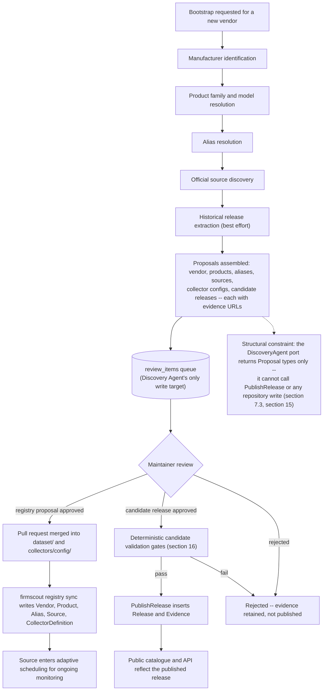

# Initial bootstrap flow

This diagram answers: when FirmScout onboards a new vendor with AI assistance, exactly what does the Discovery Agent produce, and where is the line it structurally cannot cross? It expands §15's Discovery Agent row and §3.11's warning that "a catalogue of plausible-looking wrong firmware versions is worse than no catalogue" into the concrete sequence of steps and the queue that sits between every proposal and anything becoming a public fact.

## What this shows

The nine bootstrap steps run in the order the objective lists them, ending in the same two outcomes as ordinary operation: a merged registry PR (for vendor/product/alias/source/collector-config proposals) or a published release (for historical candidates), both gated by a human and, for releases, also by the deterministic validation pipeline from §16. The dashed callout node makes explicit what the solid arrows alone cannot: the Discovery Agent's output type is a `Proposal`, and no publishing or registry-sync use case accepts that type as input — the review queue is not a convention the agent chooses to respect, it is the only thing its port can write to.

## Assumptions

- "Manufacturer identification" through "official source discovery" are agent-assisted research steps, not database writes; nothing exists in PostgreSQL or Git until step G's proposals are assembled.
- Historical release extraction is "best effort" because the agent is working from whatever the manufacturer publishes as history (changelogs, archives), which is frequently incomplete — hence every extracted candidate still passes through the same gates as a routine `changed` outcome (see `update-decision-tree.md`).
- Collector config generation happens once the source proposal is approved, using the same config schema validated by `firmscout collector test` (§14), not as a separate AI step.

## Failure modes

- The agent proposes a source that is later found to have a restrictive `robots.txt` or terms (the Dell case, §3.6) — the source is registered with `robots_policy_status = 'disallowed'` and `enabled = false` rather than rejected outright, so the evidence trail survives even though collection does not proceed.
- Historical extraction finds no evidence for a claimed release — such candidates fail gate 7 (evidence retained) in §16 and are rejected, not silently dropped, so a maintainer can see what was attempted.
- A maintainer approves a registry proposal but the subsequent `firmscout registry sync` fails schema validation — the PR is already merged in Git, so the fix is a follow-up commit, not a database rollback (§3.3).

## Related ADRs

- [ADR-0006 — AI as escalation](../adr/0006-ai-as-escalation.md)
- [ADR-0016 — Hybrid dataset](../adr/0016-hybrid-dataset.md)
- [ADR-0018 — Source compliance policy](../adr/0018-source-compliance-policy.md)

## Implementing code

**Not implemented.** This diagram documents an intended design.

No discovery agent exists. The registry is authored by hand in `dataset/`.

See [the architecture consistency report](../architecture/consistency-report.md) for what is verified by execution and what is not.
