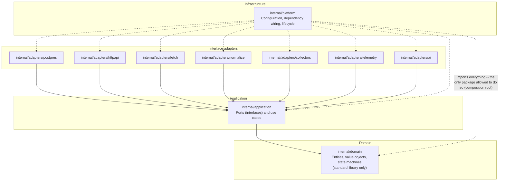

# Clean Architecture dependencies

This diagram answers: which Go package is allowed to import which, and why does `internal/platform` get to break the rule everyone else follows? It is the enforceable picture behind §7.2 — the dependency direction that `internal/archtest` checks mechanically with `go list -deps`, not by convention.

## What this shows

Every solid arrow points inward, toward `internal/domain`, matching `domain ← application ← adapters ← platform` from §7.2: the seven adapter packages each depend only on `application` (and, transitively, `domain`); `application` depends only on `domain`; `domain` depends on nothing in this repository. The dashed arrows are the one sanctioned exception — `internal/platform` imports every layer because its job is composition (wiring concrete adapters into use cases and starting the binaries in `apps/api`, `apps/worker`, `apps/cli`). No other package may do this; that asymmetry is the whole point of the diagram, and it is why the dashed edges are visually distinct from the inward solid ones rather than just another dependency.

## Assumptions

- `internal/domain/ingestion`, `internal/application/ingestion`, and the other bounded-context sub-packages named in §8.1 live *inside* the domain and application layers per the repository-structure deviation noted in §10, so this diagram keeps the four-layer view rather than introducing a fifth axis; `module-dependencies.md` covers the bounded-context view.
- `internal/archtest` is the enforcement mechanism, not this diagram; the diagram documents the rule the test suite checks.
- AI provider adapters (`internal/adapters/ai`) are included even though only fakes exist in the MVP (§7.3), because the dependency rule applies identically to fakes and real adapters.

## Failure modes

- A dependency-rule violation (e.g. `internal/domain` importing `pgx`) fails CI via `archtest`, not via this diagram — the diagram is documentation, not the check.
- A future adapter added without updating this file goes undocumented until the next diagram/code consistency pass (§B9 of the implementation plan).
- If a use case bypasses its own port and imports an adapter directly, `go list -deps` catches it structurally even though nothing here would visibly change until the file is regenerated.

## Related ADRs

- [ADR-0001 — Modular monolith](../adr/0001-modular-monolith.md)
- [ADR-0002 — Clean Architecture](../adr/0002-clean-architecture.md)

## Implementing code

**Implemented.** This diagram describes code that exists and is covered by tests.

- `internal/domain`, `internal/application`, `internal/adapters/*`, `internal/platform`
- `internal/archtest/arch_test.go` — the rule as an executable test
- `scripts/archcheck.sh` — the same rule from a shell

See [the architecture consistency report](../architecture/consistency-report.md) for what is verified by execution and what is not.
