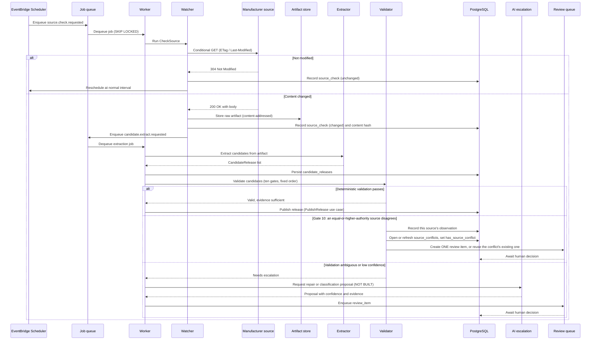

# Collector sequence

This diagram answers: step by step, what happens between a scheduled source check and a published release, and how does the cheap "nothing changed" path differ from the expensive "content changed" path?

## What this shows

The overwhelming majority of scheduled checks take the cheap left branch: a conditional GET returns `304 Not Modified`, the check is recorded, and the source is rescheduled — no artifact storage, no extraction, no AI. Only a `200 OK` with an actually-changed body triggers the expensive branch: artifact storage, extraction into candidates, and deterministic validation. Validation itself branches three ways — most candidates pass and publish directly; a candidate contradicted by a source FirmScout cannot outrank becomes a recorded conflict and one review item; and an ambiguous or low-confidence candidate would escalate to AI, which is designed but not built, so it routes straight to a human.

Extraction is the same step regardless of which engine reads the document. Three exist: `html_selectors`, `text_regex`, and `rss_atom`. All three are configuration, not code — a new source with a feed FirmScout can already parse is a YAML file and a fixture, not a Go change (ADR-0005).

## Assumptions

- Most registered sources expose a usable conditional-request signal (ETag or Last-Modified), per assumption T1; sources that do not are checked by full-body normalised hashing instead, which is more expensive but still far cheaper than extraction.
- The watcher, not the extractor, owns the fetch — collectors receive an already-fetched artifact and never make their own network calls (Collector SDK contract, §13).
- `Extract` is a pure function of the artifact, so re-running it never re-fetches the source and is always safe to retry.
- AI escalation is bounded by a per-run budget cap; if the cap would be exceeded, the candidate routes directly to human review instead of calling the AI agent.
- A candidate that passes deterministic validation for an official, high-confidence source can auto-publish; community or low-confidence sources always route to review regardless of confidence (validation gate 8, §16).
- A collector's `Extract` is a pure function of `(source, artifact)` and holds no state on the receiver, so two goroutines extracting different artifacts through the same collector cannot see each other's diagnostics. Warnings are returned, never accumulated.
- `rss_atom` distinguishes RSS from Atom by the document's root element and reads its ten-name field vocabulary accordingly. It never falls back from Atom's `published` to `updated`: a document's last edit is not its release date, and substituting one for the other invents a date the source did not publish (ADR-0017).

## Failure modes

- A source that always returns `200 OK` without honouring conditional headers (a misconfigured or non-compliant server) forces every check down the expensive path — the watcher falls back to normalised-section hashing to detect a true no-op and avoid needless extraction.
- Extraction can throw on a genuinely malformed artifact (a config selector matching zero elements after a layout change) — this must produce a `SourceBroken`-style outcome and a repair-triggering event, not a silent empty candidate list. A truncated or unparseable feed is a hard error in `rss_atom` for the same reason: a partial result read from a partial document is indistinguishable from a source that genuinely shrank.
- A feed that changes dialect under a config declaring `release_container: item` extracts zero candidates and warns, rather than silently misreading the other dialect's elements. That is the intended failure: an empty result with a warning is recoverable, a wrong result is not.
- If the AI agent's output fails schema validation, the run is recorded as failed and billed, and the candidate falls back to human review rather than retrying — an infinite retry loop against a paid model is the specific failure this design prevents.
- A crash between "artifact stored" and "source_check recorded" could leave an orphaned artifact; content-addressed storage makes this benign (the artifact is simply unreferenced and eligible for later cleanup) rather than a correctness bug.

## Related ADRs

- [ADR-0005: deterministic collectors](../adr/0005-deterministic-collectors.md)
- [ADR-0006: AI as escalation](../adr/0006-ai-as-escalation.md)
- [ADR-0015: job queue port](../adr/0015-job-queue-port.md)
- [ADR-0020: multi-source conflict is a recorded finding](../adr/0020-multi-source-conflict-detection.md)

## Implementing code

**Implemented, except the AI branch.** This diagram describes code that exists and is covered by tests.

- `internal/application/checksource.go` and `ingest.go` — the sequence itself, including `reconcileConflict`
- `internal/adapters/collectors/pipeline.go` — the shared value pipeline every engine feeds
- `internal/adapters/collectors/html_selectors.go`, `text_regex.go`, `rss_atom.go` — the three engines
- `internal/adapters/collectors/config.go`, `registry.go` — config validation and the construction switch
- `internal/adapters/artifact` and `internal/adapters/postgres/artifact_store.go` — content-addressed storage
- `internal/integration/slice_test.go` — the sequence run end to end, once per engine that has a registered source

AI escalation is replaced by human review.

See [the architecture consistency report](../architecture/consistency-report.md) for what is verified by execution and what is not.
