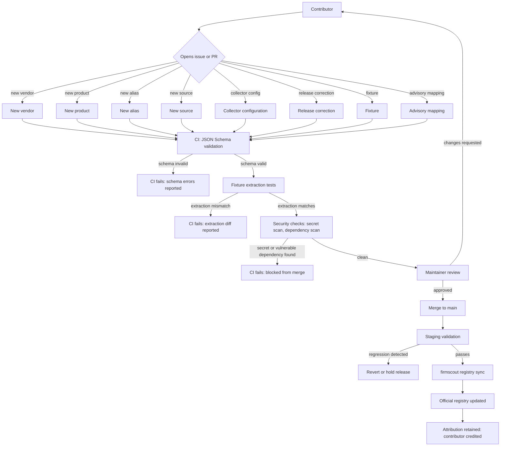

# Open-source contribution flow

This diagram answers: when someone outside the core team proposes a new vendor, product, source, or correction, what has to happen before their change is live in the official FirmScout registry?

## What this shows

Every registry change, regardless of type, passes through the same four automated gates in order — schema validation, fixture extraction tests, secret and dependency scanning — before a human ever reviews it. This ordering is deliberate: cheap, deterministic checks run first and fail fast, so a maintainer's attention is spent only on submissions that are already structurally and behaviourally sound. Merge does not mean live: `firmscout registry sync` is the only path from Git to the production registry, and it runs against staging first. Attribution is retained through to the live registry, which is part of what makes community contribution sustainable rather than extractive.

## Assumptions

- Registry YAML (`dataset/`, `collectors/config/`) is validated against the same JSON Schemas that `firmscout registry sync` uses, so CI and the sync tool can never disagree about validity.
- Fixture extraction tests run entirely against recorded fixtures on disk, never against a live vendor site (§7.8) — a contributor's PR cannot be flaky because a manufacturer's website changed mid-review.
- A collector configuration PR is expected to include its own fixture pair (`*.fixture.html` / `.json` / `.txt` plus `expected.json`), per the Collector SDK's `RunFixtures` convention (§13); a config without fixtures fails the fixture-extraction gate by construction.
- Release corrections and advisory mappings go through the same CI gates as registry data even though they touch different tables, because both are contributor-authored facts that need the same evidence discipline.
- Staging validation is a smoke check against the newly synced registry (e.g. the new source resolves, the new collector's fixtures still pass against the synced config) rather than a full re-collection run.

## Failure modes

- A schema that is too permissive lets structurally valid but semantically wrong data through (e.g. a source URL for the wrong vendor) — the schema gate catches shape errors, not truth; maintainer review remains the check for correctness.
- `registry sync` run outside CI/CD by a maintainer with direct database access bypasses every gate in this diagram — mitigated by marking registry rows `managed_by = 'registry'` (§3.3) so direct edits are visibly non-compliant and get overwritten by the next sync.
- A merged PR that fails staging validation must block the sync from reaching production, not silently proceed — the rollback path exists specifically so a bad merge does not become a bad production registry.
- Secret scanning has both false negatives (a secret in an unusual format) and false positives (a fixture that happens to look like a credential) — the fixture-provenance README convention (URL, timestamp, hash) helps a reviewer distinguish a real fixture from a leaked one at a glance.

## Related ADRs

- [ADR-0016: hybrid dataset](../adr/0016-hybrid-dataset.md)
- [ADR-0005: deterministic collectors](../adr/0005-deterministic-collectors.md)
- [ADR-0009: code and data licensing](../adr/0009-code-and-data-licensing.md)

## Implementing code

**Partially implemented.**

- `.github/workflows/{ci,schemas,security,mermaid}.yml`
- `scripts/check-schemas.py` — registry validation
- `collectors/sdk/collectortest` — the fixture gate

Staging validation does not exist.

See [the architecture consistency report](../architecture/consistency-report.md) for what is verified by execution and what is not.
