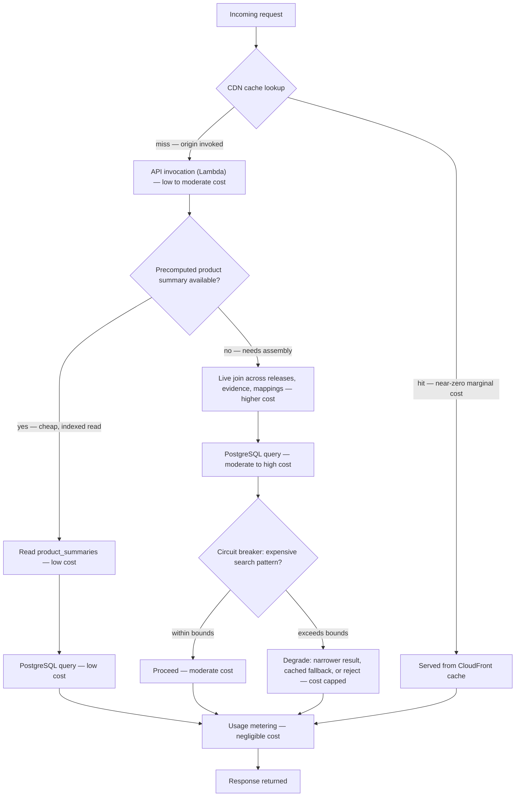

# Cost-aware request flow

This diagram answers: for one incoming request, which path does it take through the system, and at each fork, which branch costs more relative to the other — without inventing dollar figures?

## What this shows

The cheapest possible outcome for a request is a CDN hit, which never reaches compute or the database at all. A cache miss invokes the API (Lambda), and from there the cost hinges on whether a precomputed `product_summaries` row can answer the request directly or whether the handler must fall back to a live join across releases, evidence, and mapping tables — the same distinction the blueprint's schema design (§11, rule 9) exists to avoid on the common path. The live-join path is additionally guarded by a circuit breaker specifically because unbounded search queries are the one request shape that can turn a cheap catalogue into an expensive one; when the breaker trips, the response degrades (narrower results, a cached fallback, or an explicit rejection) rather than letting the query run unchecked. Every path, however it resolves, is metered.

## Assumptions

- `product_summaries` is refreshed synchronously by `PublishRelease` (§7.5), so it is very rarely stale relative to the live tables, which is what makes the precomputed path safe to treat as the default for read endpoints.
- "Live join" paths are largely confined to search and bulk endpoints, which is exactly why those endpoint classes carry stricter policies in the request-protection flow.
- The circuit breaker's bounds are on query cost proxies available before or during execution (query plan cost, timeout, row-scan limits), not on dollar amounts, consistent with never invoking a live pricing figure in code or documentation.
- CDN cache hit ratio is the single largest lever on aggregate cost at low-to-moderate traffic, ahead of database tuning, because it eliminates compute and database load entirely rather than making it cheaper.
- Usage metering cost is treated as negligible relative to the request-serving cost it measures, because it is a small, indexed write, not a query.

## Failure modes

- A cache key that is too specific (e.g. includes a volatile header) collapses the CDN hit rate toward zero, silently pushing most traffic onto the more expensive origin path — cache key design is a cost decision, not just a correctness one.
- A `product_summaries` refresh that lags behind publication (a bug, not the intended synchronous design) forces more requests onto the live-join path than expected, which is both a correctness and a cost regression, and should alert on refresh lag.
- A circuit breaker tuned too loosely lets a pathological search query (e.g. a very broad trigram match) through repeatedly before tripping — the breaker's bounds need periodic review against real query-cost distributions, not a single initial guess.
- Degraded responses that are not clearly labelled as degraded to the caller erode trust; a narrowed or cached-fallback result must be distinguishable from a complete one in the response.

## Related ADRs

- [ADR-0013: cost minimisation](../adr/0013-cost-minimization.md)
- [ADR-0010: AWS runtime, Lambda-first](../adr/0010-aws-runtime.md)

## Implementing code

**Partially implemented.**

- `internal/adapters/postgres/summary_repo.go` — the precomputed-summary read
- `internal/adapters/httpapi/middleware.go` — cache headers

There is no CDN and no circuit breaker.

See [the architecture consistency report](../architecture/consistency-report.md) for what is verified by execution and what is not.
