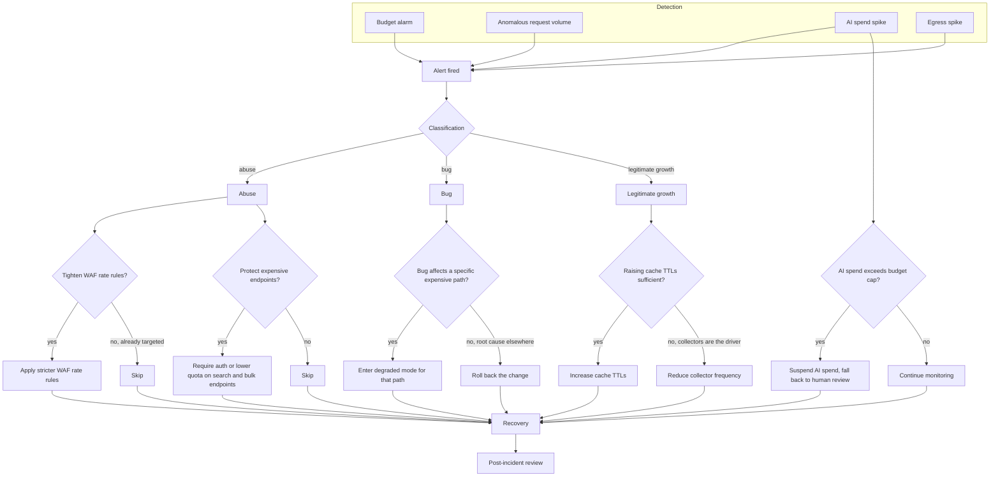

# Cost-containment incident runbook

This diagram answers: when a cost signal fires, how does an on-call responder classify it and choose a response that is proportionate — tight enough to stop the bleeding, loose enough not to punish legitimate growth?

## What this shows

Four independent signals can open an incident: a budget alarm, an anomalous request volume, an AI spend spike, or an egress spike. Whatever triggered it, the first real decision is classification — abuse, a bug, or legitimate growth — because that classification determines which graduated response is proportionate. Abuse gets edge-level and endpoint-level tightening. A bug gets either a scoped degraded mode or a rollback, depending on whether the expensive path can be isolated. Legitimate growth gets cache-TTL and collector-frequency levers before anything more drastic, because the correct response to real usage is to make it cheaper to serve, not to throttle it. AI spend has its own fast, independent branch, because token cost is the blueprint's highest-variance cost driver (§8.3) and the only response that reliably bounds it is suspension with a human-review fallback. Every branch converges on recovery and a mandatory post-incident review.

## Assumptions

- Budget alarms, request-volume anomaly detection, AI spend tracking, and egress monitoring are all backed by the same observability pipeline (Prometheus metrics, Grafana Alerting) rather than separate ad hoc scripts, so "detection" is one system with four alert rules, not four systems.
- Classification is a human judgement call informed by dashboards (request origin patterns, error rates, correlation with a recent deploy, correlation with a marketing event), not an automated verdict — the diagram shows the decision point, not an algorithm that makes it.
- "Legitimate growth" is distinguished from abuse primarily by request diversity and conversion behaviour (many distinct paying or converting consumers versus one source hammering one endpoint), which is why the response for growth is capacity-shaping (cache, collector frequency) rather than access-restricting.
- AI spend suspension falls back to human review for anything that would otherwise have been AI-escalated, per the existing escalation contract (§15) — suspension does not silently drop those items.
- Every graduated response is reversible; none of the actions in this runbook (tightening WAF rules, raising TTLs, reducing collector frequency, suspending AI) require a deployment to undo.

## Failure modes

- Misclassifying legitimate growth as abuse and applying WAF tightening punishes real customers at the exact moment the business should be capturing them — this is why classification is a deliberate, evidence-based step rather than an automatic reflex from the alarm.
- Reducing collector frequency as a cost response degrades data freshness, which is itself a product-quality regression if left in place after the incident — the recovery step must include reverting cost-containment actions once the underlying cause is resolved, not just resolving the alarm.
- Suspending AI spend without a functioning human-review fallback creates a backlog of unresolved candidates and broken sources with no path forward — the fallback queue's capacity should be sized before it is needed, not discovered during the incident.
- Skipping the post-incident review after "the numbers went back down" loses the chance to lower the alarm threshold, fix the root cause, or discover the classification was wrong — the review step is not optional even when the immediate cost impact was small.

## Related ADRs

- [ADR-0013: cost minimisation](../adr/0013-cost-minimization.md)
- [ADR-0008: scraping resilience](../adr/0008-scraping-resilience.md)
- [ADR-0006: AI as escalation](../adr/0006-ai-as-escalation.md)

## Implementing code

**Not implemented.** This diagram documents an intended design.

A runbook. No alarms exist because nothing is deployed.

See [the architecture consistency report](../architecture/consistency-report.md) for what is verified by execution and what is not.
