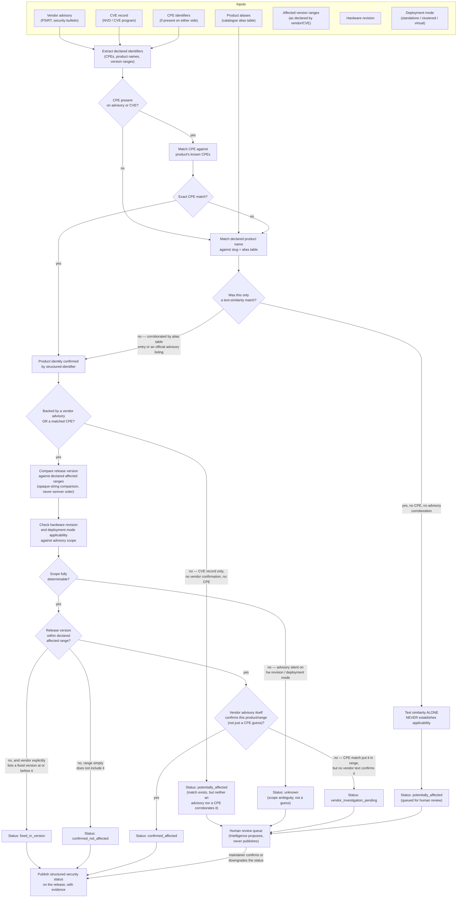

# CVE correlation

This diagram answers: given a vendor security advisory or a CVE record, and a product already in the catalogue, what security status can FirmScout responsibly publish against a specific release — and what has to stay short of a claim because the evidence does not yet support one?

## What this shows

The correlation pipeline never treats a CVE-to-product association as established by prose similarity. Structured identifiers (CPEs) and explicit vendor confirmation are the only inputs that can produce `confirmed_affected`, `confirmed_not_affected`, or `fixed_in_version`. Every other path — a name match without a CPE, a CPE match without vendor corroboration, an advisory silent on hardware revision or deployment mode — terminates in `potentially_affected`, `unknown`, or `vendor_investigation_pending`, all of which route to the human review queue before anything security-relevant is published against a release.

## Assumptions

- CVE records and vendor advisories are ingested as evidence, not as facts; each carries its own retrieval timestamp and source URL like any other evidence row.
- A product's CPE list is itself curated registry data (subject to the same correction flow as aliases), not derived automatically from the advisory being matched.
- Version range comparison uses the same opaque `VersionString` plausibility machinery as release ingestion — never semver ordering — so "within range" is a vendor-declared boundary check, not an inferred one.
- Hardware revision and deployment mode are optional fields; their absence on an advisory is scope ambiguity, not proof of blanket applicability.

## Failure modes

- A vendor advisory lists a product family without enumerating models; naive matching could over-apply the status to every model. The hardware-revision/deployment-mode check exists specifically to catch this and fall back to `unknown` rather than guess.
- A CPE dictionary entry is wrong or stale (vendor renamed a product line); this is caught the same way a bad alias is caught — via the dataset correction flow, not by trusting the CPE blindly.
- Two advisories from the same vendor disagree on the affected range for the same CVE; this is treated as a multi-source conflict (see `multi-source-conflict.md`) and surfaces a warning rather than picking one.
- An LLM-assisted classification agent proposes a CPE or product match; per the AI escalation rule, that proposal is a `review_items` candidate only and can never move a release directly to `confirmed_affected`.

## Related ADRs

- [ADR-0006 — AI as escalation](../adr/0006-ai-as-escalation.md)
- [ADR-0017 — Version strings and date precision](../adr/0017-version-strings-and-date-precision.md)

## Implementing code

**Not implemented.** This diagram documents an intended design.

Deferred to a later phase; the tables are specified in `docs/architecture/data-model.md`.

See [the architecture consistency report](../architecture/consistency-report.md) for what is verified by execution and what is not.
