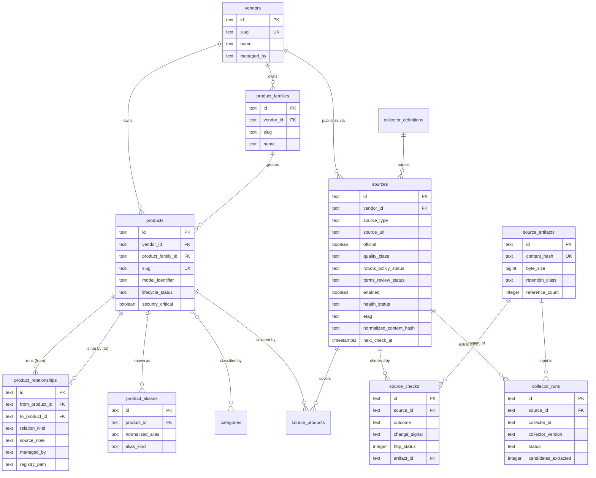
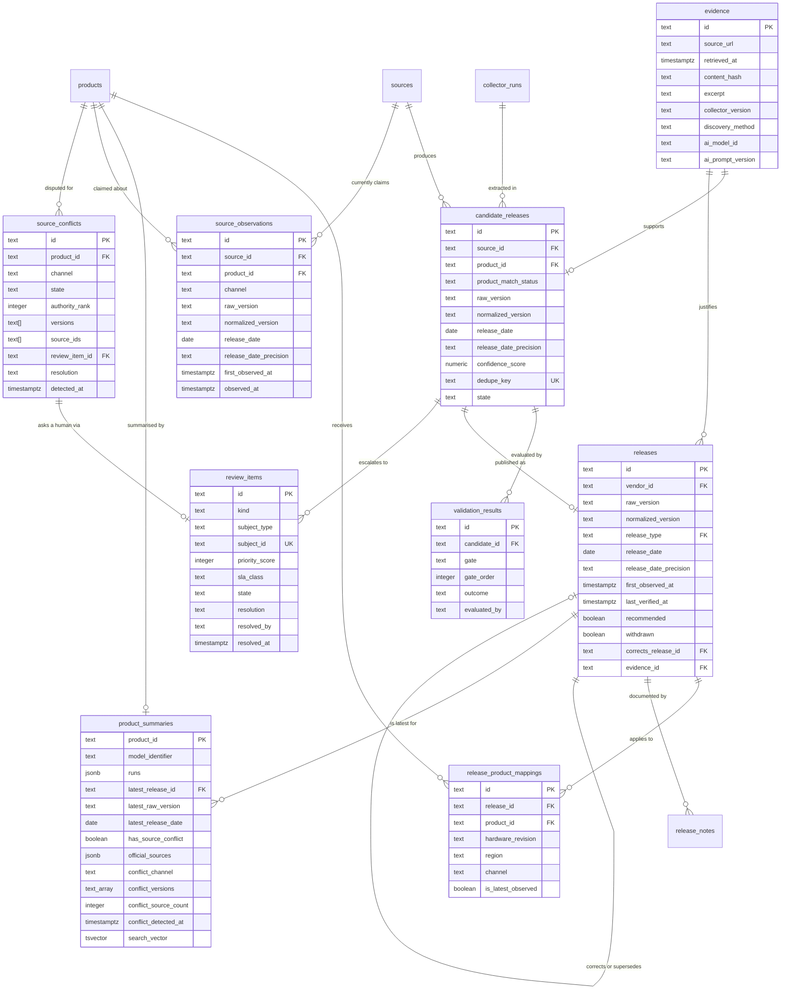
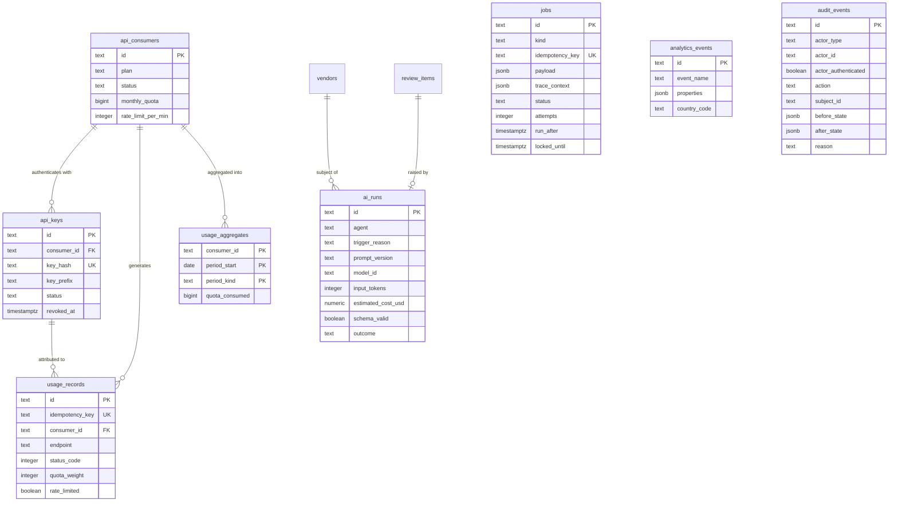

# Data model entity relationships

FirmScout's schema separates four kinds of data that behave very differently: curated
**registry** rows synchronised from Git, high-volume **observation** rows produced by
watchers, append-only **fact** rows that the public API serves, and **platform** rows for
jobs, entitlement, analytics and audit. The diagrams below are split along those lines
because a single 32-entity diagram is unreadable, and because the boundaries between them
are the boundaries that matter.

The authoritative definition is [`database/migrations/00001_initial.sql`](../../database/migrations/00001_initial.sql).
Commentary is in [`docs/architecture/data-model.md`](../architecture/data-model.md).

## Catalog and sourcing

Identity and naming on the left, monitored locations and their observations on the right.

## Ingestion and publication

Candidates are observations; releases are facts. Everything crossing that boundary passes
through validation and carries evidence.

## Platform: jobs, entitlement, analytics, audit

These tables have no foreign keys into the fact tables by design, so retention policies can
delete them without touching published history.

## What this shows

The schema encodes thirteen rules that the application would otherwise have to remember.

**Candidates and releases are different tables, not different states of one table.** A
candidate is an observation that may be wrong; a release is a fact FirmScout stands behind.
Keeping them separate is what makes "collectors cannot publish" structurally true rather
than a code-review convention: a collector writes candidates, and only the `PublishRelease`
use case writes releases.

**A hardware model is a product, not a table of its own.** A fleet's inventory is a list of
model numbers, so the model number has to be the thing you can look up. It is: a device is a
`products` row with `model_identifier` set — a column `00001` declared and nothing populated
until ADR-0024 — which is why a device inherits aliases, categories, the summary projection
and full-text search without a second implementation of any of them. Nothing marks a row as
"a device"; `model_identifier` being set is the whole test, and it is deliberately not
exclusive with having a release stream, because a rack server is a device *and* publishes its
own BIOS versions. The one thing that genuinely had nowhere to live in 31 tables is the
navigation edge from a device to the operating system whose releases the operator is actually
after, and `product_relationships` is that edge and only that edge.

**A family claims a shared image file, never a shared version.** `product_families` groups
MikroTik devices by published architecture because architecture is what decides *which*
`routeros-<version>-<arch>.npk` file a device takes. It does not decide which version: every
architecture measured, from a 32 MB SMIPS `hAP lite` to an ARM 64bit device, is offered the
same current release. So no `release_product_mappings` row targets a family today, and
`release_mappings_family_latest_idx` (migration `00005`) exists to make the first one that
tries to claim two latest rows for a family fail loudly. `00001`'s latest-flag index is
partial on `product_id IS NOT NULL` and therefore never constrained family-targeted rows at
all; that hole was unreachable while zero families existed, and the change that registered the
first five is the change that closed it.

**A device's missing version is a recorded absence, not a gap to be filled.** A device has
zero `release_product_mappings` rows, so `product_summaries` gives it `release_count = 0` and
null latest columns, and `/products/{slug}/latest` answers 404. That is the honest answer:
FirmScout knows the box runs RouterOS and has *not* established which RouterOS image this
exact model takes. The API states it as a value (`firmwareApplicability.basis =
runs_os_unverified`) rather than by omitting a key, because an absent key reads as "they
apply" — and a device page that silently inherited the operating system's newest release would
be telling an operator to flash an image nobody verified their hardware accepts.

That object carries a third member, `ownReleases {mapped, releaseCount}`, and the reason is
this same table's other half: a product may hold `release_product_mappings` rows *and* a
`runs_os` edge at once — a rack server that is a device and publishes its own BIOS versions.
`basis` answers which of ANOTHER product's releases apply to this model; `ownReleases` answers
whether the releases in the response are this product's own. For the six devices here the
answer is `{mapped: false, releaseCount: 0}`, because none has a mapping. See ADR-0024's
2026-09-06 amendment.

**Applicability is a mapping, not a column.** `release_product_mappings` carries hardware
revision, region, channel and deployment mode, so one release row can legitimately apply to
one model, forty models, or a whole family without duplicating the fact.

**`is_latest_observed` is on the mapping, not the release**, because "latest" is a property
of a product-and-channel pair, not of a release. A partial unique index enforces that at most
one mapping per product and channel carries the flag.

**Date precision is a constraint, not a convention.** The `CHECK` on both
`candidate_releases` and `releases` forces a month-precision date to be anchored on day 1 and
a year-precision date on 1 January, so a stored `DATE` can never be misread as a real day.
`unknown` precision requires a NULL date outright.

**Evidence is mandatory on a release** (`evidence_id` is `NOT NULL` with
`ON DELETE RESTRICT`), and evidence produced with AI help must record the model and prompt
version, enforced by `evidence_ai_provenance`.

**Compliance gates dispatch at the index level.** `sources_dispatchable_idx` is a partial
index whose predicate is the full dispatch condition, so the scheduler's query cannot
accidentally omit a compliance check and still use the index.

**What a source currently claims is a projection, not a query over the candidate log.**
`source_observations` holds exactly one row per `(source_id, product_id, channel)`, enforced
by a unique constraint. `candidate_releases` is an append-log of every observation anybody
ever made, so "what does source X say today" is not answerable from it without an ordering,
and the only orderings available are the version string (forbidden by ADR-0017) and
`discovered_at`, which records when FirmScout first saw a row rather than which release is
newest. The projection states the ordering rule once, in `domain.LaterObservation`, where a
test can reach it. The same date-precision `CHECK` that guards `releases` guards this table.

**A conflict is a row with a lifecycle, not a boolean derived in SQL.** `source_conflicts`
carries the disagreement, its participants and its resolution, and `product_summaries.has_source_conflict`
is set from `EXISTS (... WHERE state = 'open')` — a question with no policy in it. Deriving
the flag from `source_observations` directly would require re-implementing the authority
ladder in a `CASE` expression, and two copies of that ladder is exactly how a product page
comes to say "sources disagree" while the pipeline says they do not. See ADR-0020.

**The boolean's detail is a projection too, computed alongside it, not queried separately.**
`product_summaries.conflict_channel`/`conflict_versions`/`conflict_source_count`/
`conflict_detected_at` (migration `00004`) are the same `LATERAL` pick of the open
`source_conflicts` row with the latest `detected_at` that decides `has_source_conflict`,
so the two can never disagree about whether a conflict is currently open — a
`CHECK` constraint (`product_summaries_conflict_consistency`) enforces that the four
columns are jointly present or jointly `NULL`, `conflict_channel` legitimately
empty-string rather than `NULL` when the disputing sources stated no channel.
`official_sources` (also `00004`) is the same idea applied to a list rather than a
record: the distinct sources that have actually contributed a currently-mapped,
non-withdrawn release, stored with each entry's raw `source_type` rather than the
already-mapped public vocabulary, so `domain.PublicSourceKind` stays the one place a
release's `source.kind` and a product's `officialSources[].kind` are decided.

**`audit_events.actor_authenticated` exists so the audit trail cannot imply a login that does
not exist.** Every row this phase writes carries `false`. See ADR-0021.

## Assumptions

- Text primary keys with type prefixes are generated by the application's `IDGenerator` port
  rather than by the database. This keeps identifiers stable across environments, makes them
  readable in logs and API responses, and avoids a database round trip for ID allocation. The
  cost is slightly larger indexes than integer keys.
- The catalogue stays within a range where a single PostgreSQL instance and `product_summaries`
  full-text search are adequate (blueprint assumption T4).
- `source_checks` and `source_artifacts` are the high-growth tables and will need monthly
  partitioning before the rest of the schema does. They are shaped for it but not partitioned
  in the MVP.
- Categories form a shallow hierarchy. The self-referencing `parent_id` has no depth limit in
  the schema, and a cycle would have to be prevented by the application.
- `source_observations` is bounded by (sources x products x channels), not by check volume:
  it is rewritten in place, never appended to. Its growth is therefore registry-shaped, which
  is why it needs none of the partitioning `source_checks` will.

## Failure modes

- **Registry drift.** Direct database edits to registry tables are silently overwritten by
  the next `firmscout registry sync`. Mitigated by `managed_by = 'registry'` marking the rows
  that sync owns, but not prevented by the schema.
- **Summary staleness, and summary absence.** `product_summaries` is refreshed by
  `PublishRelease` and, since ADR-0024, by `SyncRegistry`. If a publication path ever bypasses
  that use case, the public site serves stale versions while the fact tables are correct — a
  silent, user-visible inconsistency. The registry path fails harder and more quietly: a
  product that never reaches the publish path, which is every hardware model, has no summary
  row at all until a sync refreshes it, and a missing row is a 404 on the public API plus
  absence from search rather than a stale value. `SyncRegistry.WithSummaries` is what supplies
  the refresher, and a sync without one appends a warning naming the consequence instead of
  silently producing an unreadable catalogue.
- **Dedupe key collisions.** `candidate_releases.dedupe_key` is unique per source. A
  collector that computes it inconsistently between runs will create duplicate candidates; one
  that computes it too coarsely will silently drop genuine releases. This is the most
  dangerous single field in the schema for a collector author to get wrong.
- **An unwired conflict port is invisible.** `ValidateCandidate` tolerates a nil
  `ConflictRepository` because the projection did not exist before Phase 2. A deployment that
  fails to wire it does not error: it publishes contested versions and records "all gates
  passed". The schema cannot prevent this; `internal/platform/wire_test.go` is what does.
- **`source_conflicts.review_item_id` is a nullable FK with `ON DELETE SET NULL`.** Deleting a
  review item therefore leaves the conflict open and unattached rather than deleting the
  finding, which is the correct direction to fail — but nothing re-attaches an item
  automatically, so the conflict stays open until the next check re-detects it.
- **Latest-flag races.** Two concurrent publications for the same product and channel contend
  on the partial unique index. The `PublishRelease` transaction must clear the old flag and
  set the new one atomically; the index turns a race into a constraint violation rather than
  two rows claiming to be latest.
- **Artifact reference counting.** `reference_count` is maintained by the application. If it
  drifts, retention either deletes an artifact still cited by evidence or retains rubbish
  forever. The first is worse and argues for conservative deletion.

## Related ADRs

- [ADR-0003](../adr/0003-postgresql.md) — PostgreSQL as the only stateful dependency
- [ADR-0004](../adr/0004-sqlc.md) — sqlc and pgx, no ORM annotations in the domain
- [ADR-0005](../adr/0005-deterministic-collectors.md) — collectors emit candidates only
- [ADR-0015](../adr/0015-job-queue-port.md) — the `jobs` table as the queue adapter
- [ADR-0016](../adr/0016-hybrid-dataset.md) — registry in Git, facts in PostgreSQL
- [ADR-0017](../adr/0017-version-strings-and-date-precision.md) — opaque versions, explicit precision
- [ADR-0018](../adr/0018-source-compliance-policy.md) — compliance fields gate dispatch
- [ADR-0020](../adr/0020-multi-source-conflict-detection.md) — the observation projection and the conflict row
- [ADR-0021](../adr/0021-asserted-reviewer-identity.md) — `audit_events.actor_authenticated`
- [ADR-0024](../adr/0024-device-first-catalogue.md) — a device is a product; `product_relationships`; families claim an image file

## Implementing code

**Implemented.** Every table drawn above exists in the migrations and is exercised against a
real PostgreSQL instance by the adapter suite.

- [`database/migrations/00001_initial.sql`](../../database/migrations/00001_initial.sql) — the authoritative DDL for everything except the two Phase 2 tables
- [`database/migrations/00002_conflicts_and_review.sql`](../../database/migrations/00002_conflicts_and_review.sql) — `source_observations`, `source_conflicts`, the `review_items` lifecycle columns, `audit_events.actor_authenticated`, and the `advisory` release type
- [`database/migrations/00003_one_open_review_item_per_subject.sql`](../../database/migrations/00003_one_open_review_item_per_subject.sql) — `review_items_open_subject_idx`, a partial UNIQUE index on `(subject_type, subject_id)` restricted to `state IN ('open','in_progress')`. It adds no table, which is why the table count is unchanged. The `UK` on `subject_id` above is that index and not a plain unique constraint: one subject may hold many *resolved* items and at most one open one. It makes the duplicate-queue-item defect impossible rather than merely tested against — an at-least-once redelivery that filed a second item now hits `23505`, which the adapter maps to `domain.ErrConflict`. Applying it to a database that already holds two open items for one subject will fail, which is the correct outcome and worth checking before a long-lived deployment
- [`database/migrations/00004_product_summary_sources_and_conflict_detail.sql`](../../database/migrations/00004_product_summary_sources_and_conflict_detail.sql) — `product_summaries.official_sources` and the four `conflict_*` columns drawn above, plus `product_summaries_conflict_consistency`, the CHECK enforcing they are jointly present or jointly `NULL`
- [`database/migrations/00005_product_relationships_and_device_summary.sql`](../../database/migrations/00005_product_relationships_and_device_summary.sql) — `product_relationships`, the `product_summaries.model_identifier`/`runs` display columns, and `release_mappings_family_latest_idx`. It adds one table and no new concept to `products`: a hardware model needed no schema change to exist, only somewhere to record what it runs
- `internal/adapters/postgres/conflict_repo.go` — `source_observations` and `source_conflicts`
- `internal/adapters/postgres/audit_repo.go` — `audit_events`
- `internal/adapters/postgres/review_repo.go` — `review_items`, including the keyset cursor over `(priority_score DESC, created_at ASC, id ASC)`
- `internal/adapters/postgres/release_repo.go` — `releases`, `release_product_mappings`, and the `RefreshProductSummary` that sets `has_source_conflict` and computes `official_sources`/`conflict_*` alongside it
- `internal/adapters/postgres/` — the remaining repository implementations

Tests: `internal/adapters/postgres/device_test.go` (`TestMigration00005ShapesTheDeviceSchema`,
`TestReplaceRelationshipsIsExactReplacement`, `TestDeleteOSWithDevicesIsRefused`,
`TestSummaryCarriesModelIdentifierAndRuns`, `TestModelNumberAliasIsSearchable`),
`internal/adapters/postgres/migrate_test.go` (`TestMigration00002UpAndDown`),
`conflict_test.go`, `review_test.go`, `ingest_test.go` (`TestRefreshProductSummaryOfficialSources`,
`TestRefreshProductSummaryConflictDetail`, `TestProductSummariesConflictConsistencyCheckRejectsPartialRows`),
and `internal/integration/slice_test.go`. All of them skip visibly without
`FIRMSCOUT_TEST_DATABASE_URL`.

`database/queries/` is empty and there is no `sqlc.yaml`: ADR-0004 chose sqlc, and the
repositories were written with hand-written SQL against pgx instead. That divergence is
recorded in [the consistency report](../architecture/consistency-report.md), not papered over
here.
