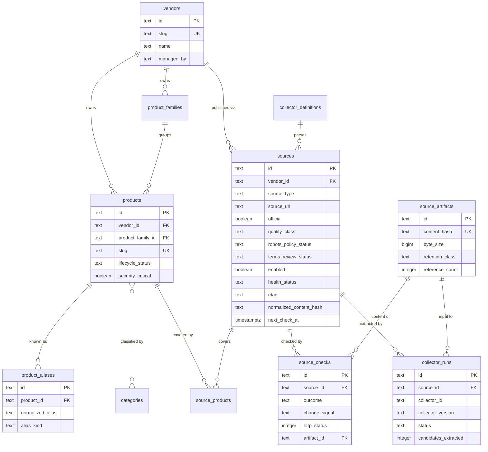
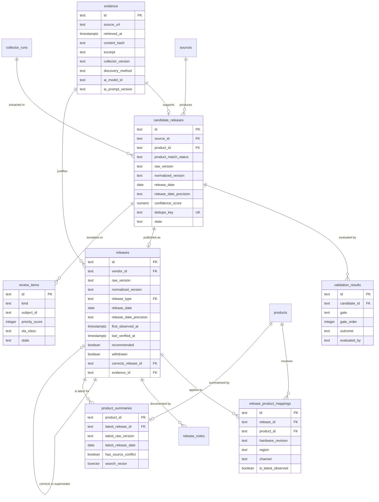
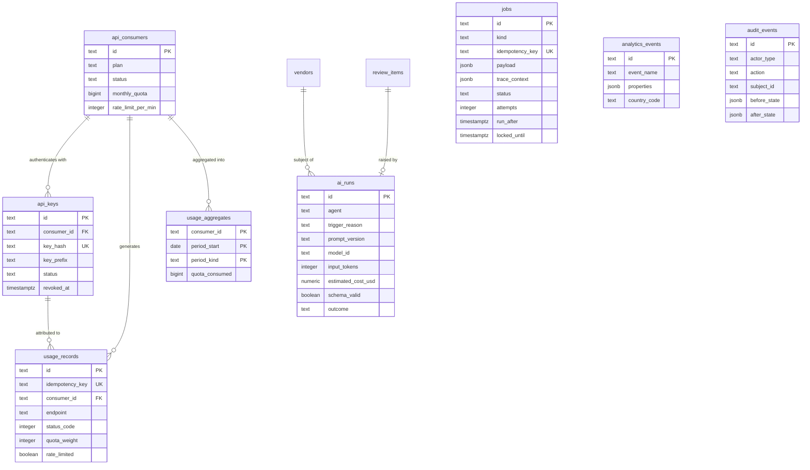

# Data model entity relationships

FirmScout's schema separates four kinds of data that behave very differently: curated
**registry** rows synchronised from Git, high-volume **observation** rows produced by
watchers, append-only **fact** rows that the public API serves, and **platform** rows for
jobs, entitlement, analytics and audit. The diagrams below are split along those lines
because a single 29-entity diagram is unreadable, and because the boundaries between them
are the boundaries that matter.

The authoritative definition is [`database/migrations/00001_initial.sql`](../../database/migrations/00001_initial.sql).
Commentary is in [`docs/architecture/data-model.md`](../architecture/data-model.md).

## Catalog and sourcing

Identity and naming on the left, monitored locations and their observations on the right.

## Ingestion and publication

Candidates are observations; releases are facts. Everything crossing that boundary passes
through validation and carries evidence.

## Platform: jobs, entitlement, analytics, audit

These tables have no foreign keys into the fact tables by design, so retention policies can
delete them without touching published history.

## What this shows

The schema encodes six rules that the application would otherwise have to remember.

**Candidates and releases are different tables, not different states of one table.** A
candidate is an observation that may be wrong; a release is a fact FirmScout stands behind.
Keeping them separate is what makes "collectors cannot publish" structurally true rather
than a code-review convention: a collector writes candidates, and only the `PublishRelease`
use case writes releases.

**Applicability is a mapping, not a column.** `release_product_mappings` carries hardware
revision, region, channel and deployment mode, so one release row can legitimately apply to
one model, forty models, or a whole family without duplicating the fact.

**`is_latest_observed` is on the mapping, not the release**, because "latest" is a property
of a product-and-channel pair, not of a release. A partial unique index enforces that at most
one mapping per product and channel carries the flag.

**Date precision is a constraint, not a convention.** The `CHECK` on both
`candidate_releases` and `releases` forces a month-precision date to be anchored on day 1 and
a year-precision date on 1 January, so a stored `DATE` can never be misread as a real day.
`unknown` precision requires a NULL date outright.

**Evidence is mandatory on a release** (`evidence_id` is `NOT NULL` with
`ON DELETE RESTRICT`), and evidence produced with AI help must record the model and prompt
version, enforced by `evidence_ai_provenance`.

**Compliance gates dispatch at the index level.** `sources_dispatchable_idx` is a partial
index whose predicate is the full dispatch condition, so the scheduler's query cannot
accidentally omit a compliance check and still use the index.

## Assumptions

- Text primary keys with type prefixes are generated by the application's `IDGenerator` port
  rather than by the database. This keeps identifiers stable across environments, makes them
  readable in logs and API responses, and avoids a database round trip for ID allocation. The
  cost is slightly larger indexes than integer keys.
- The catalogue stays within a range where a single PostgreSQL instance and `product_summaries`
  full-text search are adequate (blueprint assumption T4).
- `source_checks` and `source_artifacts` are the high-growth tables and will need monthly
  partitioning before the rest of the schema does. They are shaped for it but not partitioned
  in the MVP.
- Categories form a shallow hierarchy. The self-referencing `parent_id` has no depth limit in
  the schema, and a cycle would have to be prevented by the application.

## Failure modes

- **Registry drift.** Direct database edits to registry tables are silently overwritten by
  the next `firmscout registry sync`. Mitigated by `managed_by = 'registry'` marking the rows
  that sync owns, but not prevented by the schema.
- **Summary staleness.** `product_summaries` is refreshed by `PublishRelease`. If a
  publication path ever bypasses that use case, the public site serves stale versions while
  the fact tables are correct — a silent, user-visible inconsistency.
- **Dedupe key collisions.** `candidate_releases.dedupe_key` is unique per source. A
  collector that computes it inconsistently between runs will create duplicate candidates; one
  that computes it too coarsely will silently drop genuine releases. This is the most
  dangerous single field in the schema for a collector author to get wrong.
- **Latest-flag races.** Two concurrent publications for the same product and channel contend
  on the partial unique index. The `PublishRelease` transaction must clear the old flag and
  set the new one atomically; the index turns a race into a constraint violation rather than
  two rows claiming to be latest.
- **Artifact reference counting.** `reference_count` is maintained by the application. If it
  drifts, retention either deletes an artifact still cited by evidence or retains rubbish
  forever. The first is worse and argues for conservative deletion.

## Related ADRs

- [ADR-0003](../adr/0003-postgresql.md) — PostgreSQL as the only stateful dependency
- [ADR-0004](../adr/0004-sqlc.md) — sqlc and pgx, no ORM annotations in the domain
- [ADR-0005](../adr/0005-deterministic-collectors.md) — collectors emit candidates only
- [ADR-0015](../adr/0015-job-queue-port.md) — the `jobs` table as the queue adapter
- [ADR-0016](../adr/0016-hybrid-dataset.md) — registry in Git, facts in PostgreSQL
- [ADR-0017](../adr/0017-version-strings-and-date-precision.md) — opaque versions, explicit precision
- [ADR-0018](../adr/0018-source-compliance-policy.md) — compliance fields gate dispatch

## Implementing code

- [`database/migrations/00001_initial.sql`](../../database/migrations/00001_initial.sql) — the authoritative DDL
- `database/queries/` — sqlc query definitions
- `internal/adapters/postgres/` — repository implementations

_Repository package paths are filled in as the first vertical slice lands._
