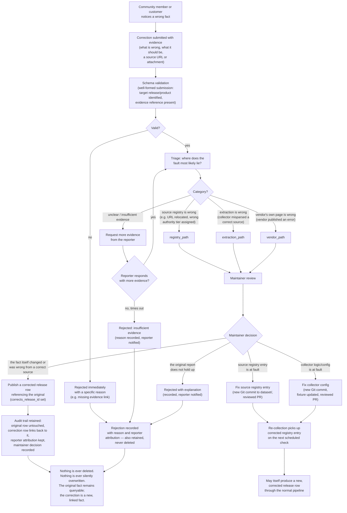

# Dataset correction

This diagram answers: when a community member or paying customer reports that FirmScout published a wrong fact, what happens between the report and a fix — and how does the system guarantee that nothing is ever deleted or silently overwritten in the process?

## What this shows

Every correction, whether it is ultimately accepted or rejected, produces a permanent, attributed audit record — there is no code path in this diagram that deletes a row or overwrites a value in place. Triage exists to route the fix to where the fault actually is: a bad source registry entry, a collector bug, or a vendor's own published error, each of which has a different remedy (registry PR, collector PR, or a corrected release row) but all of which preserve the original row and link the correction back to it.

## Assumptions

- Correction submissions require at least a claimed correct value and a supporting reference; a bare "this is wrong" without evidence is treated as insufficient rather than as a signal to start an open-ended investigation.
- Registry fixes (source or collector) go through the same Git pull-request review path as any other registry change — a correction does not grant a shortcut around code review.
- "Vendor's own page is wrong" is a real, distinct triage category: FirmScout is not responsible for a vendor's factual error, but it is responsible for not silently perpetuating a superseded vendor error once corrected evidence exists — the remedy there is a corrected release row with evidence of the vendor's own update or a documented discrepancy note, not a rewrite of history.
- Reporter attribution is retained through both acceptance and rejection, which is part of what keeps the correction process itself auditable and resistant to accusations of arbitrary moderation.

## Failure modes

- A malicious or mistaken correction with fabricated "evidence" could pass schema validation (it is well-formed) and reach maintainer review; the mitigation is that maintainer review is a required human gate before anything publishes — no correction auto-publishes regardless of how well-evidenced it appears.
- A vendor silently fixes an error on their own page without any changelog entry, so "vendor's own page is wrong" corrections can become stale — re-collection is the only way to know the vendor moved, and that depends on the next scheduled check running, which the reporter cannot force.
- High-volume low-quality corrections (spam, or a single confused reporter submitting many near-duplicates) could overwhelm the review queue; the review-prioritisation flow (`review-prioritization.md`) is what keeps genuine, high-impact corrections from being buried, not this diagram.
- A correction that turns out to require withdrawing a release (not just adding a corrected one) follows the withdrawal path described in the blueprint's update-and-publication rules — a `withdrawn` marker, never a delete — which this diagram treats as a variant of "publish a corrected/linked row", not a separate destructive operation.

## Related ADRs

- [ADR-0016 — Hybrid dataset](../adr/0016-hybrid-dataset.md)
- [ADR-0005 — Deterministic collectors](../adr/0005-deterministic-collectors.md)

## Implementing code

**Not implemented.** This diagram documents an intended design.

The `user_corrections` table is specified but not created.

See [the architecture consistency report](../architecture/consistency-report.md) for what is verified by execution and what is not.
