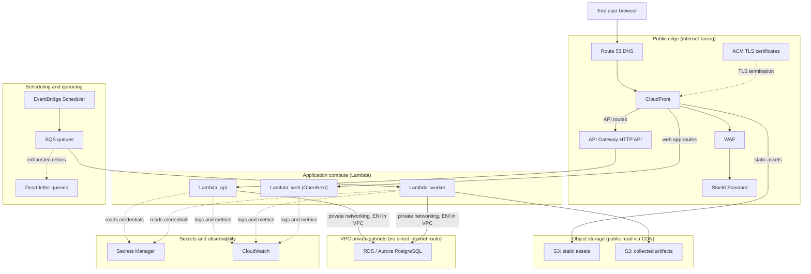

# AWS deployment

This diagram answers: which AWS services host FirmScout in production, how does a request or a scheduled job move between them, and which components sit on the public internet versus inside the private network boundary?

## What this shows

The same Go binary runs as three Lambda functions (api, worker, web via OpenNext) behind CloudFront, with WAF and Shield Standard absorbing abuse at the edge before it reaches compute. Everything public-facing terminates at CloudFront, API Gateway, or the static S3 buckets it serves; the only component with no direct internet route is RDS/Aurora PostgreSQL, reached exclusively over private VPC networking from the api and worker Lambdas. EventBridge Scheduler drives the worker on a schedule through SQS, with dead-letter queues catching jobs that exhaust their retries. Secrets Manager and CloudWatch are cross-cutting: every compute component reads credentials from one and writes logs and metrics to the other.

## Assumptions

- The api and worker Lambdas run inside the VPC (with the cold-start and NAT considerations that implies) specifically because RDS/Aurora requires it; the web Lambda does not need VPC access since it only calls the public API.
- API Gateway HTTP API (not REST API) is used for its lower cost and latency, consistent with the Lambda-first, low-idle-cost decision (ADR-0010).
- S3 artifact storage is the AWS `ArtifactStore` adapter; the same port has a filesystem/PostgreSQL adapter for local development (§7.3).
- SQS is the AWS `JobQueue` adapter; the PostgreSQL `SKIP LOCKED` adapter remains the default for self-hosted and Compose deployments (ADR-0015) — this diagram shows the AWS-specific adapter only.
- Fargate is not shown because it is documented as an alternative for sustained high traffic, not part of the default deployment (§3.4).

## Failure modes

- A Lambda cold start inside the VPC (ENI attachment) is the dominant latency risk for the api function; provisioned concurrency is the mitigation if p95 latency becomes unacceptable, not a move away from Lambda.
- If SQS delivery to the worker Lambda fails repeatedly, jobs land in the DLQ — an unmonitored DLQ is a silent data-loss risk, so CloudWatch alarms on DLQ depth are mandatory, not optional.
- A NAT gateway (needed for VPC Lambdas to reach the public internet, e.g. to call vendor sources) is a real, metered cost per §3.4's honest-downsides note; if watcher Lambdas need outbound internet access, this must be sized and monitored, not assumed free.
- Secrets Manager throttling under high invocation concurrency is mitigated by Lambda-layer credential caching, not by re-fetching secrets on every invocation.

## Related ADRs

- [ADR-0010: AWS runtime, Lambda-first](../adr/0010-aws-runtime.md)
- [ADR-0003: PostgreSQL](../adr/0003-postgresql.md)
- [ADR-0015: job queue port](../adr/0015-job-queue-port.md)

## Implementing code

**Not implemented.** This diagram documents an intended design.

`infrastructure/terraform/` is an empty skeleton. Nothing is deployed and no AWS account is configured.

See [the architecture consistency report](../architecture/consistency-report.md) for what is verified by execution and what is not.
