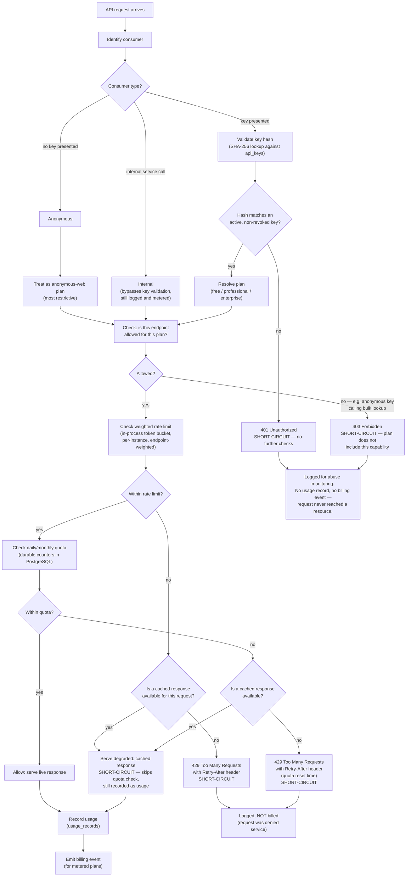

# Entitlement evaluation

This diagram answers: when an API request arrives, what sequence of checks decides whether it is served, degraded, or rejected — and at which point in that sequence does each kind of failure short-circuit the rest?

## What this shows

Each stage can independently terminate the request before later stages ever run: an invalid key never reaches plan resolution, a disallowed endpoint never reaches rate limiting, and a rate or quota breach either falls back to a cached response (which still counts as served usage) or returns `429` with `Retry-After` and stops there. Usage is recorded, and a billing event emitted, only for requests that were actually served — live or cached — never for requests rejected at authentication, authorization, rate, or quota stage.

## Assumptions

- Rate limiting is an in-process, per-instance approximation (per §3.9 of the blueprint) — the effective ceiling scales with instance count, which is an accepted MVP limitation, not modelled as exact in this diagram.
- Quota checks are durable and exact (PostgreSQL counters) because they are billing-relevant; rate checks are approximate and cheap because they exist to absorb bursts, not to meter precisely.
- "Degrade to cached" is only offered where a cached response exists and is not stale beyond an acceptable bound; otherwise the request is rejected outright with `429` rather than serving arbitrarily old data silently.
- Internal service calls bypass key validation but are still logged and metered, so entitlement bookkeeping stays consistent for cost attribution even when authentication is not the relevant control.

## Failure modes

- A revoked key that is still cached client-side will consistently hit `401`; this is intended, but the error message must be unambiguous enough that a legitimate customer does not mistake it for a rate limit.
- Token-bucket state is per-instance, so a consumer spread across many requests routed to different instances gets a higher effective rate than configured — documented in §3.9 as an accepted limitation, not something this flow can fix by itself; the WAF layer bounds the worst case.
- Serving a cached response during a rate or quota breach could mask staleness from a consumer who needs the live answer (e.g. a compliance check at a specific point in time) — this is why bulk/compliance-oriented endpoints are the ones least likely to have a degrade-to-cache path at all, per the capability matrix in §5 of the blueprint.
- A billing event emitted for a cached-degraded response must be tagged as such, since professional/enterprise contracts may price live and cached responses differently; failing to tag this is a metering-accuracy bug, not a security one.

## Related ADRs

- [ADR-0007 — Public web, paid API](../adr/0007-public-web-paid-api.md)
- [ADR-0013 — Cost minimization](../adr/0013-cost-minimization.md)

## Implementing code

**Partially implemented.**

- `internal/application/queries.go` — `EvaluateAPIEntitlement`
- `internal/adapters/httpapi/middleware.go` — key resolution, quota and 429

Plans and billing events are not implemented.

See [the architecture consistency report](../architecture/consistency-report.md) for what is verified by execution and what is not.
