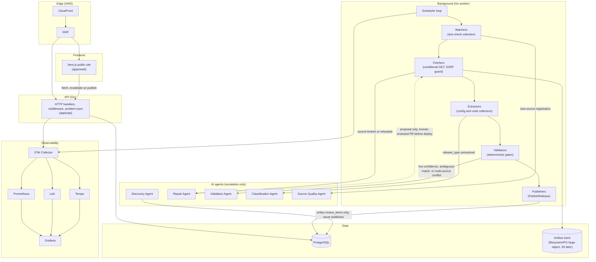

# High-level architecture

This diagram answers: what are the deployable and logical building blocks inside FirmScout, and how does a request or a background check move through them? It groups the modular monolith's runtime pieces (§10) into the layers the blueprint uses to reason about cost, security, and replacement (§8.3), from the AWS edge down to the observability stack that watches all of it.

## What this shows

Seven groupings, matching the blueprint's own component catalogue (§8.3): the AWS edge (CloudFront + WAF, ADR-0010), the Next.js frontend, the Go API, the worker's five-stage pipeline (scheduler → watchers → fetchers → extractors → validators → publishers, §16), the five AI agent ports that are escalation-only in the MVP (§7.3, §15), the single stateful store plus the artifact store, and the OTel-based observability stack (ADR-0011). The dashed edge from Repair back to Fetchers is deliberately weak — it represents a proposal that only reaches production through the PR and CI path in `source-repair-flow.md`, never a direct write. AI agents feed advisory or proposal signals into the pipeline (validation verdicts, classification labels, quality scores) but only Discovery is drawn writing to PostgreSQL, and even then only to `review_items`.

## Assumptions

- All AI agent boxes are drawn even though only fakes exist in the MVP (§7.3), because the diagram documents the target architecture, not only what is implemented today.
- The worker's five named stages are logical, not necessarily five separate goroutine pools; §10 and §16 describe them as pipeline stages within one binary.
- CloudFront/WAF terminate both the web and API paths, consistent with ADR-0010's "same binary behind CloudFront" approach.

## Failure modes

- A worker stage backs up (e.g. `extractors` behind slow parsing of large artifacts) — visible as job queue depth in Prometheus; see `adaptive-scheduling.md` for how backpressure is expressed as interval changes rather than a separate control plane.
- AI agent budget exhaustion degrades `validators` and `fetchers` escalation paths without stopping the deterministic pipeline; see `ai-cost-escalation.md`.
- Loss of the artifact store breaks re-extraction and repair (no `previous_artifact_ref`), but does not affect already-published releases, which are immutable rows in PostgreSQL.

## Related ADRs

- [ADR-0001 — Modular monolith](../adr/0001-modular-monolith.md)
- [ADR-0003 — PostgreSQL](../adr/0003-postgresql.md)
- [ADR-0006 — AI as escalation](../adr/0006-ai-as-escalation.md)
- [ADR-0010 — AWS runtime](../adr/0010-aws-runtime.md)
- [ADR-0011 — Open-source observability](../adr/0011-open-source-observability.md)
- [ADR-0015 — Job queue port](../adr/0015-job-queue-port.md)

## Implementing code

**Partially implemented.**

- `apps/*` — the four runtime components
- `internal/adapters/postgres` — data, queue and artifact metadata
- `internal/adapters/telemetry` — the observability edge

The AI agent box has ports and schemas but no runtime.

See [the architecture consistency report](../architecture/consistency-report.md) for what is verified by execution and what is not.
