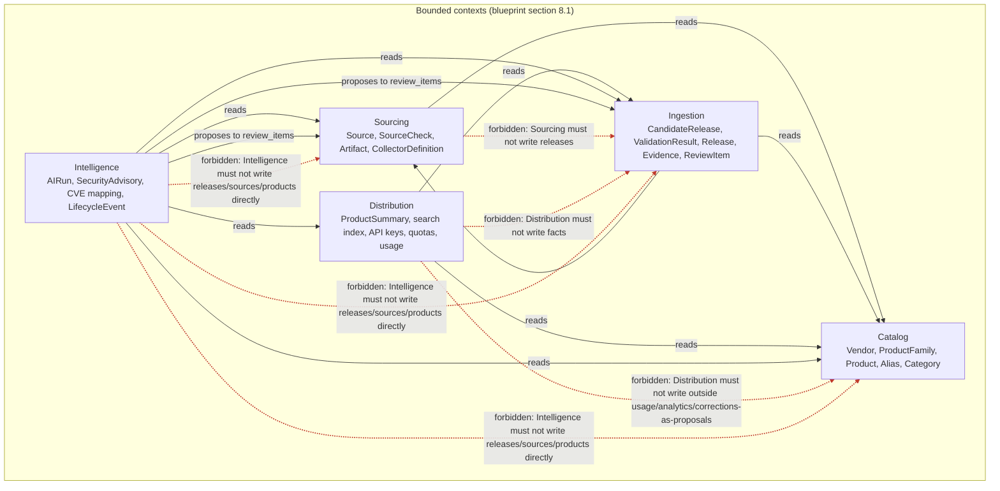

# Module dependencies, allowed and forbidden

This diagram answers: which of FirmScout's five bounded contexts may read from which, and — more importantly — which writes are structurally forbidden? It renders §8.2 directly: the allowed reads are what makes the contexts useful together, and the forbidden writes are what keeps "collectors cannot publish" and "AI cannot write facts directly" true in code, not just in prose.

## What this shows

Solid black arrows are the allowed reads from §8.2: any context may read Catalog, Ingestion may read Sourcing, Distribution may read Catalog and Ingestion, and Intelligence may read everything. The two "proposes to review_items" edges are also allowed — they represent Intelligence's only sanctioned write path, a proposal landing in a review queue owned by Sourcing or Ingestion, reviewed by a human or a deterministic use case before it becomes a real write. The dotted red arrows, each labelled "forbidden", are the three structural prohibitions the blueprint calls out as the ones that matter most: Sourcing cannot write releases (it only emits candidates, §3.11/§8.2), Distribution cannot write facts (only usage, analytics, and corrections-as-proposals), and Intelligence cannot write to `releases`, `sources`, or `products` directly under any circumstance — only propose. Catalog has no outgoing edges at all, solid or dotted, which is the diagram's way of showing "Catalog depends on nothing" (§8.2): there is nothing to forbid because nothing is drawn leaving it.

## Assumptions

- "Reads" here means the context's use cases call read-only ports/queries against another context's repositories; it does not imply a network call — these are Go packages inside one module (§8.1).
- The propose edges terminate at the *context*, not at a specific table, because the actual landing table (`review_items`) is owned jointly by Sourcing and Ingestion depending on the proposal type (§15).
- "No context imports an adapter package" (§8.2) is a Clean-Architecture-layer rule, not a bounded-context rule, and is covered by `clean-architecture.md` instead of repeated here.

## Failure modes

- A future use case in Distribution accidentally calls a Ingestion repository's write method — this is the exact violation the dotted red edges warn against; it should be caught by code review and, ideally, a dedicated architecture test alongside `internal/archtest`.
- An Intelligence agent's proposal type is accepted directly by a publishing use case without going through `review_items` — this collapses "propose" into "write" and defeats the whole diagram; §15 states no publishing use case accepts a proposal type without a human decision or a deterministic validation pass.
- Sourcing's collector adapters return `[]CandidateRelease` with no repository handle at all (§7.4), which is what makes "Sourcing must not write releases" true at the type level, not just at the package-dependency level shown here.

## Related ADRs

- [ADR-0002 — Clean Architecture](../adr/0002-clean-architecture.md)
- [ADR-0005 — Deterministic collectors](../adr/0005-deterministic-collectors.md)
- [ADR-0006 — AI as escalation](../adr/0006-ai-as-escalation.md)

## Implementing code

**Implemented.** This diagram describes code that exists and is covered by tests.

- `internal/archtest/arch_test.go` — every forbidden edge here is a failing test
- `scripts/archcheck.sh`

See [the architecture consistency report](../architecture/consistency-report.md) for what is verified by execution and what is not.
