# Multi-source conflict resolution

This diagram answers: when two or more active sources for the same product report different versions or dates, how does FirmScout decide what to publish — and specifically, when does it refuse to decide automatically and surface the disagreement instead?

```mermaid
flowchart TD
    conflict_detected["Two or more active sources report<br/>different versions or dates<br/>for the same product<br/>(gate 10 of candidate validation)"]

    conflict_detected --> classify_sources["Classify each reporting source<br/>by authority tier"]

    classify_sources --> tiers["Authority ladder (highest first):<br/>1. Official manufacturer source<br/>2. Authorised portal<br/>3. Vendor repository<br/>4. Trusted community source<br/>5. Unknown third party"]

    tiers --> tier_check{"Do the conflicting sources<br/>sit at different tiers?"}

    tier_check -->|"no — same tier"| recency_check
    tier_check -->|"yes — different tiers"| both_official{"Are BOTH of the<br/>top-tier conflicting sources<br/>'official manufacturer'?"}

    both_official -->|"yes — two official sources<br/>disagree with each other"| never_auto["NEVER auto-resolved,<br/>regardless of tier.<br/>Two official sources disagreeing<br/>is itself the finding."]
    never_auto --> conflict_warning

    both_official -->|"no — one side outranks<br/>the other on the ladder"| higher_wins["Higher-tier source's value<br/>is treated as the working value"]

    higher_wins --> guard["Guard: lower-tier value is<br/>NEVER allowed to silently<br/>outrank the higher-tier one,<br/>even if newer or more confident"]

    guard --> tentative_publish["Tentatively usable,<br/>subject to gates below"]

    recency_check["Compare evidence recency<br/>(retrieved_at / first_observed_at)<br/>among same-tier sources"]

    recency_check --> recency_clear{"Is one source's evidence<br/>clearly more recent AND<br/>the older evidence plausibly stale?"}

    recency_clear -->|"yes"| tentative_publish
    recency_clear -->|"no — comparable recency,<br/>or older source still<br/>actively confirmed"| confidence_check

    confidence_check["Compare per-source<br/>confidence scores"]

    confidence_check --> confidence_clear{"Is one confidence score<br/>decisively higher?"}

    confidence_clear -->|"yes, by a wide,<br/>configured margin"| tentative_publish
    confidence_clear -->|"no — scores close,<br/>or tied"| conflict_warning

    tentative_publish --> still_official_pair{"Does the resolved pair still<br/>include two same-tier official<br/>sources disagreeing?"}
    still_official_pair -->|"yes"| never_auto
    still_official_pair -->|"no"| publish_with_note["Publish the higher-ranked value.<br/>Lower-ranked conflicting observation<br/>retained as evidence, not discarded."]

    conflict_warning["Surface a conflict warning<br/>on the product page<br/>+ create a review item"]

    conflict_warning --> maintainer["Maintainer reviews both<br/>pieces of evidence and<br/>either publishes a decision<br/>or requests more evidence"]
```

## What this shows

The resolution ladder — official manufacturer, then authorised portal, then vendor repository, then trusted community, then unknown third party — only ever lets a *higher*-tier source's value stand in for a lower-tier one. It is never inverted by recency or confidence: those two are tie-breakers used strictly *within* a tier, never a way for a third-party source to leapfrog an official one. The one case the ladder cannot resolve by construction — two sources at the official tier disagreeing with each other — always produces a visible conflict warning and a review item; there is no automatic tie-break for that case, because there is no lower-authority signal left to appeal to.

## Assumptions

- Source authority tier is a field on the source registry (Git-synchronised, per §3.3 of the blueprint), reviewed like any other registry change — it is not inferred at conflict-resolution time.
- "Recency" and "confidence" tie-breakers only apply among sources at the *same* tier; they are never invoked to override a tier difference, which is the specific rule this diagram exists to make visually unmissable.
- A conflict warning on a product page does not block the previously published value from remaining visible — the site does not go blank while a conflict is under review; it shows the last-published value alongside the warning.
- The evidence from a lower-ranked or losing source is retained (not deleted), consistent with the immutability principle — it becomes part of the audit trail even when it did not win.

## Failure modes

- A source's authority tier is misclassified in the registry (e.g. a reseller portal incorrectly marked "authorised portal" instead of "vendor repository"). Because the tier is registry data, this is fixed via the same correction path as any other registry error — but until fixed, it could let a lower-trust source outrank a higher-trust one. This is a registry-data-quality risk, not a resolution-logic risk.
- Two official sources disagreeing is not necessarily an error at all — it can mean a staged regional rollout, which looks identical to a genuine conflict until a human adds that context. The design deliberately does not try to distinguish these automatically.
- Confidence-score tie-breaking could be gamed by a source whose extraction confidence is miscalibrated (systematically high). The wide-margin requirement exists specifically to reduce sensitivity to this, but does not eliminate it — the mitigation is monitoring confidence calibration per source, not a rule this diagram can express.

## Related ADRs

- [ADR-0017 — Version strings and date precision](../adr/0017-version-strings-and-date-precision.md)
- [ADR-0018 — Source compliance policy](../adr/0018-source-compliance-policy.md)

## Implementing code

**Partially implemented.**

- `internal/domain/validation.go` — gate 10

The gate is implemented and tested but nothing yet populates the conflicting-version list, so it always passes.

See [the architecture consistency report](../architecture/consistency-report.md) for what is verified by execution and what is not.
