# Multi-source conflict resolution

This diagram answers: when two or more active sources for the same product report different versions or dates, how does FirmScout decide what to publish — and specifically, when does it refuse to decide automatically and surface the disagreement instead?

```mermaid
flowchart TD
    conflict_detected["Two or more active sources report<br/>different versions or dates<br/>for the same product<br/>(gate 10 of candidate validation)"]

    conflict_detected --> classify_sources["Classify each reporting source<br/>by authority tier"]

    classify_sources --> tiers["Authority ladder (highest first):<br/>1. Official manufacturer source<br/>2. Authorised portal<br/>3. Vendor repository<br/>4. Trusted community source<br/>5. Unknown third party"]

    tiers --> tier_check{"Do the conflicting sources<br/>sit at different tiers?"}

    tier_check -->|"no — same tier"| same_tier_built{"As built: is the disagreement<br/>at or above this source's tier?"}

    same_tier_built -->|"yes — this is what<br/>the code does"| conflict_warning
    same_tier_built -->|"the designed tie-break<br/>below is NOT built"| recency_check
    tier_check -->|"yes — different tiers"| both_official{"Are BOTH of the<br/>top-tier conflicting sources<br/>'official manufacturer'?"}

    both_official -->|"yes — two official sources<br/>disagree with each other"| never_auto["NEVER auto-resolved,<br/>regardless of tier.<br/>Two official sources disagreeing<br/>is itself the finding."]
    never_auto --> conflict_warning

    both_official -->|"no — one side outranks<br/>the other on the ladder"| higher_wins["Higher-tier source's value<br/>is treated as the working value"]

    higher_wins --> guard["Guard: lower-tier value is<br/>NEVER allowed to silently<br/>outrank the higher-tier one,<br/>even if newer or more confident"]

    guard --> tentative_publish["Tentatively usable,<br/>subject to gates below"]

    recency_check["DESIGNED, NOT BUILT (ADR-0020)<br/>Compare evidence recency<br/>(retrieved_at / first_observed_at)<br/>among same-tier sources"]

    recency_check --> recency_clear{"Is one source's evidence<br/>clearly more recent AND<br/>the older evidence plausibly stale?"}

    recency_clear -->|"yes"| tentative_publish
    recency_clear -->|"no — comparable recency,<br/>or older source still<br/>actively confirmed"| confidence_check

    confidence_check["DESIGNED, NOT BUILT (ADR-0020)<br/>Compare per-source<br/>confidence scores"]

    confidence_check --> confidence_clear{"Is one confidence score<br/>decisively higher?"}

    confidence_clear -->|"yes, by a wide,<br/>configured margin"| tentative_publish
    confidence_clear -->|"no — scores close,<br/>or tied"| conflict_warning

    tentative_publish --> still_official_pair{"Does the resolved pair still<br/>include two same-tier official<br/>sources disagreeing?"}
    still_official_pair -->|"yes"| never_auto
    still_official_pair -->|"no"| publish_with_note["Publish the higher-ranked value.<br/>Lower-ranked conflicting observation<br/>retained as evidence, not discarded."]

    conflict_warning["Surface a conflict warning<br/>on the product page<br/>+ create a review item"]

    conflict_warning --> maintainer["Maintainer reviews both<br/>pieces of evidence and<br/>either publishes a decision<br/>or requests more evidence"]
```

## What is built and what is not

**One item per disagreement, pointed at what is actually in dispute.** A re-check of a
disagreement that has not moved must not file a second item, and the first implementation
achieved that by reusing any open item the conflict already had. That was too blunt. A
source is free to revise its claim, and when it does, the candidate the item names stops
being a participant: the item went on naming a withdrawn version, so accepting it published
a release *no source claimed* — the catalogue inventing a version out of its own
bookkeeping. Reuse is therefore now conditional on the item's subject still being in
dispute; when it is not, the item is retargeted in place (subject, title, detail, payload,
priority) rather than duplicated, and the superseded candidate is released from review so
nothing is left parked with nothing pointing at it. A uniqueness index
(`review_items_open_subject_idx`, migration `00003`) makes the duplicate physically
impossible rather than merely unlikely.

**A rejected candidate can still be a live disagreement.** Gate 4 short-circuits with
`decision = rejected` when a version is already published, and the rejected path originally
filed no review item at all — so once both sources' current claims were published, every
later check hit gate 4 and the conflict stayed open forever with nothing in the queue. The
queue item is now filed whenever a conflict is open, whatever the verdict; on the rejected
path its subject is the *conflict* (`source_conflict`), not the candidate, because an item
pointing at a rejected candidate would offer a reviewer an accept button that publication is
bound to refuse.

**Built (ADR-0020):** the authority ladder, and only the authority ladder. A disagreement in which every other eligible source sits *strictly below* this source's tier is recorded as outranked, named in gate 10's detail, and does not block publication. A disagreement in which any other eligible source sits *at or above* this source's tier — including two official manufacturer sources — is recorded as an open `source_conflicts` row, produces one review item, and sets `has_source_conflict` on the product page. It is never auto-resolved.

`has_source_conflict` on the product page is a boolean, and for a while that was the entire public answer to "what is disputed" — a reader could see that a disagreement existed and nothing about it. `conflict`, additive alongside it on both `Product` and `LatestReleaseResponse` (`docs/api/openapi.yaml`, `docs/architecture/api.md` §3.2/§3.4), now carries the `source_conflicts` row's own channel, disputed versions, participant count and detection time, computed by the same `RefreshProductSummary` refresh that sets the boolean (migration `00004`) rather than queried separately — the CHECK constraint on those four columns is what keeps this diagram's "one row with a lifecycle, not two copies of the same fact" claim true of the public API as well as the internal projection. It is `null`, honestly rather than defensively, for a summary computed before this field existed or a conflict this package has not finished recording detail for — never a placeholder built just to agree with the boolean.

**Designed but deliberately not built:** the same-tier recency and confidence tie-breakers, drawn above with a `DESIGNED, NOT BUILT` label. ADR-0020 records why: a recency tie-break publishes a value only one source supports, which is the guess gate 10 exists to refuse; "a wide, configured margin" is a threshold nobody has evidence for; and with two pilot vendors the branch would be dead code with no fixture that exercises it honestly. Every same-tier disagreement therefore takes the `conflict_warning` path today.

## What this shows

The resolution ladder — official manufacturer, then authorised portal, then vendor repository, then trusted community, then unknown third party — only ever lets a *higher*-tier source's value stand in for a lower-tier one. It is never inverted by recency or confidence: those two were designed as tie-breakers used strictly *within* a tier — never a way for a third-party source to leapfrog an official one — and are not implemented at all (ADR-0020). The one case the ladder cannot resolve by construction — two sources at the official tier disagreeing with each other — always produces a visible conflict warning and a review item; there is no automatic tie-break for that case, because there is no lower-authority signal left to appeal to.

## Assumptions

- Source authority tier is a field on the source registry (Git-synchronised, per §3.3 of the blueprint), reviewed like any other registry change — it is not inferred at conflict-resolution time.
- "Recency" and "confidence" tie-breakers, *as designed*, only apply among sources at the *same* tier and are never invoked to override a tier difference — the specific rule this diagram exists to make visually unmissable. As built they are not invoked at all: ADR-0020 declines to implement them, so a same-tier disagreement always surfaces.
- A conflict warning on a product page does not block the previously published value from remaining visible — the site does not go blank while a conflict is under review; it shows the last-published value alongside the warning.
- The evidence from a lower-ranked or losing source is retained (not deleted), consistent with the immutability principle — it becomes part of the audit trail even when it did not win.

## Failure modes

- A source's authority tier is misclassified in the registry (e.g. a reseller portal incorrectly marked "authorised portal" instead of "vendor repository"). Because the tier is registry data, this is fixed via the same correction path as any other registry error — but until fixed, it could let a lower-trust source outrank a higher-trust one. This is a registry-data-quality risk, not a resolution-logic risk.
- Two official sources disagreeing is not necessarily an error at all — it can mean a staged regional rollout, which looks identical to a genuine conflict until a human adds that context. The design deliberately does not try to distinguish these automatically.
- Confidence-score tie-breaking could be gamed by a source whose extraction confidence is miscalibrated (systematically high). The wide-margin requirement exists specifically to reduce sensitivity to this, but does not eliminate it — the mitigation is monitoring confidence calibration per source, not a rule this diagram can express.

## Related ADRs

- [ADR-0017 — Version strings and date precision](../adr/0017-version-strings-and-date-precision.md)
- [ADR-0018 — Source compliance policy](../adr/0018-source-compliance-policy.md)
- [ADR-0020 — Multi-source conflict is a recorded finding](../adr/0020-multi-source-conflict-detection.md)

## Implementing code

**Implemented, except the same-tier tie-breakers, which ADR-0020 declines to build.**

- `internal/domain/conflict.go` — `SourceObservation`, `LaterObservation`, `AssessSourceConflict`, `SourceConflict`
- `internal/domain/validation.go` — gate 10, which now routes an unresolved disagreement to review and names an outranked one in its detail
- `internal/application/ingest.go` — `ValidateCandidate.buildContext` loads every source's current observation; `reconcileConflict` opens, refreshes or closes the conflict and attaches at most one review item to it
- `internal/application/review.go` — `DecideReviewItem`, which resolves the conflict with the item
- `internal/adapters/postgres/conflict_repo.go` — `source_observations` and `source_conflicts`
- `database/migrations/00002_conflicts_and_review.sql` — the tables and their constraints
- `internal/adapters/postgres/release_repo.go` — `RefreshProductSummary`'s `conflict_channel`/`conflict_versions`/`conflict_source_count`/`conflict_detected_at` LATERAL pick of the open conflict with the latest `detected_at`, alongside the same query's `has_source_conflict`
- `database/migrations/00004_product_summary_sources_and_conflict_detail.sql` — those four columns and `product_summaries_conflict_consistency`, the CHECK that keeps them jointly present or jointly absent
- `internal/adapters/httpapi/presenter.go` — `presentProductConflict`, rendering the summary's detail as the public `conflict` field, `nil` exactly when the summary carries none

- `internal/platform/wire.go` — where the two ports are attached to the running pipeline; a deployment that omits them turns gate 10 into a gate that can only pass

Tests: `internal/domain/conflict_test.go`, `internal/domain/validation_test.go`
(`TestGateTenRoutesUnresolvedConflictToReview`),
`internal/application/pipeline_test.go`
(`TestValidateCandidateOpensConflictAndReusesReviewItem`),
`internal/adapters/postgres/conflict_test.go` (the tables, against a real database),
`internal/platform/wire_test.go` (the ports reach the use case at all), and
`internal/integration/slice_test.go`
(`TestTwoSourcesDisagreeAndTheDecisionReachesAHuman`), which drives two disagreeing sources
through check, extract and validate and asserts that the contested version is not published,
that `has_source_conflict` flips, that a re-check of the *same* disagreement reuses the same
review item, and that a human acceptance publishes it with an audit row. The same test's
step 4a reads that open conflict back through the real public API (`GET
/api/v1/products/{slug}`) and asserts the `conflict` field's channel, versions and source
count against the row `w.conflicts.GetConflict` loaded, not a literal expected value, and
reads the release that did publish back through `GET /api/v1/releases/{id}` to assert a
real, non-empty `source`/`evidence` — both assertions confirmed to fail under sabotage
(removing `PresentRelease`'s `Source`/`Evidence` fields, and separately hardcoding
`PresentProduct`'s `OfficialSources`/`Conflict` to empty/nil) before this session's fix,
then reverted; and
`TestAcceptingASupersededConflictPublishesTheLiveClaim`, which covers the case that reuse
rule got wrong — see below.

See [the architecture consistency report](../architecture/consistency-report.md) for what is verified by execution and what is not.
