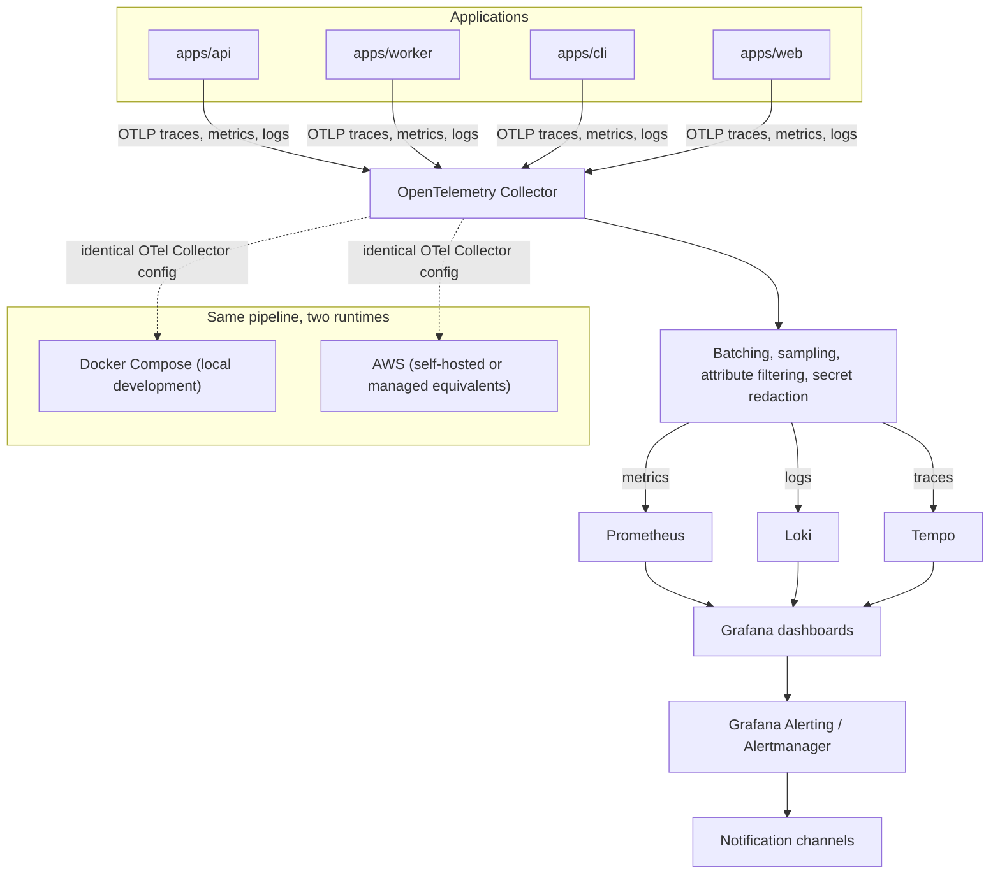

# Observability architecture

This diagram answers: where do traces, metrics, and logs come from, what happens to them between the application and the dashboard, and why does the same pipeline definition work identically on a laptop and in AWS?

## What this shows

All four binaries (api, worker, cli, web) emit traces, metrics, and logs over OTLP to a single OpenTelemetry Collector, which batches, samples, filters attributes, and redacts secrets before fanning the three signal types out to their specialised backends: Prometheus for metrics, Loki for logs, Tempo for traces. Grafana reads all three and is the single pane of glass; Grafana Alerting (or Alertmanager) evaluates rules against that same data and notifies. The pipeline's configuration is identical whether the backends are the Docker Compose services used in local development or their AWS-hosted equivalents — nothing in the application changes between environments, only where the Collector forwards to.

## Assumptions

- Logs reach the pipeline via a `slog` bridge into OTel, not via a separate logging path, so log correlation with trace IDs is automatic (§7's mention of "logs via bridge slog").
- Secret redaction happens in the Collector, not only at the application layer, as a defence-in-depth measure against an application-level redaction bug leaking a credential into a span attribute.
- Sampling is applied in the Collector (tail-based or head-based, decided in `observability.md`) so the applications themselves emit unsampled data and stay simple.
- The Compose profile for observability is optional for day-to-day development (§B7 of the implementation plan) but uses the same Collector configuration file as production, differing only in backend endpoints via environment variables.
- Dashboards and alert rules are provisioned as code (Grafana provisioning files checked into `infrastructure/observability/`), not created by hand in the UI, so they are identical in both runtimes by construction.

## Failure modes

- A misconfigured redaction rule that is too narrow leaks a secret into Loki — the mitigation is testing redaction rules against known-shape secrets (API keys, database URLs) as part of CI, not trusting the rule by inspection alone.
- High-cardinality attributes (e.g. raw URLs with query strings, or per-request IDs used as metric labels) blow up Prometheus's storage and query cost — the Collector's attribute-filtering stage is the enforcement point, not a convention developers are expected to remember.
- If the Collector itself is down, applications must not block or crash — the OTel SDK's exporter is configured to drop and continue rather than back-pressure the request path.
- Divergence between the Compose and AWS Collector configs (e.g. one gets a redaction rule update and the other doesn't) reintroduces exactly the inconsistency this design avoids — the configs should be the same file, parameterised by environment variables, not two hand-maintained copies.

## Related ADRs

- [ADR-0011: open-source observability](../adr/0011-open-source-observability.md)
- [ADR-0002: Clean Architecture](../adr/0002-clean-architecture.md)

## Implementing code

**Partially implemented.**

- `internal/adapters/telemetry` — OTLP export, Prometheus reader, log correlation
- `infrastructure/observability/` — collector, Prometheus, Loki, Tempo and Grafana configuration

The stack has never been started; Docker was unavailable.

See [the architecture consistency report](../architecture/consistency-report.md) for what is verified by execution and what is not.
