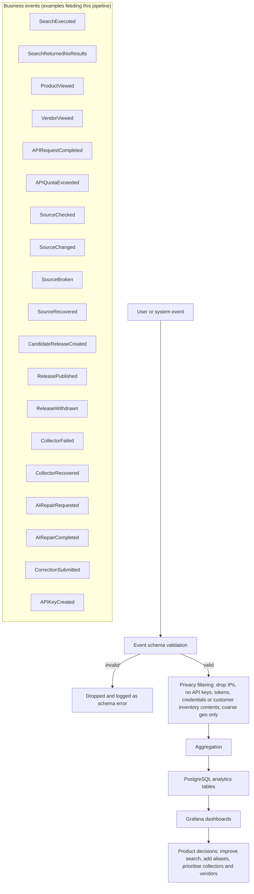

# Product analytics flow

This diagram answers: how does a user action or a system event become a product decision, and what guarantees does FirmScout make about what analytics data never contains?

## What this shows

Every event, whether it originates from a human clicking around the public site or from the platform's own pipeline (a source check, a release publication, an AI repair run), passes through the same two gates before it is durable: schema validation, so malformed events fail loudly rather than silently corrupting an aggregate, and privacy filtering, so the platform structurally cannot retain IP addresses, credentials, or the contents of a customer's uploaded inventory. Only after both gates does an event get aggregated into PostgreSQL analytics tables, which feed the same Grafana used for operational dashboards. The event catalogue spans product usage (`SearchExecuted`, `ProductViewed`), API commercial signals (`APIRequestCompleted`, `APIQuotaExceeded`, `APIKeyCreated`), and platform health (`SourceChecked` through `CollectorRecovered`, `AIRepairRequested`/`Completed`), because product decisions depend on all three, not just user clicks.

## Assumptions

- Privacy filtering is applied at ingestion, not at query time, so there is no analytics table anywhere that ever held an IP address, API key, token, credential, or customer inventory content, even transiently.
- Geo data is coarse (country or region, not city or coordinates) and derived at ingestion from a source that does not require storing the originating IP afterwards.
- The `EventPublisher` port (§7.3) is the single point where both operational domain events (`SourceChanged`, `ReleasePublished`, ...) and product-usage events are emitted, so this pipeline and the domain-events pipeline share the same guarantees rather than being two independently maintained systems.
- Aggregation happens on a schedule or on write (materialised counts, daily rollups) rather than computing every dashboard panel from raw event rows, to keep Grafana query latency low as event volume grows.
- "Product decisions" in the diagram (search quality, alias coverage, collector and vendor prioritisation) are illustrative outcomes, not a claim that these are the only uses of the data.

## Failure modes

- A schema change deployed to producers before consumers (dashboards, aggregation jobs) causes valid new-shape events to be silently misread by old aggregation logic — schema versioning and backward-compatible additions are required, not optional.
- Privacy filtering implemented per-event-type risks a new event type shipping without the filter applied — the mitigation is a single shared ingestion path that every event producer calls, so filtering cannot be bypassed by adding a new event type.
- Over-aggregation (rolling up too early) can make later product questions unanswerable because the raw distinction was discarded — the aggregation stage should preserve enough granularity (by day, by endpoint, by vendor) to support questions not yet asked.
- High event volume from a busy collector (thousands of `SourceChecked` events per hour) can dwarf the signal from user-facing events in dashboards not scoped by event category — dashboards must filter by category, not assume uniform event importance.

## Related ADRs

- [ADR-0012: product analytics](../adr/0012-product-analytics.md)
- [ADR-0003: PostgreSQL](../adr/0003-postgresql.md)

## Implementing code

**Partially implemented.**

- `internal/domain/events.go` — the event vocabulary
- `internal/platform/wire.go` — the current publisher, which writes to the log

The privacy filter and the analytics tables are not implemented.

See [the architecture consistency report](../architecture/consistency-report.md) for what is verified by execution and what is not.
