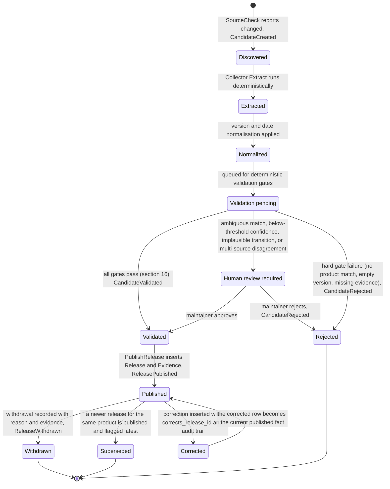

# Release state machine

This diagram answers: what states does a piece of firmware/BIOS/driver version data pass through between "something on a vendor page changed" and "a published, immutable fact", and what triggers each transition? It merges the `CandidateRelease` state machine from §7.1 with the post-publication lifecycle from §16, because in practice a release's story does not end at `published` — corrections, withdrawals, and supersession are first-class, evidence-backed transitions, never silent edits.

## What this shows

Pre-publication, a candidate moves forward through `discovered → extracted → normalized → validation_pending`, then branches three ways at the validation gates from §16: straight through to `validated` if every deterministic gate passes, sideways to `human_review_required` if a gate routes to review rather than rejecting outright, or terminates at `rejected` if a gate hard-fails. Post-publication, `published` is not terminal: it can move to `withdrawn` (never deleted — a marker row, per §16), to `superseded` (a newer release for the same product becomes latest — a flag update on a derived column, not a change to the fact), or to `corrected` (a new row referencing the original via `corrects_release_id`), and a corrected release returns to `published` because the correction *is* the new current fact. `rejected → published` does not exist as a transition anywhere in this diagram, matching §7.6's invariant that "`published → discovered` is not expressible" — state transitions are declared, not ad hoc.

## Assumptions

- `validation_pending → validated` and the parallel routes to `human_review_required` or `rejected` are drawn as mutually exclusive outcomes of the same gate pass, consistent with §16's ten ordered gates, each of which can reject or route to review.
- `superseded` is modelled as a real transition here for clarity even though the underlying implementation is "a flag update on a derived column, not a change to the fact" (§16) — the release row itself never changes; only its "is this the latest" status does.
- Corrections form a chain (`corrected → published → corrected → …`) rather than a single-use transition, since nothing in §16 limits a release to at most one correction.

## Failure modes

- A candidate stuck in `human_review_required` indefinitely represents a review-queue backlog, not a state machine failure — see `review-prioritization.md` (referenced from the blueprint's diagram list, §9) for how such backlogs are triaged.
- An attempt to transition `withdrawn → published` or any other transition not drawn here must be rejected by the domain type itself, not merely by application logic, per the invariant in §7.6.
- A rollback of a bad import is implemented as a bulk `published → withdrawn` transition keyed on `collector_run_id` (§16), which this diagram covers as an instance of the ordinary withdrawal transition, not a separate mechanism.

## Related ADRs

- [ADR-0003 — PostgreSQL](../adr/0003-postgresql.md)
- [ADR-0005 — Deterministic collectors](../adr/0005-deterministic-collectors.md)
- [ADR-0017 — Version strings and date precision](../adr/0017-version-strings-and-date-precision.md)

## Implementing code

**Implemented.** This diagram describes code that exists and is covered by tests.

- `internal/domain/candidate.go` — the transition table
- `internal/domain/statemachine_test.go` — every illegal edge asserted

See [the architecture consistency report](../architecture/consistency-report.md) for what is verified by execution and what is not.
