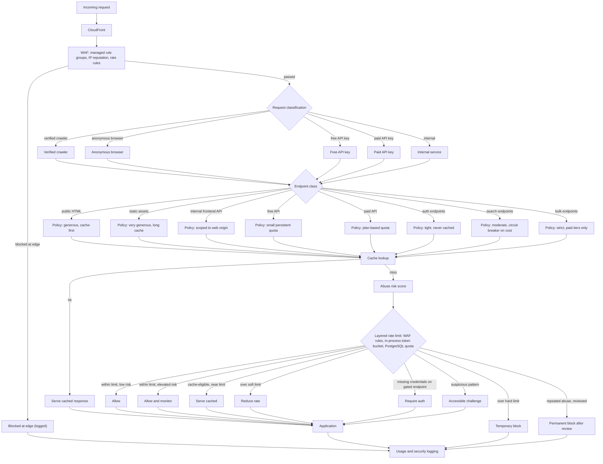

# Request and scraping protection flow

This diagram answers: when a request arrives at FirmScout's edge, what sequence of checks decides whether it is served, throttled, challenged, or blocked, and why does the answer depend on which endpoint class it targets rather than on a single global limit?

## What this shows

Two independent axes determine treatment: **who is asking** (verified crawler, anonymous browser, free key, paid key, internal service) and **what they are asking for** (public HTML, static assets, internal frontend APIs, free API, paid API, auth endpoints, search endpoints, bulk endpoints). There is no single global rate limit — each endpoint class has its own policy, evaluated after classification and before the shared cache and risk-scoring stages. The response ladder is graduated: allow, allow and monitor, serve cached, reduce rate, require auth, an accessible challenge, a temporary block, and — only after human review of the evidence — a permanent block. Every terminal path, including edge blocks, reaches usage and security logging.

## Assumptions

- WAF managed rule groups and IP reputation lists catch high-confidence automated abuse before it reaches the application, at negligible marginal cost.
- Request classification (crawler / anonymous / free key / paid key / internal) is resolved from verifiable signals (API key, verified bot user-agent plus reverse DNS, mTLS or VPC source for internal) rather than trusted self-declaration.
- The abuse risk score is a lightweight, explainable heuristic (request pattern, header consistency, historical behaviour), not an opaque ML classifier in the MVP.
- "Accessible challenge" means a challenge that does not depend on vision or fine motor control (per O1/O2 in the blueprint) — never a CAPTCHA that blocks legitimate accessibility tools or well-behaved crawlers.
- Permanent blocks always require a human review step; nothing is permanently blocked by an automated decision alone.

## Failure modes

- Over-aggressive classification misfiles a legitimate paid API consumer as anonymous, applying the wrong (stricter) policy — mitigated by always trusting a valid API key signature over any other heuristic.
- WAF rate rules tuned for one endpoint class bleed into another if rules are not scoped per path — this diagram exists specifically to keep that scoping visible and auditable.
- A challenge step that is not accessible becomes a de facto block for legitimate users, which is the failure this design explicitly avoids (O1).
- Risk scoring based on stale reputation data allows an abusive IP through after it changes behaviour, or blocks a shared corporate NAT egress unfairly — both require the "allow and monitor" and "reduce rate" middle tiers rather than jumping straight to a block.

## Related ADRs

- [ADR-0008: scraping resilience](../adr/0008-scraping-resilience.md)
- [ADR-0007: public web, paid API](../adr/0007-public-web-paid-api.md)
- [ADR-0013: cost minimisation](../adr/0013-cost-minimization.md)

## Implementing code

**Partially implemented.**

- `internal/adapters/httpapi/middleware.go` — request classification and the response path
- `internal/adapters/httpapi/ratelimit.go` — per-endpoint-class token buckets

There is no edge: no CloudFront, no WAF, and no abuse scoring. Rate limiting is per instance.

See [the architecture consistency report](../architecture/consistency-report.md) for what is verified by execution and what is not.
