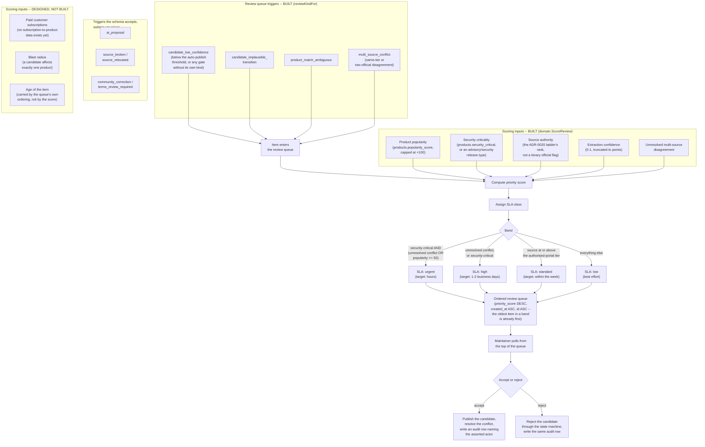

# Human review prioritisation

This diagram answers: with several different kinds of events all feeding the same human review queue, how does FirmScout decide what a maintainer should look at first — and what response-time commitment attaches to each item?

## What is built and what is not

**Built.** The single queue, the additive score, the four SLA bands, the ordering, and both
decisions. `domain.ScoreReview` computes the score from five signals and returns the reasons
that produced it, so the queue can explain its own order rather than presenting an
unexplained integer. `ListReviewQueue` reads it; `DecideReviewItem` closes it.

**Designed but not built,** drawn above under `DESIGNED, NOT BUILT`:

- *Paid customer dependency* — there is no subscription-to-product data in the schema. A term
  computed from data that does not exist would make the score look better informed than it is.
- *Blast radius* — a candidate release affects exactly one product, so the term would be the
  constant 1 for every item in the queue today.
- *Age as a scoring term, and periodic re-scoring.* Age is deliberately not a term. A decaying
  score would need a periodic re-scoring job over the whole queue to reproduce what the queue
  index already does: it orders by `(priority_score DESC, created_at ASC)`, so the oldest item
  within a band is already first. `ReviewQueueEntry.Age` is computed at read time for display.

## What this shows

Every trigger — regardless of what kind of uncertainty produced it — funnels into one queue and is scored on the same set of inputs, so a low-confidence candidate on a popular product can legitimately outrank an ambiguous match on an obscure one. Scoring, not arrival order or trigger type, determines position. The score also maps to an SLA class, so the queue carries both an ordering and an explicit response-time commitment, which matters most for the security-critical cases the capability matrix (§5 of the blueprint) promises freshness targets for. The paid-dependency half of that promise is not yet backed by data — see below.

Four of the ten kinds the `review_items.kind` constraint accepts are raised today, all of them by `reviewKindFor` in the validation pipeline. The rest are reachable through the queue's filters and would be scored by the same function, but nothing creates them: AI escalation is not implemented (ADR-0006 remains a plan), and neither source repair nor community correction has a code path yet.

## Assumptions

- The score is computed once, at item creation, and is not recomputed. That is a deliberate reversal of the original design (see "What is built and what is not"): the queue's index already surfaces the oldest item within a band first, which is the property periodic re-scoring existed to provide. If a signal other than age ever needs to move an existing item, re-scoring becomes necessary and this assumption has to be revisited.
- Security criticality here means "this item is on the path to a CVE correlation decision" (see `cve-correlation.md`), not a general severity judgment — it is a structural property of the trigger, not a maintainer guess. As built it reads `products.security_critical` plus the candidate's release type.
- Scoring does no I/O. `domain.ScoreReview` takes a struct of already-gathered facts, because a policy that can query is a policy nobody can test in a microsecond. `ValidateCandidate.reviewSignals` is what gathers them, and a product it cannot load contributes nothing rather than failing the pipeline.
- The weights are exported constants (`ReviewScoreBase`, `ReviewScoreSecurityCritical`, and so on), not literals in the formula, so tuning them is a diff a reviewer can read and a test can assert a band boundary without hardcoding the same number twice. They remain untuned against real throughput.

## Failure modes

- If popularity dominated the score, security-relevant items on unpopular products could be starved even though they matter to the small set of customers running that product — this is why security criticality is a first-class input on its own, worth more than the popularity term can ever reach (+150 against a +100 cap), rather than folded into popularity.
- A burst of items could flood the queue. Arrival order is not what orders it — score is, and `created_at` breaks ties only within a band — so a genuinely urgent item submitted after a flood still sorts above it. What a flood does threaten is the *reviewer's* throughput, which no scoring rule can fix.
- The one failure this design actively prevents is a queue that grows by one item per check for a single unchanging disagreement: `ValidateCandidate` attaches at most one open review item to one open conflict, and reuses it on every later check (D5). Without that, a two-source disagreement would produce four items a day forever and the queue's value — that it stays short enough to read — would be gone within a week.
- Blast radius is not always knowable up front (a source-registry fix's true blast radius depends on how many products share that source, which is itself a query). Because the term is not built, no item is currently scored on a guess about it — but the day it is built, it will need the re-scoring this design dropped.
- An SLA class is a target, not a guarantee; a maintainer-capacity shortfall does not silently downgrade the SLA class — a missed SLA is itself a signal that should be visible (e.g. in an operational dashboard), not quietly absorbed by the scoring model.

## Related ADRs

- [ADR-0013 — Cost minimization](../adr/0013-cost-minimization.md)
- [ADR-0006 — AI as escalation](../adr/0006-ai-as-escalation.md)
- [ADR-0020 — Multi-source conflict is a recorded finding](../adr/0020-multi-source-conflict-detection.md)
- [ADR-0021 — Review decisions record an asserted, unauthenticated actor](../adr/0021-asserted-reviewer-identity.md)

## Implementing code

**Implemented, minus the three scoring inputs listed above as not built.**

- `internal/domain/review.go` — `SLAClass`, `ReviewSignals`, `ScoreReview`, `slaFor` and the scoring weights
- `internal/application/ingest.go` — `reviewSignals` gathers the facts; the review branch of `ValidateCandidate` creates or reuses the item
- `internal/application/review_queries.go` — `ListReviewQueue` (filters, keyset pagination, slug and age resolution) and `GetReviewItem` (candidate, gates, evidence, source, conflict, observations, audit trail)
- `internal/application/review.go` — `DecideReviewItem.Accept` and `.Reject`, one unit of work each
- `internal/adapters/postgres/review_repo.go` — the queue query and its mixed-order keyset cursor
- `internal/adapters/postgres/audit_repo.go` — the decision's audit row
- `internal/adapters/httpapi/review_handlers.go`, `review_presenter.go`, and the `/internal/review` routes in `router.go` — off unless `FIRMSCOUT_REVIEW_API_ENABLED` is true *and* the use cases are wired. A third switch, `FIRMSCOUT_REVIEW_UI_ENABLED`, gates the web viewer below on a different host; api.md §11 tabulates all three
- `apps/web/app/review/page.tsx`, `apps/web/app/review/[id]/page.tsx`, `apps/web/lib/review.ts` — the maintainer's **read-only** view of this diagram. The Server Action that issued accept and reject was removed in Phase 2's closing pass: a public app that runs a private surface's writes on a visitor's behalf is an internet-reachable deputy for it (ADR-0021's 2026-09-05 amendment)
- `apps/cli/main.go` — `firmscout review list`, `review show`, `review accept`, `review reject`. Accept and reject moved here when they left `apps/web`; they call `application.DecideReviewItem` directly rather than the HTTP surface, so the control is a database connection string and a shell on a host that holds one. `review show` is also the only production reader of `PayloadKeyConflictCandidates` — the other candidates a multi-source conflict has parked, which `item.SubjectID` alone cannot reach

Tests: `internal/domain/review_test.go` (score terms and band boundaries),
`internal/application/review_queries_test.go` (including the documented page bounds:
default 50, max 200, clamped in each direction separately),
`internal/application/ingest_review_payload_test.go`
(`TestReviewPayloadListsEveryDisputingCandidate`, which exercises the non-subject
candidate the queue must still reach), `internal/application/review_test.go`,
`internal/adapters/postgres/review_test.go` (filters and pagination against a real database),
`internal/adapters/httpapi/review_handlers_test.go`, `apps/web/lib/review.test.ts`, and
`internal/integration/slice_test.go`
(`TestTwoSourcesDisagreeAndTheDecisionReachesAHuman`), which walks a real disagreement from
two sources to an accepted decision with its audit row.

See [the architecture consistency report](../architecture/consistency-report.md) for what is verified by execution and what is not.
