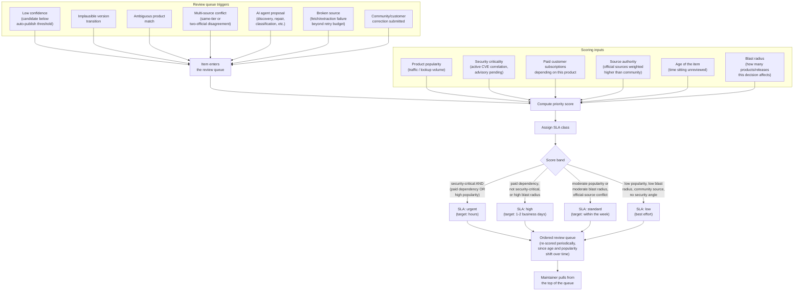

# Human review prioritisation

This diagram answers: with several different kinds of events all feeding the same human review queue, how does FirmScout decide what a maintainer should look at first — and what response-time commitment attaches to each item?

## What this shows

Every trigger — regardless of what kind of uncertainty produced it — funnels into one queue and is scored on the same set of inputs, so a low-confidence candidate on a popular product can legitimately outrank an ambiguous match on an obscure one. Scoring, not arrival order or trigger type, determines position. The score also maps to an SLA class, so the queue carries both an ordering and an explicit response-time commitment, which matters most for the security-critical and paid-dependency cases the capability matrix (§5 of the blueprint) promises freshness targets for.

## Assumptions

- Scoring inputs are recomputed periodically, not just at item creation — an item's age and a product's popularity both change while the item sits unreviewed, so a static one-time score would let old, previously-minor items become invisible even as their age itself becomes a reason to prioritise them.
- Security criticality here means "this item is on the path to a CVE correlation decision" (see `cve-correlation.md`), not a general severity judgment — it is a structural property of the trigger, not a maintainer guess.
- Paid customer subscriptions are read from the entitlement/product-summary data, not requested per item — the scoring step is a query against existing data, not a new source of truth.
- The SLA bands shown are illustrative of the ordering logic the blueprint requires (urgent/high/standard/low); the exact score thresholds are a tuned configuration value, not a domain constant, and are expected to be revisited against real review-queue throughput.

## Failure modes

- If popularity and paid-dependency signals dominate the score too heavily, security-relevant items on unpopular products could be starved even though they matter to the (small) set of customers running that product — this is why security criticality is a first-class scoring input on its own, not folded entirely into popularity.
- A burst of AI-agent proposals (e.g. after a discovery run against many new vendors) could flood the queue with many low-blast-radius items; without periodic re-scoring, a genuinely urgent single-item correction submitted afterward could be pushed far down purely by arrival-order bias — periodic re-scoring is the mitigation, not a queue cap.
- Blast radius is not always knowable up front (a source-registry fix's true blast radius depends on how many products share that source, which is itself a query) — an inaccurate early estimate should be corrected the same way any other scoring input drifts, by re-scoring rather than trusting the number computed at creation time.
- An SLA class is a target, not a guarantee; a maintainer-capacity shortfall does not silently downgrade the SLA class — a missed SLA is itself a signal that should be visible (e.g. in an operational dashboard), not quietly absorbed by the scoring model.

## Related ADRs

- [ADR-0013 — Cost minimization](../adr/0013-cost-minimization.md)
- [ADR-0006 — AI as escalation](../adr/0006-ai-as-escalation.md)

## Implementing code

**Partially implemented.**

- `internal/application/ingest.go` — `reviewPriority` and review item creation
- `internal/adapters/postgres/review_repo.go`

The scoring is crude and there is no interface for reading the queue.

See [the architecture consistency report](../architecture/consistency-report.md) for what is verified by execution and what is not.
