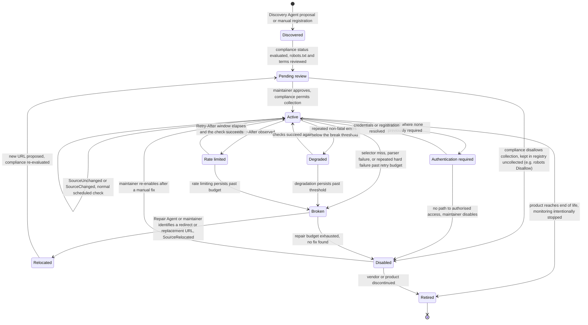

# Source health state machine

This diagram answers: what states can a monitored source be in, and what has to happen for it to move between them? It formalises §7.6's invariant that "a `Source` in `retired` accepts no further checks", and it is the state machine `update-decision-tree.md` writes into on every non-`unchanged` outcome and that `source-repair-flow.md` walks when a source needs fixing.

## What this shows

A source enters through `discovered` (whether from the Discovery Agent's bootstrap proposals or a manual registration) and cannot become `active` without first passing `pending_review`, where compliance status — robots.txt and terms — is evaluated, per ADR-0018's principle that "compliance status is a first-class source field... evaluated before collection, not an afterthought". From `active`, the machine branches into the failure classes the source-repair flow already names: `degraded` (soft errors), `rate_limited`, `authentication_required`, and `broken` (hard failures past the retry budget). `relocated` is reachable only from `broken`, reflecting that a source is not assumed to have moved until deterministic retries and/or repair have exhausted the simpler explanations, and a relocated source must re-pass `pending_review` because the new URL's compliance status is not inherited from the old one. `retired` is drawn as the only truly terminal state — no arrow leaves it — which is the direct rendering of "a Source in retired accepts no further checks" (§7.6).

## Assumptions

- `discovered → pending_review` is drawn as automatic (both bootstrap-proposed and manually-registered sources go through the same compliance check), so there is no way for a source to reach `active` without it.
- `active → active` is a self-transition standing in for the ordinary check loop (`SourceUnchanged`/`SourceChanged` domain events, §7.7); it does not change health state, only `source_checks` rows and, separately, the next-check interval (`adaptive-scheduling.md`).
- `disabled` is reachable both from compliance rejection (`pending_review → disabled`) and from exhausted repair (`broken → disabled`) and from unresolved authentication (`authentication_required → disabled`) — all three represent "kept in the registry, visible, but not collected", the same posture the blueprint documents for Dell (§3.6).

## Failure modes

- A source oscillating between `degraded` and `active` repeatedly without ever reaching `broken` could mask a slow, persistent problem — the "degradation persists past threshold" transition condition must define what "persists" means (e.g. a rolling window), which is implementation detail this diagram does not fix.
- `relocated → pending_review` re-entering compliance review means a relocation can, in principle, stall indefinitely in review if a maintainer does not act — the same review-prioritisation concern noted for candidate releases applies here.
- If `authentication_required` is misclassified for a source that is actually just `rate_limited` (some APIs return 401/403 under load), the wrong recovery path is attempted; the failure classification step in `source-repair-flow.md` is the place this ambiguity should be resolved before the state transition is recorded.

## Related ADRs

- [ADR-0005 — Deterministic collectors](../adr/0005-deterministic-collectors.md)
- [ADR-0008 — Scraping resilience](../adr/0008-scraping-resilience.md)
- [ADR-0018 — Source compliance policy](../adr/0018-source-compliance-policy.md)

## Implementing code

**Implemented.** This diagram describes code that exists and is covered by tests.

- `internal/domain/source.go` — the transition table and `HealthForOutcome`
- `internal/domain/statemachine_test.go`

See [the architecture consistency report](../architecture/consistency-report.md) for what is verified by execution and what is not.
