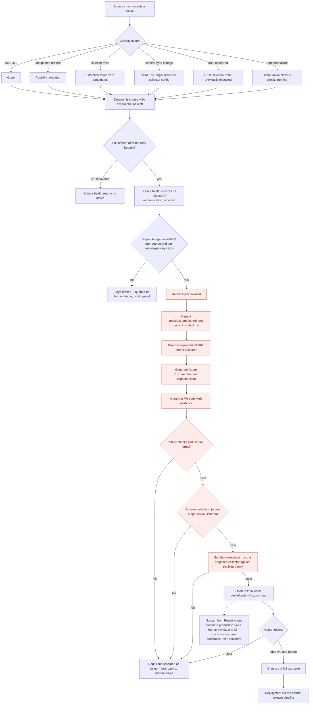

# Source failure and AI repair

This diagram answers: when a source breaks, what happens before an AI model is ever invoked, what happens after, and — critically — what is the only path by which AI-generated code can reach production? It is the concrete mechanism behind the Repair Agent row in §15 and the security posture in §8.3 ("AI-generated code must never deploy directly to production").

## What this shows

Failure classification (six concrete classes, matching the objective) feeds a deterministic retry with backoff first — the same mechanism every ordinary transient failure uses, so AI is never invoked for a blip that a retry would have fixed. Only after the retry budget is exhausted does the source health transition to `broken`/`relocated`/`authentication_required`, and only then is a repair *budget* checked before the Repair Agent runs at all — a second gate independent of the AI cost-escalation budgets in `ai-cost-escalation.md`, specific to repair. Every node shaded red is something the Repair Agent produces or a check that runs on its output; none of them has a path to `V` (deployment) that skips the PR (`S`) and the human review gate (`T`). The dashed callout exists because this is the single most important property of the diagram: the arrows themselves already show it (there is no edge from `S` or earlier directly to `U`/`V`), but the objective specifically requires that this be unmistakable, so it is stated as well as drawn.

## Assumptions

- "Repair budget" is distinct from the general AI cost budgets in `ai-cost-escalation.md`; a source can be within its per-vendor-per-day AI spend and still be denied repair if a separate per-source repair-attempt cap has been hit, to prevent one flaky source from consuming a vendor's entire daily allocation.
- Sandbox execution (`Q`) runs the proposed collector only against the recorded fixture, never against the live vendor site, consistent with the absolute rule in §7.8 that live manufacturer websites are never a test dependency.
- A PR that fails human review (`T` → reject) is treated the same as a failed static/schema/sandbox check for cost-accounting purposes — it is a completed, billed AI run (§15's run envelope), not a retry loop.

## Failure modes

- The Repair Agent proposes a plausible-looking but wrong selector that happens to pass sandbox execution against a poorly chosen fixture — this is why fixture generation itself is part of the PR under human review, not trusted output.
- Static checks, schema validation, or sandbox execution failing repeatedly for the same source burns repair budget without producing a usable fix — `I`'s per-source cap exists specifically to bound this.
- A source is `relocated` rather than `broken`, and the Repair Agent's proposed replacement URL turns out to have different compliance status (robots/terms) than the original — the merged PR still goes through the same source-registration compliance review as a brand-new source (ADR-0018), it does not inherit the old source's compliance status.

## Related ADRs

- [ADR-0005 — Deterministic collectors](../adr/0005-deterministic-collectors.md)
- [ADR-0006 — AI as escalation](../adr/0006-ai-as-escalation.md)
- [ADR-0013 — Cost minimisation](../adr/0013-cost-minimization.md)

## Implementing code

**Not implemented.** This diagram documents an intended design.

Sources transition to `broken` and `relocated` correctly, but nothing proposes a repair.

See [the architecture consistency report](../architecture/consistency-report.md) for what is verified by execution and what is not.
