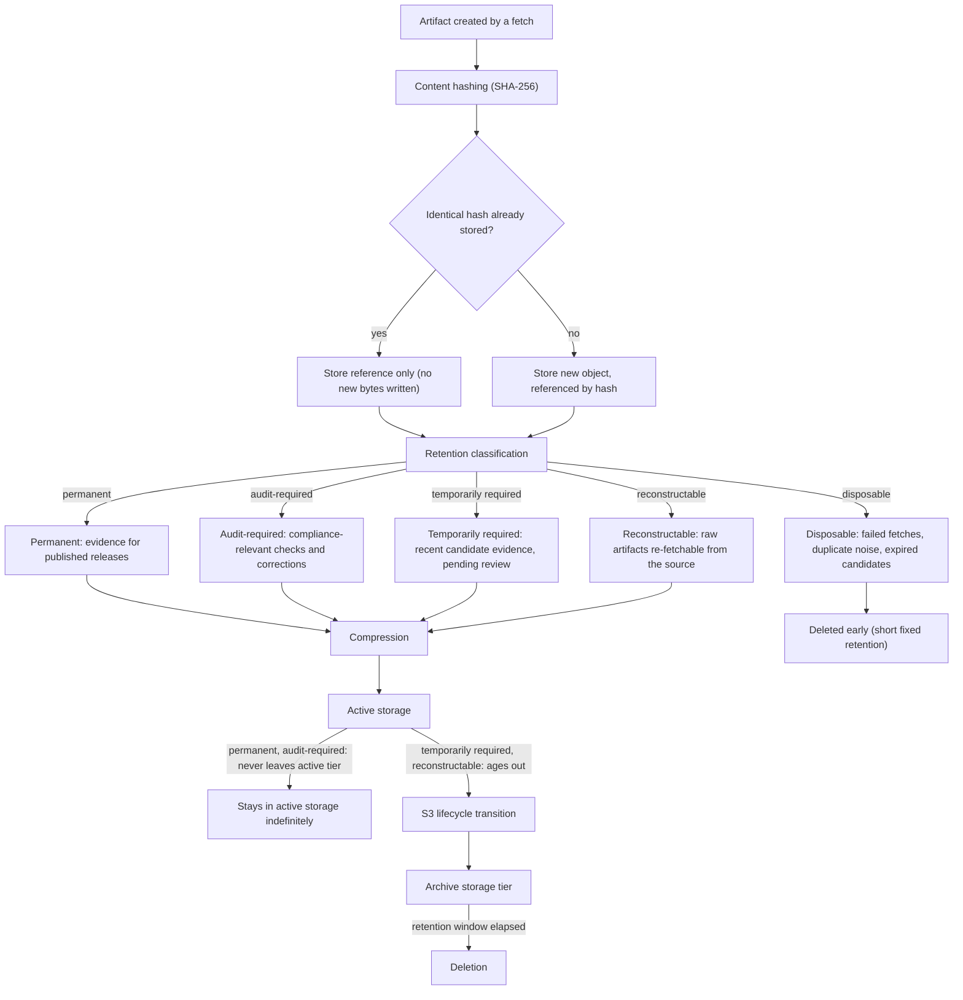

# Storage lifecycle

This diagram answers: from the moment a fetch produces raw content, what determines how long that content is kept, in which tier, and which data classes are allowed to leave active storage at all?

## What this shows

Every artifact is hashed before it is stored, and an identical hash is stored once and referenced many times — the same changelog page fetched unchanged across a hundred checks costs one object, not a hundred. After deduplication, retention classification decides everything that follows: **permanent** evidence backing a published release and **audit-required** records never leave active storage, because they are the proof a compliance customer or a dispute resolution needs on demand. **Temporarily required** and **reconstructable** artifacts age out through normal S3 lifecycle transitions into an archive tier and are eventually deleted. **Disposable** artifacts — failed fetches, duplicate noise, expired unpublished candidates — are deleted early on a short fixed retention, never reaching the archive tier at all.

## Assumptions

- Content-addressed storage (hash as key or hash-derived path) is what makes deduplication a free side effect of the storage scheme rather than a separate cleanup job.
- Retention classification is assigned at write time based on what produced the artifact (a published release's evidence versus a failed fetch versus a candidate still pending review), not inferred later by scanning content.
- "Reconstructable" specifically means the artifact could be re-fetched from the still-live manufacturer source if needed — this classification would be wrong for a source that has since gone offline or relocated, which is a reason source-relocation events should trigger a reclassification review.
- Compression is applied uniformly to everything that reaches active storage, since fetched text/HTML/JSON compresses well and the CPU cost is negligible compared to the storage savings.
- S3 lifecycle transition and archive-tier retention windows are configuration, not code, so they can be tuned per data class without a deployment.

## Failure modes

- Misclassifying a candidate's evidence as "disposable" before its candidate has finished the review path would delete evidence a human reviewer still needs — the classification must be tied to the candidate's state machine, not assigned once at ingestion and forgotten.
- A hash collision (theoretically negligible with SHA-256, but worth stating) would cause two different artifacts to be treated as identical — acceptable risk at SHA-256's collision resistance, explicitly not mitigated further.
- If a source is later found to have been relocated or taken down, artifacts classified "reconstructable" are no longer actually reconstructable — this is a known limitation the classification does not currently detect automatically.
- Deleting "disposable" artifacts too aggressively before a failure investigation is complete removes the evidence needed to debug a collector regression — the fixed short retention window should be long enough to cover a normal on-call investigation cycle, and is a tuning knob, not a fixed constant.

## Related ADRs

- [ADR-0013: cost minimisation](../adr/0013-cost-minimization.md)
- [ADR-0003: PostgreSQL](../adr/0003-postgresql.md)

## Implementing code

**Partially implemented.**

- `internal/adapters/postgres/artifact_repo.go` — hashing, deduplication and retention classification
- `internal/adapters/artifact/filesystem.go` — the blob backend

Nothing sweeps expired artifacts yet.

See [the architecture consistency report](../architecture/consistency-report.md) for what is verified by execution and what is not.
