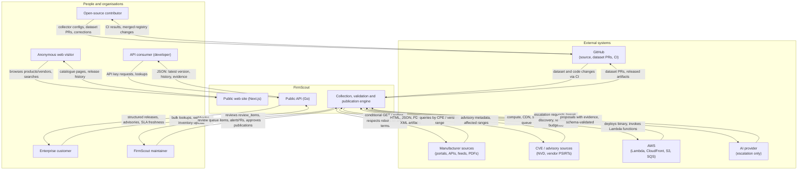

# System context

This diagram answers: who and what does FirmScout talk to, and what crosses each boundary? It places FirmScout as a single system and shows every external actor and system that sends it data, receives data from it, or both, so that trust boundaries (§4.3 of the blueprint) are visible at a glance.

## What this shows

Five actor types on the left, three external system categories that carry the most trust weight (manufacturer sources, advisory sources, and the AI provider) on the right, and FirmScout itself decomposed only as far as "web / API / engine" — enough to show that anonymous and paid access go through the same API (§12), and that the collection engine, not the web tier, is what talks to manufacturers. Every arrow is labelled with what actually crosses it, not a generic "data flow", because the blueprint's core distinction — what a vendor published versus what FirmScout inferred (§4.3) — starts at this boundary: nothing enters the catalogue that did not first arrive as an artifact from `manuf` or an evidence-backed proposal from `aiprovider`.

## Assumptions

- GitHub is both a code-hosting system and the transport for the hybrid dataset (registry PRs), per §3.3 / ADR-0016, so it appears once with both roles labelled.
- The AI provider is drawn as a single external system; the blueprint treats provider choice as an adapter decision (§15), so no specific vendor is named.
- Enterprise customers are shown as a distinct actor from generic API consumers because their capability matrix (§5) includes bulk lookup, webhooks, and inventory upload that the free API key does not.

## Failure modes

- A manufacturer source blocks or rate-limits FirmScout (O2, §34) — visible as the `platform → manuf` edge failing, handled by the source health state machine, not by this diagram.
- The AI provider is unreachable or exhausts its budget — the `platform → aiprovider` edge degrades gracefully; see `ai-cost-escalation.md` for the fallback path that keeps FirmScout operating without it.
- A contributor's PR conflicts with registry data edited out-of-band — mitigated by `managed_by = 'registry'` per §3.3, not shown here.

## Related ADRs

- [ADR-0006 — AI as escalation](../adr/0006-ai-as-escalation.md)
- [ADR-0007 — Public web, paid API](../adr/0007-public-web-paid-api.md)
- [ADR-0009 — Code and data licensing](../adr/0009-code-and-data-licensing.md)
- [ADR-0010 — AWS runtime](../adr/0010-aws-runtime.md)
- [ADR-0016 — Hybrid dataset](../adr/0016-hybrid-dataset.md)
- [ADR-0018 — Source compliance policy](../adr/0018-source-compliance-policy.md)

## Implementing code

**Partially implemented.**

- `apps/api`, `apps/worker`, `apps/cli`, `apps/web` — the FirmScout box
- `internal/adapters/fetch` — every outbound interaction with a manufacturer source
- `.github/workflows` — the GitHub relationship

CVE and advisory sources, AWS, and the AI provider are drawn but not connected.

See [the architecture consistency report](../architecture/consistency-report.md) for what is verified by execution and what is not.
