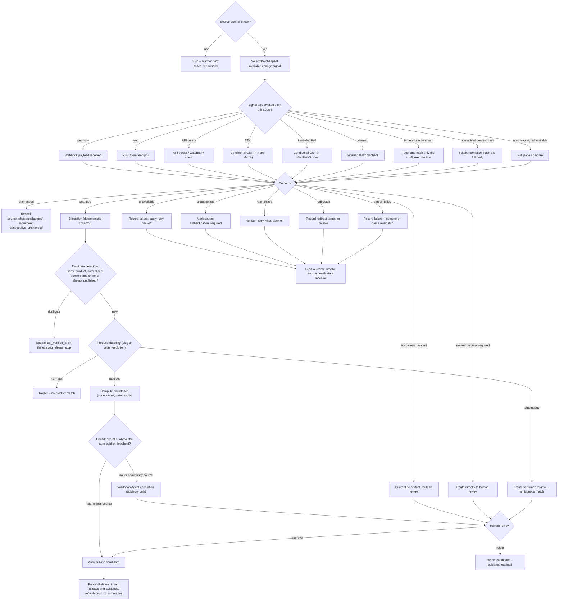

# Update decision tree

This diagram answers: for one source, on one scheduled check, what is the full decision path from "is it due?" to "published, rejected, or routed to a human"? It is the operational heart of the platform — the path every one of the tens of thousands of sources the blueprint's cost model depends on (§1) walks through on every check, almost always without touching an AI model.

## What this shows

The full per-check path in the order the objective specifies: due-check gate, cheapest-signal selection among ten concrete signal types (matching `T1` in §2 — most vendor sources expose at least one cheap signal), the nine possible check outcomes from `CheckSource`, and — only on `changed` — extraction, duplicate detection, product matching, confidence computation, optional AI escalation, human review, and finally publish or reject. Every terminal box on the left (`E2`–`E8`) feeds the source health state machine rather than the release pipeline, keeping the two state machines (`release-state-machine.md`, `source-health-state-machine.md`) cleanly separated: a source can be unhealthy without any candidate ever being created, and a candidate can be rejected without the source being unhealthy.

## Assumptions

- The "cheapest available signal" selection (`B1`) is a per-source, not per-check, configuration outcome in the MVP — a source is configured with the best signal it supports, and this branch represents that configuration choice rather than a live decision on every check; §16 and the collector SDK (§13) describe the fetch contract this implements.
- "Duplicate" resolves by updating `last_verified_at` on the existing release rather than creating a new row, consistent with releases being append-only (§11, rule 2) — a re-observation is not a new fact.
- The 0.85 default confidence threshold for auto-publication from official sources, and the rule that community sources always route to review, come directly from §16 gate 8.

## Failure modes

- `suspicious_content` and `manual_review_required` outcomes bypass extraction entirely and go straight to human review (`M`) — this is deliberate: some signals (e.g. a WAF challenge page swapped in for real content) should never reach a collector.
- A collector that returns candidates for a source whose compliance status forbids collection is rejected at gate 3 in §16, not shown as a separate branch here — it is folded into the deterministic gates inside `I`/`J`.
- Repeated `parser_failed` outcomes accumulate toward the repair threshold described in `source-repair-flow.md`; this diagram shows one check in isolation, not the accumulation logic.

## Related ADRs

- [ADR-0005 — Deterministic collectors](../adr/0005-deterministic-collectors.md)
- [ADR-0006 — AI as escalation](../adr/0006-ai-as-escalation.md)
- [ADR-0017 — Version strings and date precision](../adr/0017-version-strings-and-date-precision.md)

## Implementing code

**Partially implemented.**

- `internal/application/checksource.go` — the whole deterministic path
- `internal/adapters/fetch/fetcher.go` — signal selection and outcome classification
- `internal/domain/source.go` — the nine outcomes and the health mapping

AI escalation is not implemented; a candidate that would escalate goes to human review instead.

See [the architecture consistency report](../architecture/consistency-report.md) for what is verified by execution and what is not.
