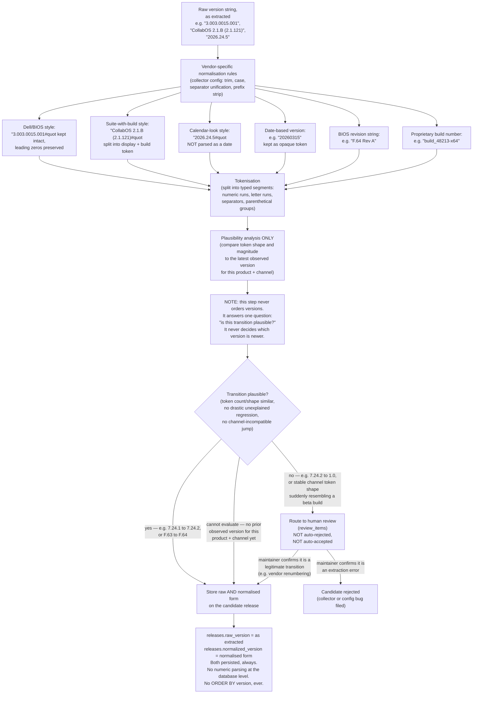

# Version normalisation

This diagram answers: when a collector extracts a raw version string, what happens between "text on a page" and "a value FirmScout is willing to store and reason about" — and why that process never sorts, compares, or trusts version strings as numbers.

## What this shows

Normalisation exists to make display and matching consistent (trimming whitespace, unifying separators, stripping vendor boilerplate), not to impose an ordering. Tokenisation feeds exactly one downstream decision — plausibility of the observed transition relative to the latest observed version for that product and channel — and that decision has exactly three outcomes: store as plausible, route an implausible transition to a human for a judgment call, or reject an extraction that a human confirms is simply wrong. Both the raw and the normalised string are always persisted side by side; the normalised form is never treated as the source of truth for "newest".

## Assumptions

- "Latest observed" for the plausibility check is derived from release date, first-observed timestamp, and channel (per ADR-0017), and is independent of this pipeline — plausibility analysis *consumes* that value, it does not produce it.
- Vendor-specific normalisation rules are registry data (collector config), reviewable and versioned like any other collector configuration, not hardcoded per-vendor logic buried in the domain.
- An implausible transition is a *signal*, not a verdict. The default behaviour is neither silent acceptance nor silent rejection — both destroy trust in different ways, so the default is a queued human decision.
- When there is no prior observed version for the product/channel pair (first-ever release recorded), plausibility cannot be evaluated and the candidate proceeds — there is nothing to compare against.

## Failure modes

- A vendor changes its numbering scheme deliberately (e.g. moving from build numbers to calendar versioning, matching the `2026.24.5` example). The plausibility check will flag this as implausible on the first occurrence; that is the intended behaviour — it becomes a one-time human decision, not a recurring one, because after the maintainer confirms it, the new shape becomes the new baseline for future comparisons.
- Over-aggressive vendor normalisation rules could accidentally collapse two genuinely different versions into the same normalised string (e.g. stripping a suffix that actually distinguishes a hotfix). This is why `raw_version` is retained unconditionally — a normalisation bug is recoverable by re-deriving from raw, never by trusting normalised-only storage.
- A collector regression (broken selector) could feed garbage into tokenisation. The plausibility gate catches shape anomalies, but a garbage string that happens to look shape-plausible (e.g. truncated to a lone digit) still needs the gate-4/gate-5 checks from the update pipeline (non-empty, duplicate, date sanity) to be fully caught.

## Related ADRs

- [ADR-0017 — Version strings and date precision](../adr/0017-version-strings-and-date-precision.md)
- [ADR-0005 — Deterministic collectors](../adr/0005-deterministic-collectors.md)

## Implementing code

**Implemented.** This diagram describes code that exists and is covered by tests.

- `internal/domain/version.go` — tokenisation and `AssessTransition`
- `internal/domain/version_test.go` — the vendor shapes that break semver

See [the architecture consistency report](../architecture/consistency-report.md) for what is verified by execution and what is not.
